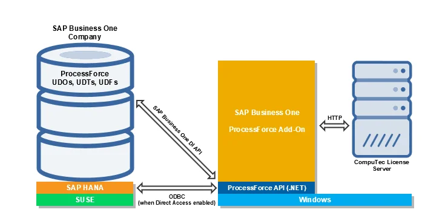

# CompuTec ProcessForce Architecture

CompuTec ProcessForce is a powerful 64-bit .NET application designed to seamlessly integrate with SAP Business One as an extension (add-on). It enhances the core functionalities of SAP Business One by offering advanced manufacturing and process industry-specific features. The lightweight deployment package enables businesses to efficiently manage complex operations while maintaining system performance.

---

**Core Architecture**:

CompuTec ProcessForce is developed in C# and runs on the .NET Framework within the Windows operating system. It operates as an executable process (ProcessForce.exe), initiated from SAP Business One.

## Key Components

- **CompuTec ProcessForce API:**

        - A dynamic-link library (DLL) stored in the installation folder.
        - Houses the data model and business logic.
        - Interacts with SAP Business One via the DI API.
        - Can directly access the company database through ADO.NET in Direct Access mode.

- **User Interface (UI)**:

        - Primarily built using the SAP Business One UI API.
        - Some new functionalities (e.g., Serialization, MRP 2.5, Batch Traceability 360 and Mass BOM Change Tool) utilize an HTML-based SAPUI5 interface.

- **Data Management**:

        - Leverages SAP Business One User-Defined Objects (UDOs), User-Defined Tables (UDTs) and User-Defined Fields (UDFs).

- **Reporting & Analytics**:

        - Supports both SAP HANA and Microsoft SQL Server.
        - Uses calculation views on SAP HANA and stored procedures, functions and views on SQL Server.
        - Provides user queries for data retrieval.
        - Print layouts are designed using Crystal Reports and executed via the built-in Crystal Reports Engine.

**SAP HANA vs. Microsoft SQL Server Compatibility**:

CompuTec ProcessForce supports identical functionalities across both databases. However, the CompuTec ProcessForce Semantic Model, which utilizes calculation views, is exclusive to SAP HANA.
With its deep integration into SAP Business One, CompuTec ProcessForce provides businesses with robust manufacturing process control, enhanced reporting and improved traceability.

Here is the overview of CompuTec ProcessForce Architecture:

---
