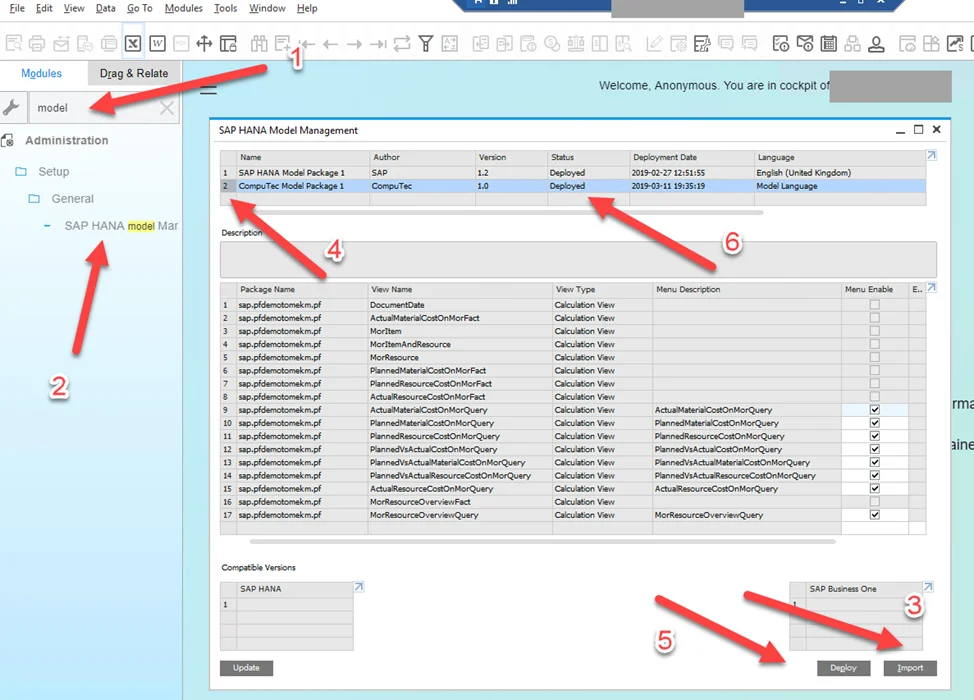
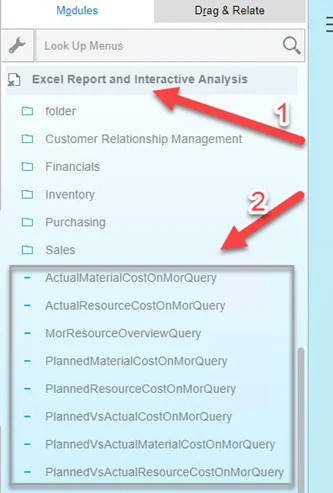

# Install CompuTec ProcessForce Data Model

The **CompuTec ProcessForce Data Model** provides a set of calculation views that can be used for reporting, analytics, and business intelligence scenarios.

The data model includes:

- 40 calculation views in total
- 10 views designed as direct data sources for reporting and analytics tools
- Additional supporting views used as indirect data sources

You can use these views with:

- Microsoft Excel
- SAP Analytics Cloud
- Dashboards and KPIs
- Custom analytics solutions
- SQL queries

## Before you start

Before installing the data model, make sure the following requirements are met.

### Step 1: Enable Analytics for the Company Database

**Analytics** must be initialized for the **SAP Business One** company database.

To verify this:

1. Open the following URL in a web browser: `https://<ServerAddress>:<Port>/Enablement`.
2. Replace `<ServerAddress>` and `<Port>` with the values used in your environment.

    

    :::info[note]

    If you don't know your **Server Address**, foolow these steps:
    - Log in to the **CompuTec AppEngine Administration Panel**.
    - Go to **Configuration** > **Advanced Configuration**.
    - The server address is displayed in the **SLD Server Address** field.

        

    :::

3. In **SAP Administration Console**, navigate to **Companies**.
4. Verify that analytics have been initialized for the company database.

    

    :::note[info]
    For more information, see the [SAP Business One Administrator's Guide for SAP HANA](https://help.sap.com/doc/4e7c047f2c9e4cbe97800ffaf7b68f8e/10.0/en-US/B1_for_SAP_HANA_Admin_Guide.pdf):

    - 7.3 Initializing and Maintaining Company Schemas for Analytical Features
    - 7.3.1 Starting the Administration Console
    - 7.3.2 Initializing and Updating Company Schemas
    :::

### Microsoft Excel, Excel Report, and Interactive

To fully use the features of the data model and to create own reports based on the provided views, it is required to have installed Microsoft Excel and Excel Report and Interactive, which is an addition to Excel Analysis. You can check these application requirements in the Administrator's Guide for SAP Business One 10.0, version for SAP HANA (chapters: 1. Introduction and 3.4 Installing Client Components).

How to work with the features you can find in the [official SAP Business One How-to Guide](https://help.sap.com/http.svc/rc/d70ddaf3fc8341bbb7ea62d0742bdd88/9.3/en-US/How%20to%20Work%20with%20Excel%20Report%20and%20Interactive%20Analysis.pdf).

**_SYS_BI"."M_TIME_DIMENSION table**

Some dates were joined with a time dictionary view ("DocumentDate"). This view uses the `_SYS_BI"."M_TIME_DIMENSION` table.


You can check with the following query if the data in this table are initialized:

```sql
select *
from _SYS_BI."M_TIME_DIMENSION"
```


If data is not present there, we can initialize it:


More details can be found [here](https://download.computec.one/media/sap/SAP_HANA_Modeling_for_SAP_Business_One_Time_Dimensions.pdf)

## Installation

Once the requirements from the previous section are met, import model.zip, which is available to download [here](../data-model/computec-processforce-data-model-download.md). You can install it from the SAP Business One level, logged in to a required database:



More information on data model import and available options can be found [here](https://download.computec.one/media/sap/How_to_Export_and_Package_SAP_HANA_Models_for_SAP_Business_One.pdf), Chapter 4. Importing and Deploying Model Packages in SAP Business One.

After a successful installation, the views are available from the SAP main menu level:



From the Excel level:


---
