# Install CompuTec ProcessForce Data Model

The **CompuTec ProcessForce Data Model** provides a set of calculation views that can be used for reporting, analytics, and business intelligence scenarios.

The data model includes:

- 40 calculation views in total
- 10 views designed as direct data sources for reporting and analytics tools
- Additional supporting views used as indirect data sources

You can use these views with:

- Microsoft Excel
- SAP Analytics Cloud
- Dashboards and KPIs
- Custom analytics solutions
- SQL queries

## Before you start

Before installing the data model, make sure the following requirements are met.

### Step 1: Enable Analytics for the Company Database

**Analytics** must be initialized for the **SAP Business One** company database.

To verify this:

1. Open the following URL in a web browser: `https://<ServerAddress>:<Port>/Enablement`.
2. Replace `<ServerAddress>` and `<Port>` with the values used in your environment.

    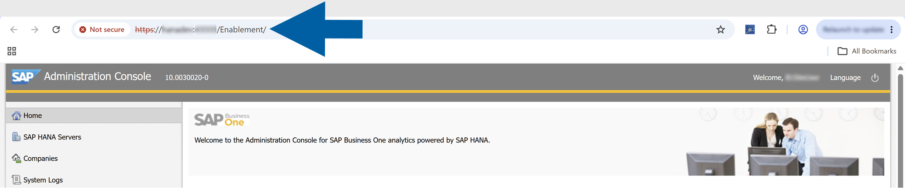

    :::info[note]

    If you don't know your **Server Address**, foolow these steps:
    - Log in to the **CompuTec AppEngine Administration Panel**.
    - Go to **Configuration** > **Advanced Configuration**.
    - The server address is displayed in the **SLD Server Address** field.

        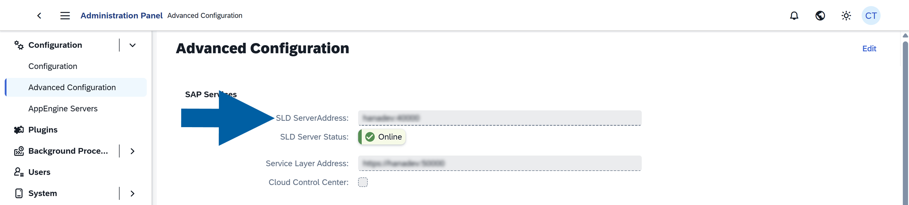

    :::

3. In **SAP Administration Console**, navigate to **Companies**.
4. Verify that analytics have been initialized for the company database.

    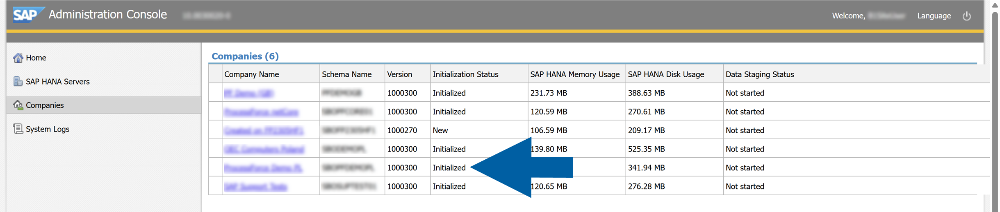

    :::note[info]
    For more information, see the [SAP Business One Administrator's Guide for SAP HANA](https://help.sap.com/doc/4e7c047f2c9e4cbe97800ffaf7b68f8e/10.0/en-US/B1_for_SAP_HANA_Admin_Guide.pdf):

    - 7.3 Initializing and Maintaining Company Schemas for Analytical Features
    - 7.3.1 Starting the Administration Console
    - 7.3.2 Initializing and Updating Company Schemas
    :::

### Step 2: Install the Required Microsoft Excel Components

To create reports based on the calculation views, install:

- **Microsoft Excel**
- **Excel Report and Interactive**
- **SAP Analysis for Microsoft Office**

:::note[info]
For installation requirements, see the [SAP Business One Administrator's Guide for SAP HANA](https://help.sap.com/doc/4e7c047f2c9e4cbe97800ffaf7b68f8e/10.0/en-US/B1_for_SAP_HANA_Admin_Guide.pdf), Chapters 1. Introduction and 3.4 Installing Client Components.

For information about using these features, see the [SAP Business One How-to Guide](https://help.sap.com/http.svc/rc/d70ddaf3fc8341bbb7ea62d0742bdd88/9.3/en-US/How%20to%20Work%20with%20Excel%20Report%20and%20Interactive%20Analysis.pdf).
:::

### Step 3: Verify the time dimension table

Some calculation views use the ``DocumentDate`` time dictionary view, which depends on the ``_SYS_BI."M_TIME_DIMENSION`` **SAP HANA** table.

To verify that the table contains data, follow these steps:

1. Open **SAP HANA Studio**.
2. Expand the **_SYS_BI** schema.
3. Locate the **M_TIME_DIMENSION** table.

    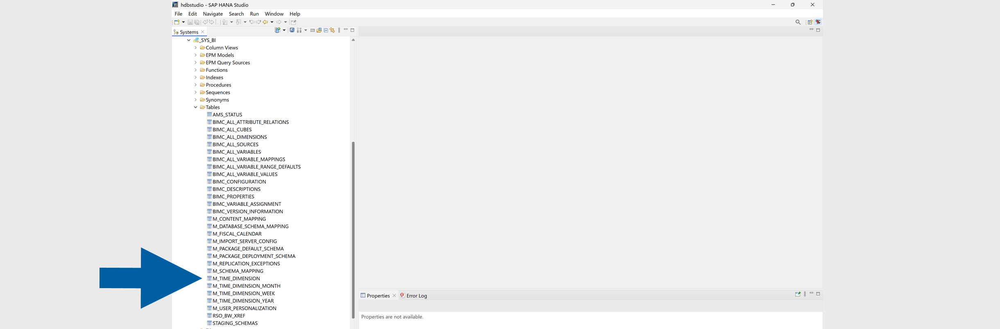

4. Right-click **M_TIME_DIMENSION** and select **Open Content**.

    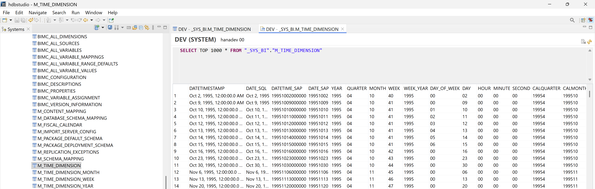

5. Verify that the table contains records.
6. To initialize the table:

    - Right-click the **SYSTEM** folder.
    - Select **SAP HANA Modeler** > **Generate Time Data**.

        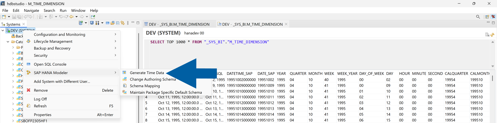

    - Specify the required date range and granularity.
    - Click **Finish** to generate the records in the **_SYS_BI.M_TIME_DIMENSION** table.

        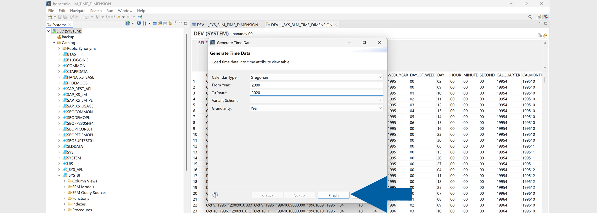

7. Alternatively, you can verify whether the table contains data by running the following SQL query:

    ```sql
    SELECT * FROM _SYS_BI."M_TIME_DIMENSION"
    ```

8. If no records are returned, initialize the table before installing the data model.

:::note[info]

For detailed instructions on generating and maintaining the M_TIME_DIMENSION table, see the [SAP HANA Modeling for SAP Business One – Time Dimensions guide](https://download.computec.one/media/sap/SAP_HANA_Modeling_for_SAP_Business_One_Time_Dimensions.pdf).

:::

## Install the Data Model

To install the **CompuTec ProcessForce Data Model**, follow these steps:

1. Download the [**CompuTec ProcessForce Data Model installation file**](../data-model/computec-processforce-data-model-download.md).
2. Log in to **SAP Business One**.
3. Go to **Administration** > **Setup** > **General** > **SAP HANA Model Management**.

    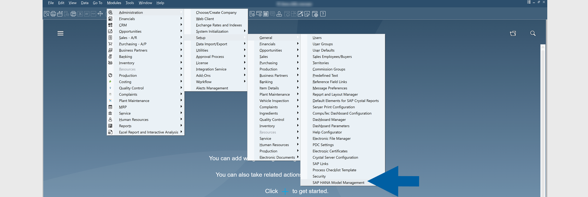

4. Click **Import**.

    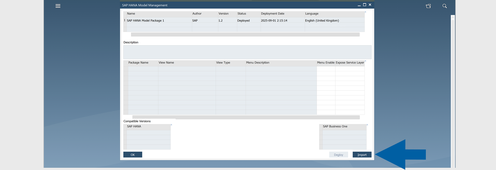

5. Select the downloaded **model.zip** package.

    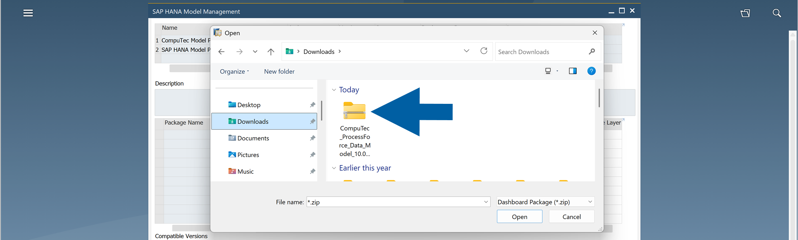

6. Seletct the imported data model, and click **Deploy**.

    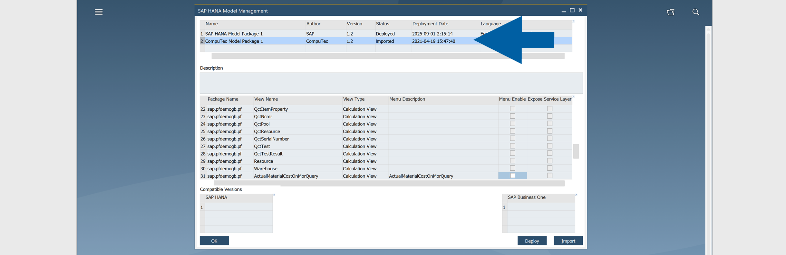

    :::note[info]
    For more information about importing model packages and available deployment options, see [Chapter 4 – Importing and Deploying Model Packages in SAP Business One](https://download.computec.one/media/sap/How_to_Export_and_Package_SAP_HANA_Models_for_SAP_Business_One.pdf).
    :::

7. Done! After the deployment is complete, you can access the calculation views from the SAP Business One menu.

## Results

### Access the calculation views from SAP Business One

To access the calculation views from the **SAP Business One** menu, follow these steps:

1. In **SAP Business One**, go to **Modules**.
2. Click **Excel Report and Interactive Analysis**.
3. Verify that the imported **CompuTec ProcessForce calculation views** are available.

    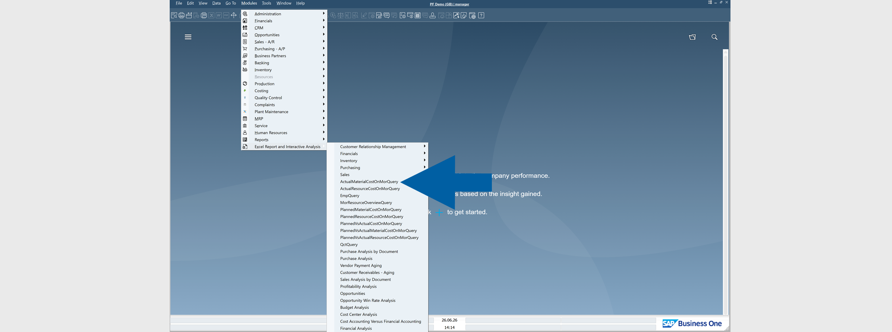

### Access the calculation views from Microsoft Excel

To use the calculation views in **Microsoft Excel**, follow these steps:

1. Open **Microsoft Excel**.
2. Select the **Interactive Analysis Designer** tab.
3. Click **New Pivot Table**.
4. Select one of the **CompuTec ProcessForce calculation views**.
5. Click **OK**.

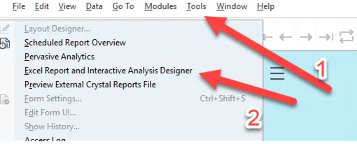

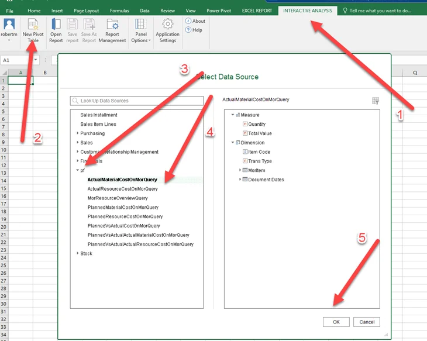

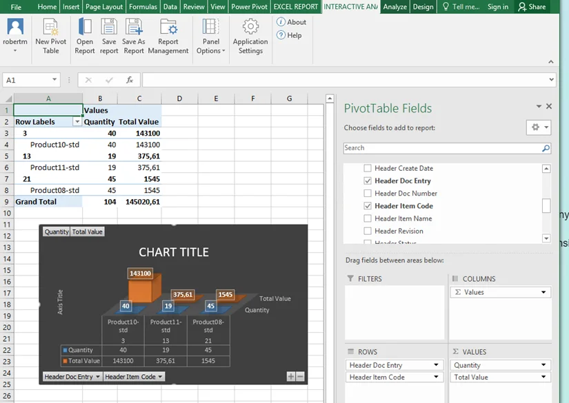

---
