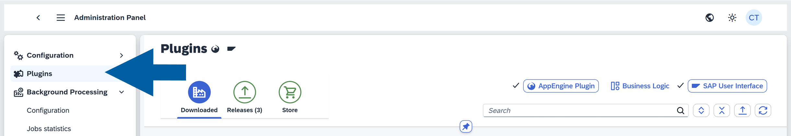
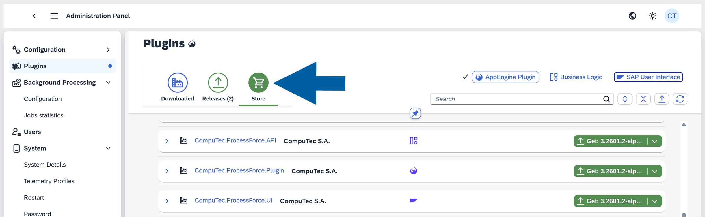

# CompuTec ProcessForce Plugins

CompuTec ProcessForce Plugins enhance the capabilities of SAP Business One by enabling seamless integration and advanced manufacturing functionalities. This guide walks you through the installation process, prerequisites and key steps required to deploy plugins successfully.

Follow these steps to install the CompuTec ProcessForce plugins properly.

## Before you start

- Ensure you meet all CompuTec ProcessForce [System Requirements](../../system-requirements.md).
- It is recommended to install the [CompuTec License Server](./license-server) before proceeding.
- Restart the SAP Business One client **before installing** the CompuTec ProcessForce Plugin.

## Step 1: Download CompuTec ProcessForce Plugins

1. Log in to CompuTec AppEngine **Administration Panel**.
2. Navigate to **Plugins**.

    

3. Go to the **Store** tab.

    

4. Locate the following two **CompuTec ProcessForce plugins**:

    - **CompuTec.ProcessForce.API**
    - **CompuTec.ProcessForce.Plugin**

5. Install them by following the [**CompuTec AppEngine Plugin Installation Guide**](https://learn.computec.one/docs/appengine/administrators-guide/configuration-and-administration/plugins/overview).

:::caution[Important]

- The CompuTec **ProcessForce API** is **required** for the CompuTec ProcessForce Plugin to work.
- When you install **CompuTec.ProcessForce.Plugin**, the API plugin is added automatically.
- If you use CompuTec ProcessForce with the **SAP Business One Desktop Client**, or want to upgrade from **CompuTec ProcessForce 2.0 to 3.0**, you must also install `CompuTec ProcessForce UI`.

:::

## Step 2: Install the plugins

After downloading all plugins, log in to your SAP Business One client. Upon login, the system will prompt you to install `CompuTec.ProcessForce.Gantt` on your local machine.

Follow these steps to install CompuTec ProcessForce Gantt:

1. Click **Install** to begin the installation.

    

    :::info[note]
    If a permission error message appears:

    - Close **SAP Business One**.  
    - Right-click the SAP Business One shortcut.  
    - Select **Run as administrator**.  
    - When prompted, install **CompuTec.ProcessForce.Gantt**.  

    In most cases, this resolves the issue immediately.

    If the installation still fails, the system will display a system message with a command for manual installation.

      

    To install the component manually:

    - Open **Command Prompt** as Administrator.  
    - Paste the command provided in the error message (it is automatically copied to the clipboard).  
    - Press **Enter** and wait for the process to complete.  
    - After the command finishes successfully, restart **SAP Business One**.

    :::

## Step 3: Assigning the License

:::info
This step is required only for new installations.
You can skip it if you are upgrading.
:::

Go to [**License Import and Assignment**](../../licensing/license-import-and-assignment.md) guide for step-by-step instructions.

## Required Checks and Warnings

These configurations and precautions are critical to ensure a smooth installation or upgrade process, preventing conflicts with SAP Business One settings and avoiding data integrity issues.

:::danger[very important]

### Check SAP Business One General Settings

Before installing or upgrading, follow these steps:

1. Log in toSAP Business One.
2. Go to **General Settings**.
3. Navigate to **Hide Functions** tab.

    

4. Make sure the following options are unchecked:
    - Serial Numbers and Batches
    - Production
    - Units of Measure

:::

:::danger[very important]

### Stored procedures (upgrade only)

Before upgrading ProcessForce, ensure these SAP Business One stored procedures are unchanged (default state):

- `SP_TransactionNotification`
- `SP_PostTransactionNotice`

Custom code in these procedures can break the upgrade process.

:::

:::danger[very important]

### Warning: Creating new databases

**Do not** use **Copy Express** or the options **Copy User-Defined Fields and Tables** / **Copy User-Defined Objects** in the **Create New Company** wizard to copy CompuTec ProcessForce objects.

Using these methods results in improper assignment of `EditType` fields in CompuTec ProcessForce structures - leaving them as `NULL`. This is due to a bug in SAP Business One that affects `DateTime` fields when new databases are created using copy methods.

✅ **To prevent this issue**:

- Create a **new database**
- Install CompuTec ProcessForce
- Transfer the required data using **CompuTec ProcessForce Integration (PFI)** tool (instead of PowerShell scripts).

:::

## Why Following These Steps Is Important

The CompuTec ProcessForce plugin is tightly connected with SAP Business One’s production and costing functions. Because of this, proper configuration and installation are essential. Skipping prerequisite checks, using copy methods, or failing to assign licenses correctly can lead to malfunctioning UIs, missing data, or incorrect system behavior.

Plugin overview:

- **CompuTec ProcessForce API Plugin**: Enables backend integration and external communications.
- **CompuTec ProcessForce Plugin**: Core functional layer enabling CompuTec ProcessForce logic.
- **CompuTec ProcessForce UI Plugin**: Desktop interface for interaction within SAP Business One.

## Restoring Existing Data (If Your Database Already Has Data)

:::caution[important]
Before restoring data, verify if the **Manage Item Cost per Warehouse** setting is enabled.

Changing this setting **after** restoration will require **removal and re-restoration** of all Item Costing details.
:::

If you are installing CompuTec ProcessForce on a database that already has **existing data** (such as item master records), you need to run the **data restoration procedures**:
    - Restore Item Details
    - Restore Item Costing
    - Restore Resource Costing
    - Restore Employee Calendars
    - Restore Batch Details

    

:::note[info]
➡️ Learn more about the Data Restore in [this guide](../../../user-guide/system-initialization/data-restore.md).
:::
