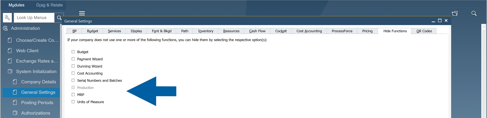
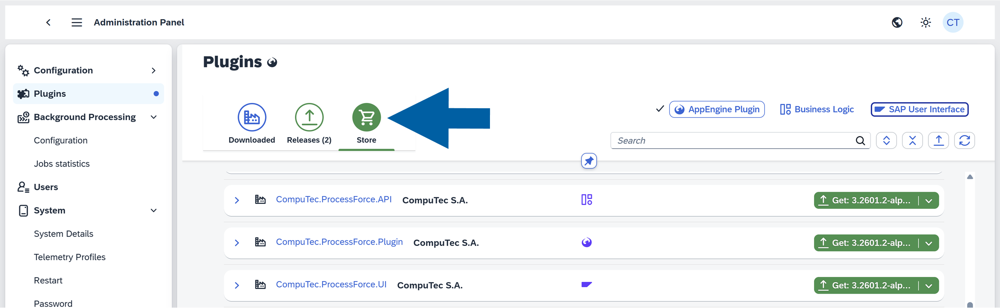
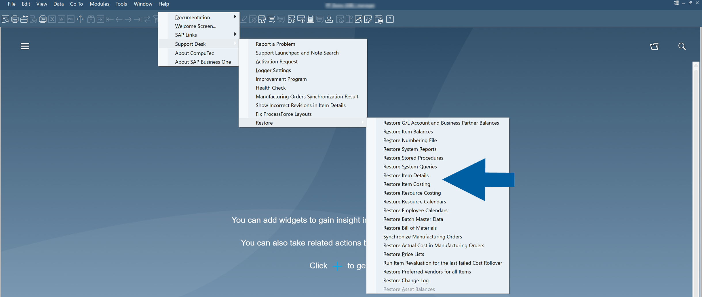

# CompuTec ProcessForce Plugins Installation

This guide explains how to install the **CompuTec ProcessForce** plugins using the **CompuTec AppEngine Administration Panel**.

During the installation you will:

- Download the required plugins.
- Install and activate the plugins.
- Install the **CompuTec ProcessForce Gantt** component.
- Assign a license (new installations only).

## Before you start

:::danger[very important]
Complete the following checks before installing or upgrading **CompuTec ProcessForce**. These steps help prevent installation issues, upgrade failures, and data inconsistencies.
:::

Before installing the plugins, make sure that:

- Your environment meets the [**CompuTec ProcessForce System Requirements**](../../system-requirements.md).
- [**CompuTec AppEngine**](https://learn.computec.one/docs/appengine/administrators-guide/configuration-and-administration/installation)  is installed and configured.
- [**CompuTec License Server**](./license-server) is installed.
- Any custom code in the ``SP_TransactionNotification`` and ``SP_PostTransactionNotice`` stored procedures is temporarily disabled. Custom code in these procedures can break the upgrade process.
- You increased the ``ConnectionTimeout`` and ``CommandTimeout`` values in **CompuTec AppEngine Administration Panel** before the first installation of the **CompuTec ProcessForce** plugins. [Read more](http://learn.computec.one/docs/processforce/troubleshooting/general-functions#problem-computec-processforce-plugin-installation-stops-or-the-session-expires-during-the-first-installation)
- In **SAP Business One**, the following options are unchecked under **SAP Business One** > **Administration** > **System Initialization** > **General Settings** > **Hide Functions** tab:
        - ``Serial Numbers and Batches``
        - ``Production``
        - ``Units of Measure``

        

- In **SAP Business One** > **Administration** > **System Initialization** > **General Settings** > **Services**, disable **Enable Query Validation** for both the **UI API** and **DI API**.

    ![SAP Business One General Settings Services tab showing UI API Configuration and DI API Configuration sections. On the left, under UI API Configuration, checkboxes read: Enable Default Connection String, Enable Path Validation, Enable Query Validation, Enable XML Filtered with the Enable Default Connection String checked. On the right, under DI API Configuration, a single checkbox reads Enable Query Validation which is unchecked. The surrounding interface shows the Administration panel sidebar with General Settings selected and other system initialization options visible. The tone is instructional and neutral.](media/extension/pf-inst-plug5.png)

    :::info[note]
    **CompuTec ProcessForce** does not currently support the **Enable Query Validation** option. If either setting is enabled, you may see an error during the **CompuTec ProcessForce** installation.
    :::

- You restart the **SAP Business One** client before beginning the installation.

## Step 1: Install the plugins

The installation consists of the following plugins:

- **CompuTec ProcessForce Plugin** – Provides the core manufacturing functionality of CompuTec ProcessForce.
- **CompuTec ProcessForce API Plugin** – Supports backend communication and integration services. This plugin is installed automatically as a dependency of the **CompuTec ProcessForce** plugin.
- **CompuTec ProcessForce UI Plugin** – Adds the desktop user interface for the **SAP Business One Desktop Client**. Install this plugin only if you use the **SAP Business One Desktop Client** or you are upgrading from **CompuTec ProcessForce 2.0**.

To install the **CompuTec ProcessForce** plugins, follow these steps:

1. Log in to **CompuTec AppEngine Administration Panel**.
2. Navigate to **Plugins**.

    

3. Go to the **Store** tab.

    

4. Locate the following two **CompuTec ProcessForce plugins**:

    - **CompuTec.ProcessForce.API**
    - **CompuTec.ProcessForce.Plugin**

5. Install them by following the [**CompuTec AppEngine Plugin Installation Guide**](https://learn.computec.one/docs/appengine/administrators-guide/configuration-and-administration/plugins/overview) instructions.

    :::caution[Important]

    - The **CompuTec ProcessForce API** plugin is required by CompuTec ProcessForce is installed automatically.
    - If you use **SAP Business One Desktop Client**, or you are upgrading from **CompuTec ProcessForce 2.0**, install **CompuTec ProcessForce UI** plugin as well.

    :::

## Step 2: Install the CompuTec ProcessForce Gantt component

After the installation, follow thses steps:

1. Log in to your **SAP Business One client**.
2. The system will prompt you to install **CompuTec.ProcessForce.Gantt** on your local machine.
3. Click **Install** to begin the installation.

    

    :::info[note]
    If a permission error message appears:
        - Close **SAP Business One**.  
        - Right-click the SAP Business One shortcut.  
        - Select **Run as administrator**.  
        - When prompted, install **CompuTec.ProcessForce.Gantt**.

    In most cases, this resolves the issue immediately.

    If the installation still fails, the system will display a system message with a command for manual installation.

    

    To install the component manually:

    - Open **Command Prompt** as Administrator.  
    - Paste the command provided in the error message (it is automatically copied to the clipboard).  
    - Press **Enter** and wait for the process to complete.  
    - After the command finishes successfully, restart **SAP Business One**.

    :::

## Step 3: Assign the license

:::info
This step is required only for new installations.
If you are upgrading an existing installation, continue to the next section.
:::

To assign the license, follow the [**License Import and Assignment**](../../licensing/license-import-and-assignment.md) guide.

## After the installation

### Restore existing data

If you are installing **CompuTec ProcessForce** in a database that already contains data, restore the existing **CompuTec ProcessForce** data.

:::warning[important]
Before restoring the data, verify that the **Manage Item Cost per Warehouse** setting is configured correctly. Changing this setting **after** the restoration requires you to remove and restore all **Item Costing** data again.
:::

To restore the existing data, follow these steps:

1. Open **SAP Business One**.
2. Navigate to **Help** > **Support Desk** > **Restore**.
3. Run the following restoration procedures:
        - **Restore Item Details**
        - **Restore Item Costing**
        - **Restore Resource Costing**
        - **Restore Employee Calendars**
        - **Restore Batch Details**

        

For detailed instructions, see [**Restore Existing Data**](../../../user-guide/system-initialization/data-restore.md).

### Creating new company databases

To create a new company database, follow these steps:

1. Create a new company database.
2. Install **CompuTec ProcessForce**.
3. Transfer the required data by using **CompuTec ProcessForce Integration** (**PFI**) instead of database copy methods.

:::warning[important]
**Do not** use **Copy Express** or the options **Copy User-Defined Fields and Tables** / **Copy User-Defined Objects** in the **Create New Company** wizard to copy **CompuTec ProcessForce** objects.

Because of a limitation in **SAP Business One**, these methods can leave ``EditType`` fields uninitialized, causing incorrect behavior.
:::

## Result

After completing these steps:

- **CompuTec ProcessForce** is installed.
- The required plugins are active.
- The **CompuTec.ProcessForce.Gantt** component is installed.
- The license is assigned (new installations).
- The system is ready for configuration and use.

:::warning[important]
The **CompuTec ProcessForce** plugins are tightly connected with **SAP Business One** production and costing functions. Because of this, proper configuration and installation are essential.  

Skipping prerequisite checks, using copy methods, or failing to assign licenses correctly can lead to malfunctioning UIs, missing data, or incorrect system behavior.
:::
