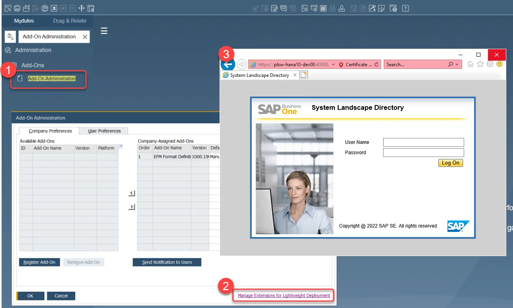
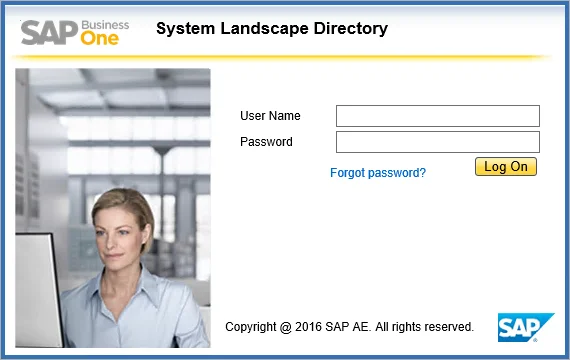
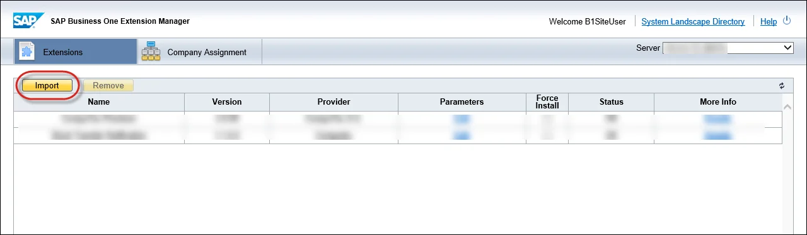
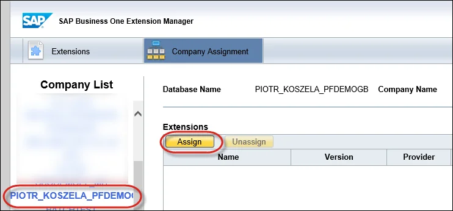
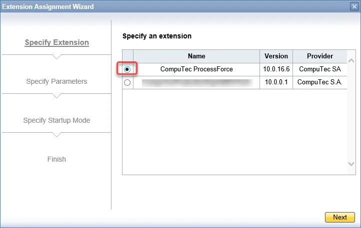
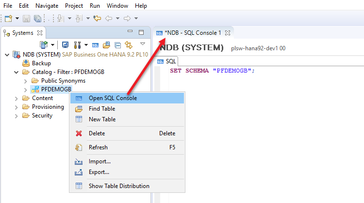
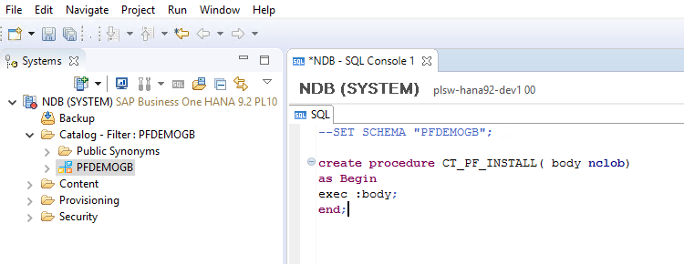

# Extension

## Installation Guide

The ProcessForce Extension is a powerful tool that enhances the functionality of SAP Business One. This guide provides a step-by-step approach to installing the ProcessForce Extension efficiently. Ensure that you meet all system requirements before proceeding with the installation.

---

:::note
    If you only need to upgrade ProcessForce, refer to the [**ProcessForce Upgrade Guide**](../upgrade) here.
:::

:::caution
    - Be sure to acquaint yourself with the [ProcessForce System Requirements](../../system-requirements.md) before starting the installation.
    - It is recommended to install [CompuTec License Server](./license-server) first.
    - It is recommended to restart the SAP Business One client before the installation of the ProcessForce Extension.
    - Due to technical limitations, it is required to execute a specific SQL query on the company database during the first installation of the Extension in the SAP HANA version. Additional information can be found in the eighth step of the installation description.
:::

:::danger
    Before upgrading the ProcessForce Extension, verify that the following SAP Business One stored procedures are in their default state and do not contain any custom queries:

    - SP_TransactionNotification
    - SP_PostTransactionNotice
:::

:::danger
    Before beginning the installation, ensure that the Serial Numbers and Batches, Production, and Units of Measure options are unchecked in General Settings → Hide Functions, as shown in the screenshot below:

        
:::

:::danger
    Please note that Copy Express, or the option Copy User-Defined Fields and Tables/Copy User-Defined Objects in the Create New Company wizard, cannot be used for copying ProcessForce objects and structures.

    <details>
        <summary>Click here to find out more</summary>
        <p>When a new ProcessForce database is created using Copy Express or the Copy User-Defined Fields and Tables/Copy User-Defined Objects option in the Create New Company wizard, SAP Business One does not properly assign values to the EditType fields in ProcessForce structures, leaving them as NULL. This issue arises due to an SAP Business One bug where newly created DateTime fields are not correctly initialized in the new database.</p>
    </details>

    To prevent this issue, create a new database, install ProcessForce, and transfer the required data using the ProcessForce API with [PowerShell scripts](../../../developer-guide/data-import/overview.md).
:::

### Installation

:::danger
    Please note that ProcessForce in 10.0 version is provided as a **Lightweight Deployment Extension only**. Please use **SAP Business One Extension Manager** to install it.
    Download installation files for it [here](../../../releases/download.md).
:::

ProcessForce is a lightweight deployment extension for SAP Business One 10.0. Follow these steps to install it:

1. You can access it directly by using a default URL `HTTPS://<SERVER_NAME>:40000/ExtensionManager` or by opening it from your SAP Business One client. Choose the highlighted option in SAP Business One:

    

2. Log in to System Landscape Directory.

    

3. Click the "Import" button and browse to the path with the extension installation file:

    

4. Navigate to the Company Assignment tab, choose the required database from the Company List and click the "Assign" button:

    

5. Select the ProcessForce option and click "Next" to proceed with the Installation.

    

6. It is recommended to set up the Startup Mode as manual for the first run of the application (this can be changed later to Mandatory). Click "Next" to continue.

7. Once done, re-login to the company database, run the extension manually and wait for the installation to finish.

    :::caution
        The first-time installation may take anywhere from several minutes to a few hours, depending on system performance.
    :::

8. If installing on SAP HANA, you must manually create a required SQL procedure. Click "Copy to Clipboard" in the System Message window, then paste and execute the query in SAP HANA Studio under the appropriate schema.

    

    :::caution Common query problem

    <details>
        <summary>Click here to expand</summary>
        <div>
            If a schema is not selected when opening the SQL Console from the root tree, the query window defaults to the SYSTEM schema. As a result, executing a query for the first time may create a procedure in the SYSTEM schema instead of the correct company schema where ProcessForce is installed.

        To ensure the SQL procedure is installed in the correct company schema, open the SQL Console and run the following command before executing the copied query:

        ```sql
        SET SCHEMA "<COMPANY-DATABASE-SCHEMA-NAME>";
        ```
    
    
    </div>
    </details>
    :::
9. After the installation is completed, a prompt will appear regarding database structure modifications - click "Yes" to proceed.

10. A message recommending a restart of SAP Business One will be displayed: click OK.

11. After installation, the ProcessForce main menu positions appear:

    

### License Assignment

:::info
    This step is only required for new installations, not for upgrades.
:::

You can find the License Import and Assignment guide [here](../../licensing/license-import-assignment.md).

### Data Preparation

:::caution
    Before running restore procedures please determine whether the [**Manage Item Cost per Warehouse**](../../../user-guide/costing-material-and-resources/configuration/overview.md) setting is used. If you alter this setting after restoration, it will necessitate the removal and subsequent restoration of all Item Costing Details.
:::

If installing ProcessForce on a database with existing data (especially Item Master Data), run the following data restoration procedures:

- Restore Item Details
- Restore Item Costing
- Restore Resource Costing
- Restore Employee Calendars
- Restore Batch Details


Click [here](../../../user-guide/system-initialization/data-restore.md) to find out more about the Restore function.

---
