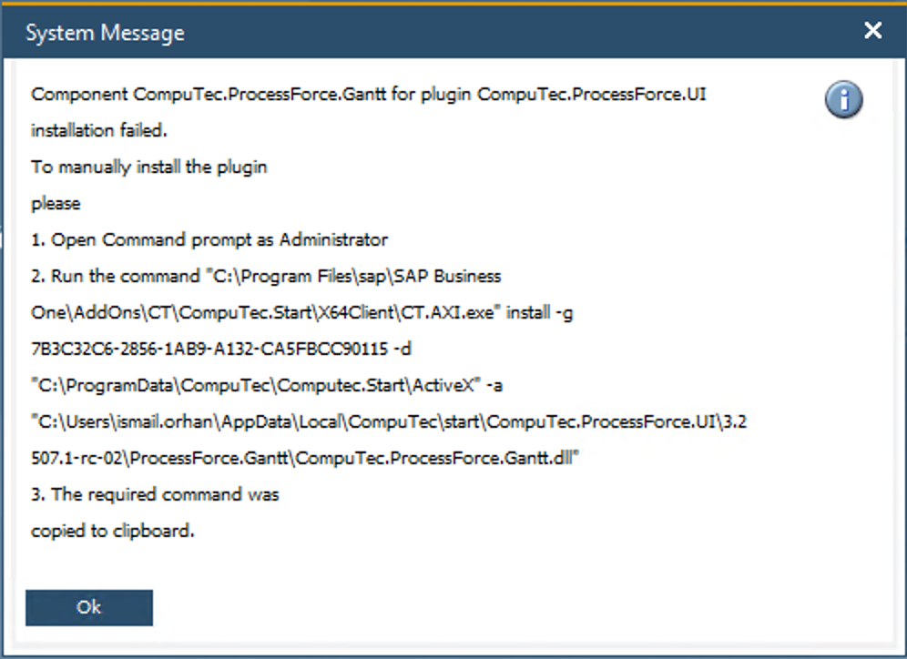
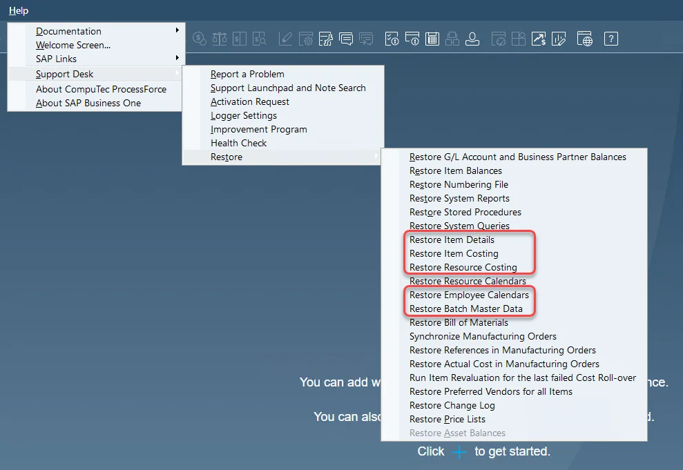

# Plugin

The CompuTec ProcessForce Plugin enhances the capabilities of SAP Business One by enabling seamless integration and advanced manufacturing functionalities. This guide walks you through the installation process, prerequisites and key steps required to successfully deploy the plugin.

---

## Installing the CompuTec ProcessForce Plugin

Follow these steps to install the CompuTec ProcessForce Plugin properly.

### 1. Review Prerequisites

- Ensure you meet all CompuTec ProcessForce [System Requirements](../../system-requirements.md).
- It is **recommended** to install the [CompuTec License Server](./license-server) before proceeding.
- Restart the SAP Business One client **before installing** the CompuTec ProcessForce Plugin.

### 2. Plugin Downloads

There are **two core plugins** you must download from the Plugin Store:

- CompuTec ProcessForce API
- CompuTec ProcessForce Plugin

You can find the installation guide for these plugins at the following link: [Plugin Installation Guide](https://learn.computec.one/docs/appengine/administrators-guide/configuration-and-administration/plugins/overview)

:::note Important
The CompuTec ProcessForce API is a **prerequisite** for the CompuTec ProcessForce Plugin. When you download the CompuTec ProcessForce Plugin, the system will automatically include the API plugin.

Additionally, if you're using CompuTec ProcessForce with the **SAP Business One desktop client**, or upgrading from **CompuTec ProcessForce 2.0 to 3.0**, you must also install:

- `CompuTec ProcessForce UI`

:::

### 3. Install the Plugins

- After downloading all plugins, log in to your SAP Business One client.
- Upon login, the system will prompt you to install `CompuTec.ProcessForce.Gantt` on your local machine.

    

    Click **Install** to proceed.

- If you encounter a permissions error (like the one below):

    

    Close the application, right-click the shortcut, and choose **Run as administrator**. Alternatively, follow the instructions in the message box.

### 4. Assigning the License

:::info
This step is **only required for new installations**, not for upgrades.
:::

Refer to the [**License Import and Assignment**](../../licensing/license-import-and-assignment.md) guide for step-by-step instructions.

---

## Reference: Required Configurations & Warnings

These configurations and precautions are critical to ensure a smooth installation or upgrade process, preventing conflicts with SAP Business One settings and avoiding data integrity issues.

### General Settings Check

:::danger
Before beginning the installation, **uncheck** the following in:

**General Settings → Hide Functions**:

- Serial Numbers and Batches
- Production
- Units of Measure

:::

### Stored Procedures for Upgrade

:::danger
Before upgrading the CompuTec ProcessForce Extension, ensure that the following SAP Business One stored procedures are in their **default state** with **no custom queries**:

- `SP_TransactionNotification`
- `SP_PostTransactionNotice`

:::

### Important Database Creation Warning

:::danger
**Do not** use **Copy Express** or the options **Copy User-Defined Fields and Tables / Copy User-Defined Objects** in the **Create New Company** wizard to copy CompuTec ProcessForce objects.

Why this matters

Using these methods results in improper assignment of `EditType` fields in CompuTec ProcessForce structures - leaving them as `NULL`. This is due to a bug in SAP Business One that affects DateTime fields when new databases are created using copy methods.

✅ **To prevent this issue**:

- Create a **new database**
- Install CompuTec ProcessForce
- Transfer the required data using **CompuTec ProcessForce Integration (PFI)** tool (instead of PowerShell scripts).

:::

---

## Why These Steps Matter

The CompuTec ProcessForce plugin deeply integrates with SAP Business One’s production and costing modules. Because of this, proper configuration and installation are essential. Skipping prerequisite checks, using copy methods, or failing to assign licenses correctly can lead to malfunctioning UIs, corrupted metadata, or incorrect system behavior.

The following distinctions are important:

- **CompuTec ProcessForce API Plugin**: Enables backend integration and external communications.
- **CompuTec ProcessForce Plugin**: Core functional layer enabling CompuTec ProcessForce logic.
- **CompuTec ProcessForce UI Plugin**: Desktop interface for interaction within SAP Business One.

---

## How to Prepare and Restore Data

:::caution
Before restoring data, verify if the **Manage Item Cost per Warehouse** setting is used.

Changing this setting **after** restoration will require **removal and re-restoration** of all Item Costing details.
:::

If you are installing CompuTec ProcessForce on a database that already has **existing data** (such as item master records), you need to run the **data restoration procedures**:

- Restore Item Details
- Restore Item Costing
- Restore Resource Costing
- Restore Employee Calendars
- Restore Batch Details

➡️ Learn more about: [Data Restore](../../../user-guide/system-initialization/data-restore.md).

---
