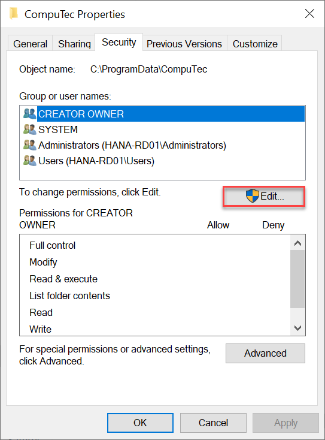
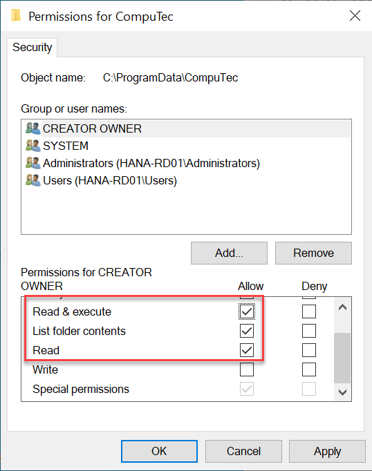

# Security Settings

ProcessForce requires specific folder-level permissions to operate correctly in environments with custom security configurations. This page includes a **tutorial** to apply those settings, a **how-to** checklist, and related **reference** information.

---

## Configuring Security Settings for ProcessForce

If you're installing ProcessForce on a system with non-default security settings (e.g., corporate IT policies or hardened environments), follow this step-by-step guide to ensure the correct folder permissions are applied.

### Step-by-Step Instructions

Follow the steps below to configure the necessary permissions:

1. **Open File Explorer** and go to the following path: `C:\ProgramData\`  
   > ⚠️ The **ProgramData** folder is hidden by default. You may need to enable “Show hidden items” in File Explorer.

2. Locate the `CompuTec` folder, right-click on it, and choose **Properties**.

3. Go to the **Security** tab and click the **Edit...** button.

   

4. In the **Permissions for CompuTec** window, for each SAP Business One user who will use ProcessForce, ensure the following permissions are enabled:

        - Read & execute
        - List folder contents
        - Read

            

   These permissions should apply to:
   - The folder itself
   - All subfolders and files (descendants)

---

## Reference: Folder Permissions Matrix

| Folder Path                     | Required For               | Permissions Needed                    |
|--------------------------------|----------------------------|----------------------------------------|
| `C:\ProgramData\CompuTec`      | All ProcessForce Users     | Read, List folder, Read & execute      |
| Subfolders of `CompuTec`       | Add-ons, Temp files, etc.  | Inherited from parent folder |

---

## Why Are These Permissions Needed?

CompuTec ProcessForce stores critical configuration and temporary data under the `CompuTec` folder within `C:\ProgramData`. In locked-down environments, default system permissions may restrict user access to these paths, leading to errors or instability during operation.

Setting the correct permissions ensures:

- Add-ons can read configuration files
- Runtime logs and temp files can be created
- Updates and extensions work without permission errors

These changes are **not required** on systems that use the default Windows security model, where users already have the necessary access.

---
