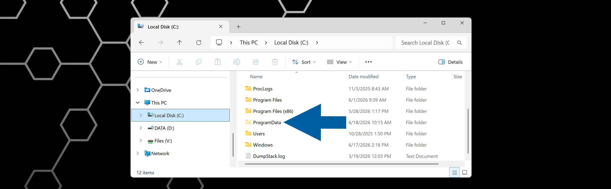
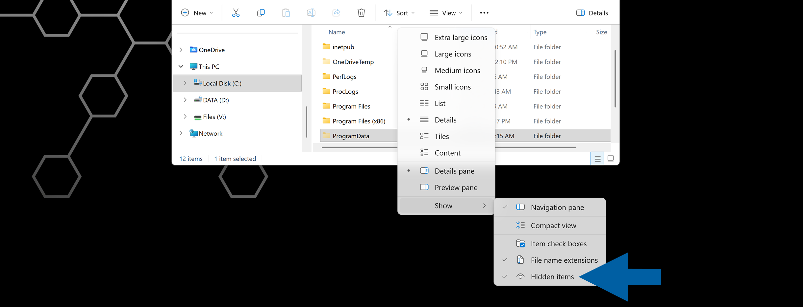
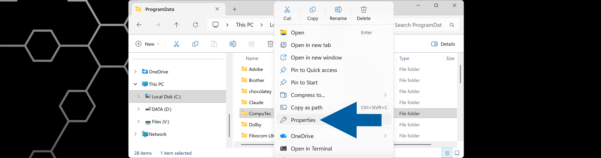
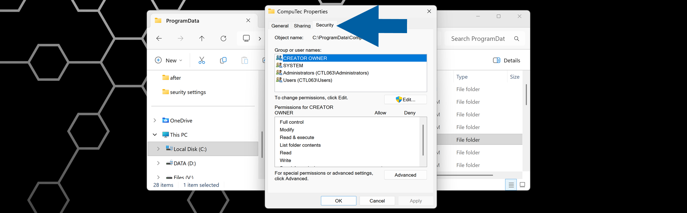
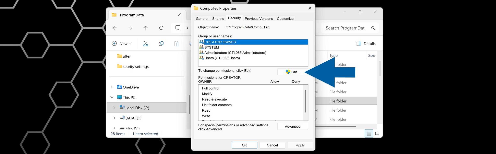
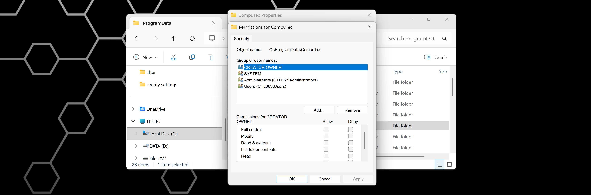

# Security Settings

In environments with custom **Windows** security policies, users may need additional permissions to access **CompuTec ProcessForce** files stored in the ``ProgramData`` directory.

This guide explains how to verify and configure the required folder permissions.

You may need to configure these permissions if:

- Your organization uses custom security policies.
- User access to system folders is restricted.
- CompuTec ProcessForce users experience file access or permission-related errors.

:::info[note]

These changes are typically not required on systems that use the default Windows security settings.
:::

## Configure folder permissions

To configure the required permissions:

1. Open **File Explorer**.
2. Navigate to: ``C:\ProgramData\``.

   

   :::info[note]

   If the folder is not visible, enable **Show** > **Hidden items** in **File Explorer**.

   
   :::

3. Right-click the **CompuTec** folder and select **Properties**.

   

4. Open the **Security** tab.

   

5. Click **Edit...**.

   

6. For each **SAP Business One user** who will use **CompuTec ProcessForce**, grant the following permissions:
   - **Read & execute**
   - **List folder contents**
   - **Read**

   

   These permissions should apply to this folder, all subfolders and files.

7. Click **OK** to save the changes.

## Required permissions

| Folder Path | Required For | Permissions Needed |
| --- | --- | --- |
| `C:\ProgramData\CompuTec` | All  Users | Read, List folder, Read & execute |
| Subfolders of `CompuTec` | Add-ons, Temp files, etc. | Inherited from parent folder |

## Results

**CompuTec ProcessForce** stores configuration files, temporary files, and runtime data in the ``ProgramData`` directory.

Without the required permissions, users may experience:

- Errors when opening CompuTec ProcessForce windows
- Problems loading configuration data
- Failures when creating temporary files
- Issues during updates or extensions installation

Ensuring that users have the required access helps **CompuTec ProcessForce** operate correctly in restricted environments.
