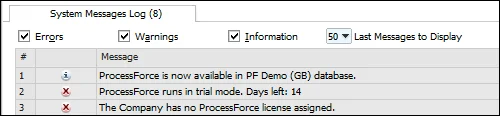
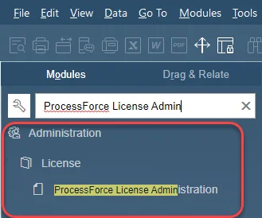
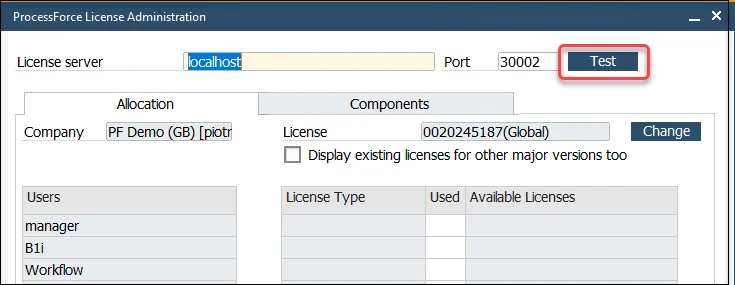
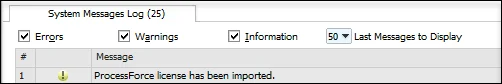
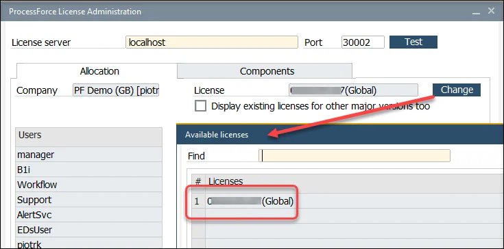
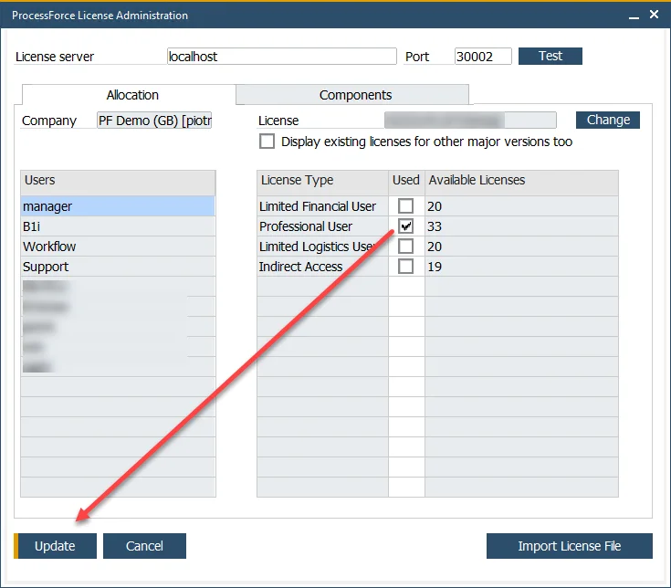

# License Import and Assignment

Setting up CompuTec ProcessForce for the first time requires importing and assigning the appropriate license. This ensures that the add-on functions correctly within SAP Business One.

:::info
    - If you are upgrading CompuTec ProcessForce rather than performing a fresh installation, you may skip these steps.
    - Assigning the CompuTec ProcessForce license works in the same way as assigning an SAP Business One license.
:::

---

## Steps to Import and Assign a License

Follow the steps below to import and assign CompuTec ProcessForce license successfully.

1. **Verify installation success**: After installation, the following confirmation message will appear:  

   

2. **Obtain a license file**: Request the license file from your CompuTec ProcessForce provider.  

   :::info
   Details on how to request a license key are available on the [Request for a license](./request-for-a-license.md) page.
   :::

3. **Open License Administration**: Navigate to the CompuTec ProcessForce **License Administration** form:

   

4. **Test License Service Connection**: To confirm that the CompuTec License Service is running, click **Test**:

   

5. **Import the license file**: If the connection is valid, click **Import License File** and browse for the license file.  

   :::caution
   The license file must have a `.xml` extension. Some browsers (e.g., Safari) may change the file type during download, which can cause errors during import.  
   :::

6. **Confirm license import**: After successful import, the following message will display:  

   

7. **Assign license to company**: Click **Change** to assign the license. Select the appropriate row from the imported licenses and click **Select**:  

   

8. **Assign users**: Map users to the appropriate license type and click **Update** to finalize:  

   

---
