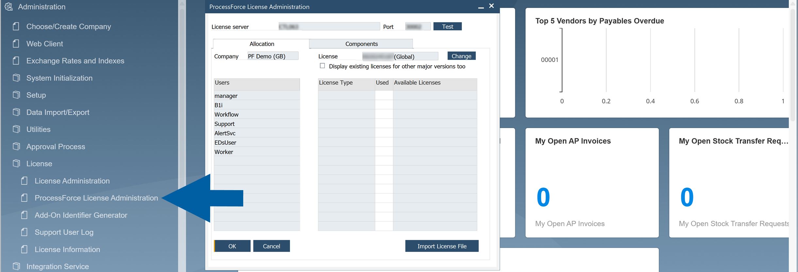
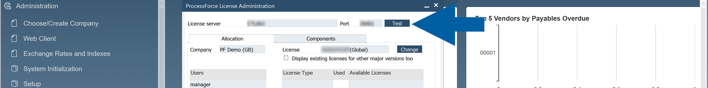
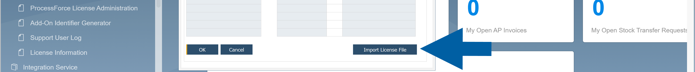
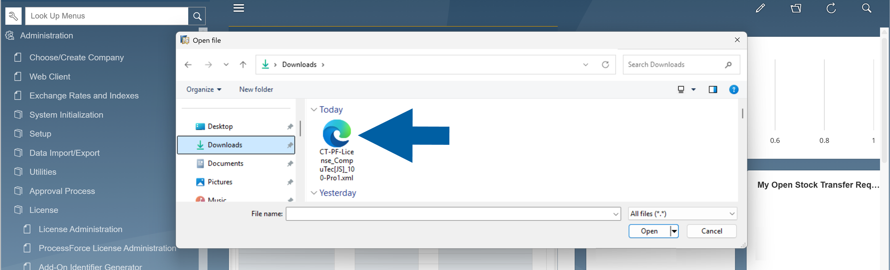
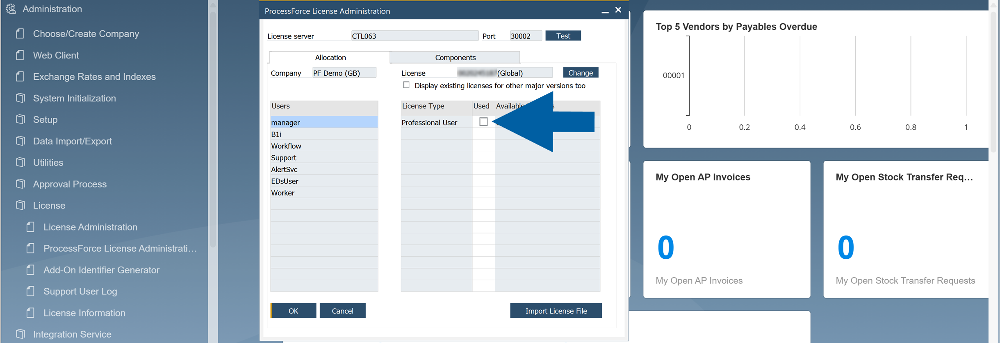
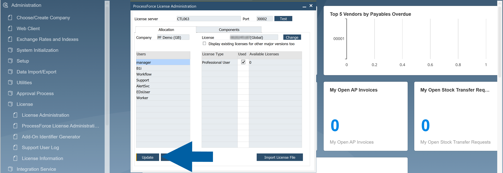

# Import and Assign Computec ProcessForce License

After installing **CompuTec ProcessForce**, you must import and assign a valid license before users can use **CompuTec ProcessForce** plugin in **SAP Business One**.

This guide explains how to import the license file, assign the license to your company database, and assign licenses to users.

:::note[info]
If you are upgrading an existing **CompuTec ProcessForce** installation, you may not need to repeat this procedure.

The license assignment process is similar to assigning new **SAP Business One** license.
:::

Follow the steps below to import and assign the license:

## Step 1: Obtain the license file

1. Before you can continue, obtain a valid license file from your **CompuTec ProcessForce** provider.

:::info[note]
If you do not already have a license file, follow our [Request CompuTec ProcessForce License](https://learn.computec.one/docs/processforce/administrator-guide/licensing/request-for-a-license/) guide.
:::

## Step 2: Open License Administration

1. In **SAP Business One**, go to **Administration** > **License** > **ProcessForce License Administration**.

   

2. Click **Test** to verify that the **CompuTec License Service** is running and available.

   

3. If the connection is successful, you will see a green success banner at the bottom of the screen.

   

## Step 3: Import the license file

1. Click **Import License File**.

   

2. Browse to the license file location.
3. Select the license file and confirm the import.

   

   :::caution[important]
   The license file must have a `.xml` extension.  
   Some web browsers, such as Safari, may change the file type during download. If this happens, the import may fail.  
   :::

## Step 4: Confirm the license import

After the import is completed successfully, a confirmation **System Message** appears.

## Step 5: Assign the licenses to users

1. Choose the users form the list and assign them to the chosen license type.

   

2. Click **Update** to save the changes.

   

3. Click **OK**.
4. The license assignment is now complete, and users can access **CompuTec ProcessForce** according to their assigned license type.
