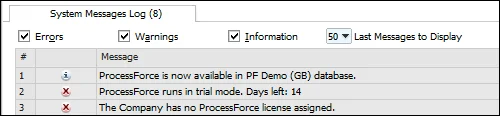
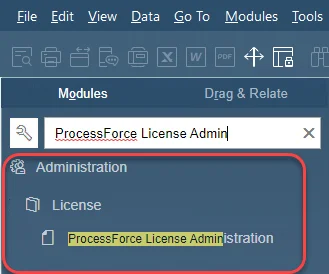
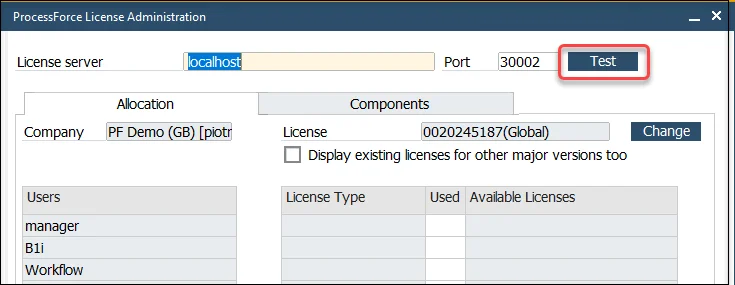
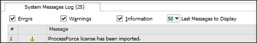
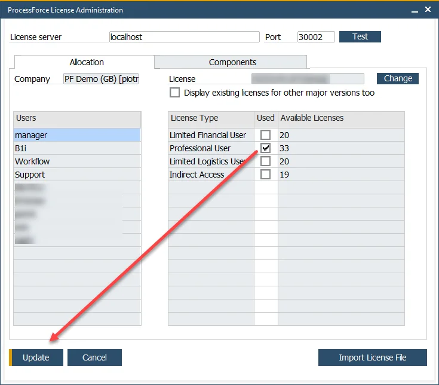

# License Import and Assignment

Setting up CompuTec ProcessForce for the first time requires importing and assigning the appropriate license. This process ensures that the add-on functions correctly within SAP Business One.

:::info
    If you are upgrading CompuTec ProcessForce rather than performing a fresh installation, you may skip these steps.
:::

:::info
    Assigning the CompuTec ProcessForce license works similarly to the SAP Business One license assignment.
:::

---

Follow the steps below to import and assign CompuTec ProcessForce license successfully.

1. After successful installation, the system message appears:

    

2. Ask your CompuTec ProcessForce provider for a license file.

    :::info
        All information required for generating a license key is described on the [Request for a license](./license-request.md) page.
    :::

3. Open CompuTec ProcessForce License Administration form:

    

4. To test whether CompuTec License Service is up and running, click the "Test" button:

    

5. If it is OK – click the Import License File button to load a valid license. You will be asked for a license file.

    :::caution
        Note that a license file should have a .xml extension. In some cases, a file downloaded from a license request issue ([support.computec.pl](https://support.computec.pl)) can have changed its type (e.g., on downloading the file by Safari browser), which may cause an error when trying to load it.
    :::

6. After the successful importation of a license, the message `ProcessForce license has been imported` will appear:

    

7. Press the Change button to assign/change the license to/in the company. You will be asked to select a proper row from imported licenses. Select a license row and click the Select button:

    

8. Assign users to the appropriate license type and click Update to finalize the process:

    

---
