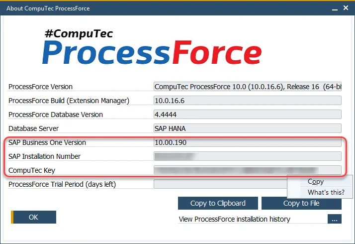
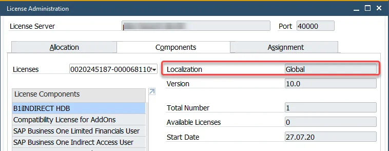

# Request for a License

To use CompuTec ProcessForce, you must request a valid license. Follow these steps to request a license through the [CompuTec Support Portal](https://support.computec.pl):

1. Go to the Support Portal.
2. Create a support ticket.
3. Type: Information, Component: License request
4. Include the required details as listed below in your request.

---

## License Type

Specify the target environment and purpose of the license:

- The destined environment:
      - a customer server
      - a partner internal server

- The license purpose:
      - an official purchase
      - a demo/test license

>**Info**: Demo/test licenses are generated by default for 1 Professional user.

## System Information

The information needed for generating the license placed on:

- About CompuTec Form

    :::info **Location**
        The SAP Business One application (with CompuTec ProcessForce installed) → upper menu → Help → About CompuTec.
    :::

  - **SAP Business One Major version** (9.3, 10.0, etc.)

    :::caution
    Each license is version-specific. If you plan to upgrade to a different major version, request a new license
    :::

  - **SAP Business One Installation Number** (10 signs)

  - **CompuTec Key** (40 signs)

    :::caution
    Please copy CompuTec Key using the Copy function available in a field context menu and paste it into the support issue.

    Alternatively please use the buttons on the lower right corner of the form: Copy to Clipboard / Copy to File.
    :::

    

    :::info
    If the Installation Number is “-1” or the CompuTec Key is missing, refer to the [Troubleshooting](../../troubleshooting/licensing-issues.md) guide.
    :::

- **License Administration Form**

    :::info Location
        SAP Business One application → upper menu → Modules → Administration → License → License Administration (Components tab)
    :::

  - **SAP Business One License Localization**

        

        :::info
        Click [here](../licensing/license-import-assignment.md) to check how to load a license file after getting it from the CompuTec support.

---
  