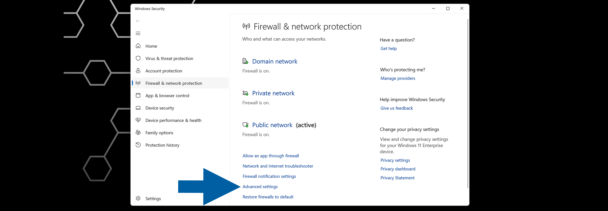
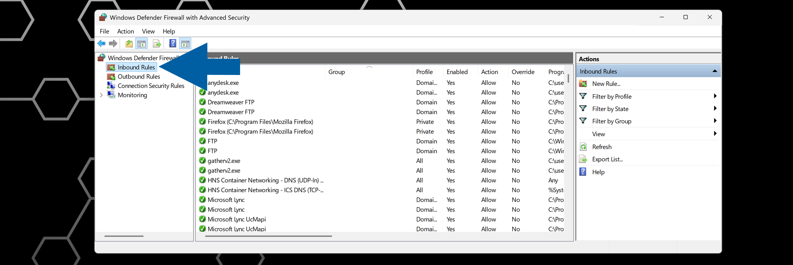
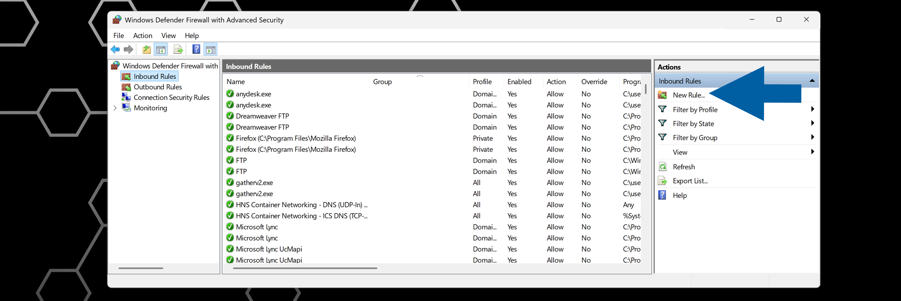
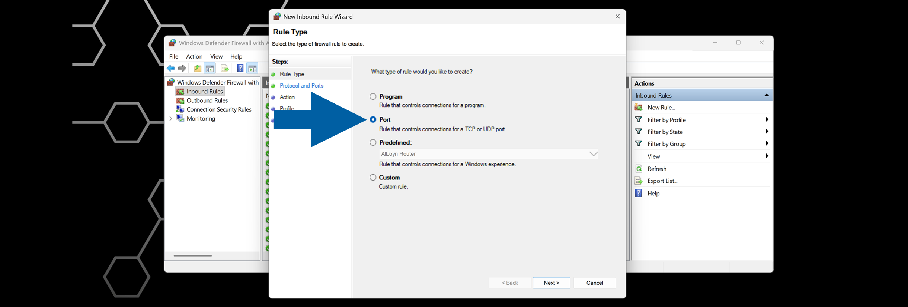
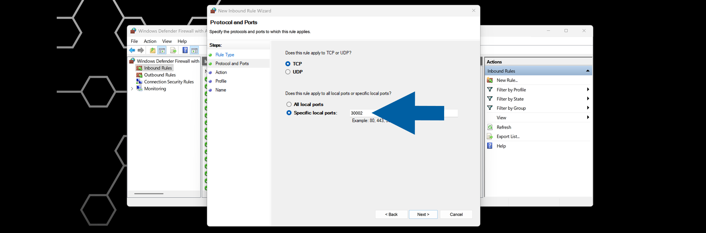
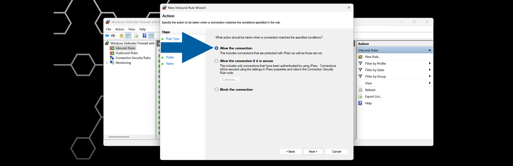
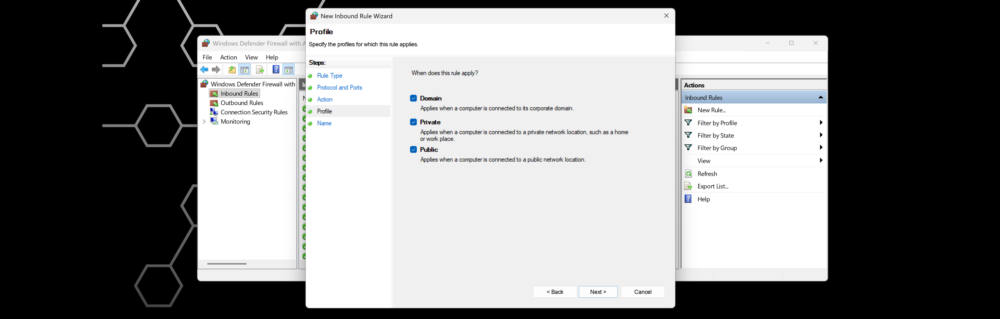
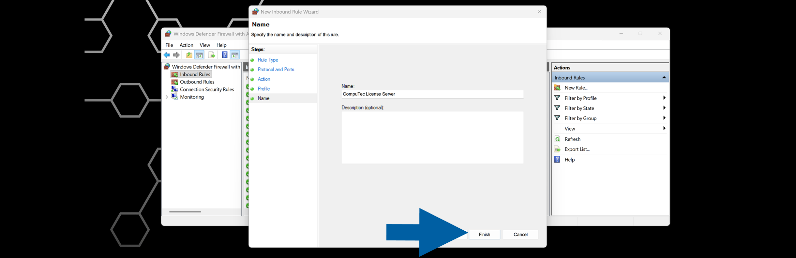

# CompuTec License Server Installation

The **CompuTec License Server** manages user licenses for CompuTec solutions.

This guide explains how to install the **CompuTec License Server** and configure **Windows Firewall** to allow communication with client applications.

:::info[Note]

For information about available license types, see [**CompuTec ProcessForce User License Types**](../license-comparison-chart.md).
:::

## Before you start

Before you begin, make sure:

- You have administrator rights on the Windows server.  
- Any previous version of **CompuTec ProcessForce License Server** has been removed.
- Any previous version of **SAP COM License Bridge** has been removed (required only for environments that previously used **CompuTec ProcessForce 8.81**, **8.82**, or **9.0 PL05–PL08 HotFix**).
- You have downloaded the [latest **CompuTec License Server** installation package](../../../releases/download.md).

:::caution[important]

**CompuTec License Server** is supported only on **Windows** operating systems.
:::

## Install and congigure CompuTec License Server

### Step 1: Install CompuTec License Server

1. Extract the **CompuTec License Server** installation package.
2. Run **CompuTec.LicenseServer.Setup.msi**.
3. Click **Next**.

    

4. Accept the default installation folder (recommended) or select a custom location.
5. Click **Next**.  

    

6. Review the installation settings, and click **Install**.

    

7. Wait for the installation to finish.
8. Click **Finish**.

    

### Step 2: Configure Windows Firewall

To allow communication with the **CompuTec License Server**, create an inbound firewall rule for **TCP** port ``30002``.

1. Open **Windows Settings**.
2. Navigate to **Windows Security** > **Firewall & network protection**.
3. Click **Advanced settings**.

    

4. In **Windows Defender Firewall with Advanced Security**, select **Inbound Rules**.

    

5. Click **New Rule...**.

    

6. Select **Port**, and click **Next**.

    

7. Select **TCP**.
8. Enter ``30002`` in **Specific local ports**.

    

9. Click **Next**.
10. Choose **Allow the connection**, and click **Next**.

    

11. Select all profiles: ``Domain``, ``Private`` and ``Public``, and click **Next**.

    

12. Enter a name for the rule, and click **Finish**.

    

## Result

After completing the installation:

- **CompuTec License Server** is installed and running.
- **Windows Firewall** allows inbound **TCP** connections on port ``30002``.
- CompuTec applications can connect to the **License Server** and validate user licenses.

:::info[note]
If client applications cannot connect to the **License Server** after installation:

- Verify that the **License Server** service is running.
- Confirm that **TCP** port ``30002`` is open.
- Check local and network firewall settings.
- Verify connectivity between the client workstation and the **License Server**.

:::
