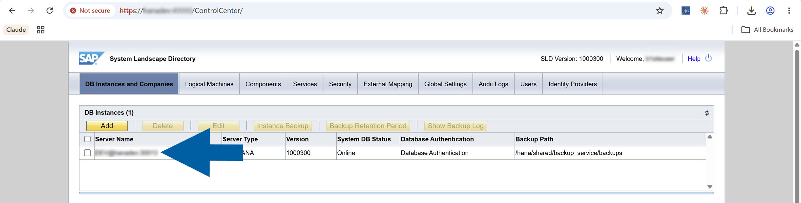

# Configure CompuTec Service Manager

**CompuTec Service Manager** is part of the **CompuTec License Server** suite. It provides a central location for managing CompuTec services and licensing components.

Using **CompuTec Service Manager**, you can:

- Start, stop, and restart CompuTec services.
- Configure service settings.
- Manage terminal licenses and licensing components for CompuTec solutions.
- Review and update **License Server** settings.
- Access service logs and diagnostic information.

## Before you start

Before you begin, make sure that:

- CompuTec **License Server** is installed.
- You have ``administrator`` permissions on the Windows server.

:::note[info]

For installation instructions, see the [**CompuTec License Server Installation**](computec-license-server-installation.md) guide.
:::

## Open CompuTec Service Manager

To use **CompuTec Service Manager**, follow these steps:

1. Open the **Windows Start menu**.
2. Locate and launch **CompuTec Service Manager**.

   

3. After the application starts, the CT icon appears in the Windows notification area.

4. Click the **CT icon** to open the **CompuTec Service Manager** window.

   

5. The main **Service Manager** window displays all available CompuTec services.

   

   From here, you can:

   - **Start** a service.
   - **Stop** a service.
   - **Refresh** a service.
   - Open service-specific **Settings**.
   - Manage licenses for **CompuTec PDC** (**Plant Data Capture**) and **CompuTec WMS** (**Warehouse Management System**).

## Configure Service Settings

To configure service settings, follow these steps:

1. Select the service from the list.

      

2. Click **Settings**.

      

3. The **Server Settings** tab allows you to configure the **License Server**.

   

   In the **Server Settings** tab, you can:
   - View or update **Server Name**: The name of the **CompuTec License Server**.
   - View or update **Port Number**: The communication port used by the **CompuTec License Server**. The default value is recommended unless your environment requires a different port.
   - Test the server connection: Click **Test** next to the port number.

      

   - Configure additional parameters:  
      - **Logging Level**: Controls the amount of information written to log files.
      - **Log Location**: Displays the location where log files are stored.

## Configure CompuTec License Server Database Connection

To allow the **CompuTec License Server** to communicate with **SAP Business One** company databases, configure a database connection.

### Step 1: Add a database server

To establish a connection between the **CompuTec License Server** and the **SAP Business One** database, follow these steps:

1. Click the **Database Connection** tab.

   

2. Enter the database server details, and click **Add**.

   

   :::note[info]

   Depending on a database server type, specify the server name in the below format:

      | Database Server Type | Server Name Format | Example |
      | --- | --- | --- |
      | Microsoft SQL Server (default instance) | ``ServerName`` | ``Test-System`` |
      | Microsoft SQL (named instance) | ``ServerName\InstanceName`` | ``Test System\Production`` |
      | SAP HANA | ``ServerName:Port`` | ``10.0.0.199:30015`` |

   

   
For **SAP HANA Server** users

   The method of obtaining the database server name depends on your **SAP Business One** authentication method.

      - **Classic SAP Business One login**: The database server name is displayed in the **Current Server** field of the **SAP Business One menu** > **Admistration** > **Choose Company** window.

         

      - **SAP Business One Authentication Server or Active Directory Domain Services**: You can find the database server information in one of the following locations:
         - the **Choose Company** window displayed during sign-in, where the server is shown in the format: ``TenantName@DatabaseServer:Port``. Example: ``DEV@hanadev:30013``.
         - **System Landscape Directory(SLD)** > **DB Instances and Companies**, where the **Server Name** column displays the connection in the same format.

            
   

   

   
For **Microsoft SQL Server** users

   For **Microsoft SQL Server**, you can also verify the server and instance name in **SQL Server Management Studio**:

      - Click **Connect** in **Object Explorer**, and then select **Browse for more...** in the **Server name** field.

         

      - You will find the server details in the **Browse for Servers** window.

         
   

   :::

3. Select the **Database Server Type**.
  
   

4. Enter the **Database User Name** and **User Password**, and click **Save**.

   

   :::info[note]
   You can configure connections to multiple database servers.

   

   :::

5. If the connection is successful, a confirmation message appears and the number of company databases available on the server is displayed next to the server entry.

   

    :::caution[important]
      To see a newly restored/imported company database, refresh the company list before refreshing the database list in **CompuTec License Server**.

      
    :::

### Step 2: Verify the connection

1. Click on the database name to expand its server node.

   

    :::info
        After this step, the warning: `Direct Data Access mode is disabled.` will no longer appear when launching CompuTec ProcessForce, provided that the connection to CompuTec License Server is configured correctly in CompuTec ProcessForce License Administration (see [Extension → License assignment section](../../installation/first-installation/extension)).
    :::

2. Verify that the required SAP Business One company databases are available.

   

   :::info[note]
   When you select a configured database server, the stored credentials are masked for security reasons.

   

   :::

3. Done! You've successfully configured **CompuTec License Server Database Connection**.

:::info[note]

To use **CompuTec ProcessForce** with **CompuTec License Server**, make sure that:

- the database connection is configured in **CompuTec License Server**, and
- a valid **CompuTec ProcessForce** license is imported and assigned. [Read more](http://learn.computec.one/docs/processforce/administrator-guide/licensing/license-import-and-assignment)

When both configurations are complete, the ``Direct Data Access mode is disabled`` warning no longer appears when starting **CompuTec ProcessForce**.
:::

## Result

After completing these steps, you can:

- Access and manage CompuTec services from a single location.
- Start, stop, and restart CompuTec services.
- Manage licensing for **CompuTec PDC** and **CompuTec WMS**.
- Review and update **CompuTec License Server** settings.
- Configure logging options for troubleshooting and diagnostics.
