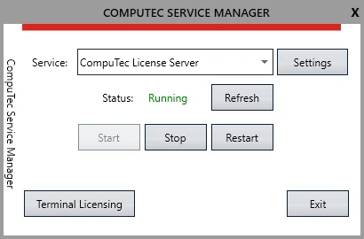

# Configure CompuTec Service Manager

The **CompuTec Service Manager** is part of the CompuTec License Server suite. It provides a central interface to start, stop, and configure CompuTec solutions such as CompuTec PDC, CompuTec WMS, and licensing components. This guide provides step-by-step instructions for setting up and using the CompuTec Service Manager to ensure seamless operation and optimal performance.

:::info
For installation instructions, see the [CompuTec License Server Installation Guide](./computec-license-server-installation.md).
:::

---

---

## Prerequisites

- CompuTec License Server must already be installed.  
- You need administrator rights on the Windows system.  

---

## Steps to Start CompuTec Service Manager

### Step 1: Open CompuTec Service Manager

1. Go to the **Windows Start menu** → locate **CompuTec Service Manager** in the program list.  

   

2. When launched, the **CT icon** appears in the Windows notification area.  

   

3. Click the icon to open the **CompuTec Service Manager** window.  

   

### Step 2: Manage Services

Inside the **Service Manager** window you can:

- **Start, stop, or restart** individual CompuTec services.  
- Open service settings by selecting a service and clicking **Settings**.  

The **Terminal Licensing** section lets you manage licenses for:

- **CompuTec PDC** (Plant Data Capture)  
- **CompuTec WMS** (Warehouse Management System)

### Step 3: Adjust License Server Settings

1. In the **Server Settings** tab, you can view or update configuration values:  
   - **Server Name**  
   - **Port Number** (default recommended)  

   

2. (Optional) Configure additional parameters:  
   - **Logging Level**: controls the detail of logs.  
   - **Log File Location**: shows where log files are stored.  

---

## Outcome

After following these steps, you can:

- Launch and access CompuTec Service Manager from Windows.  
- Control the state (start/stop/restart) of CompuTec services.  
- Manage licensing for PDC and WMS.  
- Review or adjust License Server settings, including server name, port, and logging options.
