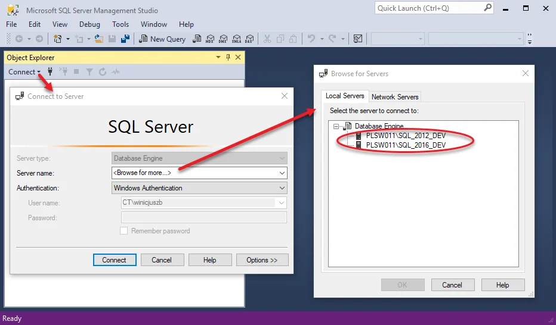
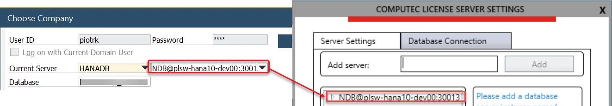
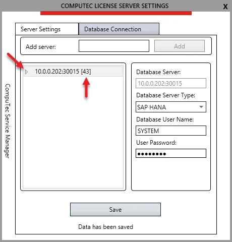
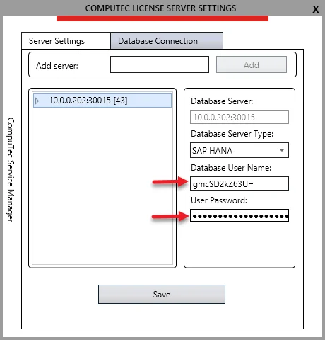

# Configure CompuTec Service Manager

CompuTec Service Manager is a crucial component of the CompuTec License Server suite, allowing users to manage and configure various CompuTec services efficiently. This guide provides step-by-step instructions for setting up and using the CompuTec Service Manager to ensure seamless operation and optimal performance.

:::info
    CompuTec Service Manager is a part of CompuTec License Server. For installation details, please refer to  [the CompuTec License Server Installation Guide](./license-server-installation.md).
:::

---

## Starting CompuTec Service Manager

Once the CompuTec License Server is installed, the CompuTec Service Manager can be accessed from the Windows program list.

    

Clicking the shortcut will place the CT icon in the Windows notification area:

Opening the Manager displays the COMPUTEC SERVICE MANAGER window, where you can start, stop, or restart a selected CompuTec service:To configure a specific service, click the Settings button. The Terminal Licensing section allows you to manage licenses for CompuTec PDC and CompuTec WMS solutions.

Configuring the settings of a selected service is possible after clicking the Settings button.

Terminal Licensing is a section for managing the license of CompuTec PDC / CompuTec WMS solutions.

## CompuTec License Server Settings

The Server Settings tab allows users to modify server configurations such as the Server Name and Port Number. You do not have to change the default values:

You can also specify a logging level and see a disk location where logs are kept.

## Configuring CompuTec License Server Database Connection

To establish a connection between the CompuTec License Server and the SAP Business One database, follow these steps:

1. In the COMPUTEC LICENSE SERVER SETTINGS window, switch to the Database Connection tab:

    

2. Retrieve the database server details from the SAP Business One interface:

    :::info Path
        SAP Business One → Administration → Choose Company
    :::

    

    Click "Add" after setting the server name:

    

    :::info
        Depending on a database server type, specify the server name in the below format:

        | Database Server Type                   | Server Name Format      | Example                |
        | -------------------------------------- | ----------------------- | ---------------------- |
        | Microsoft SQL Server, default Instance | ServerName              | Test-System            |
        | Microsoft SQL, Named Instance          | ServerName\InstanceName | Test System\Production |
        | SAP HANA                               | ServerName:Port         | 10.0.0.199:30015       |
    :::

    For Microsoft SQL Server/instance name, use the SQL Server Management Studio to verify the server instance.

   

    You can read the SAP Business One HANA server and port in the SAP Business One installation:

    

3. Set a database server type of added server:
  
    

4. Specify the database user name and password, and click "Save":

    

5. If the inserted data are correct, then the 'Data has been saved' message appears, and the company database number is displayed next to the server position:

    :::caution
        Please note that the application does not show a newly restored/imported company database until Choose Company list in the SAP Business One client is refreshed.
    :::

    

    :::info
        After this step, the warning: `Direct Data Access mode is disabled.` will no longer appear when launching ProcessForce, provided that the connection to CompuTec License Server is configured correctly in ProcessForce License Administration (see [Extension → License assignment section](../../installation/first-installation/extension)).
    :::

6. Expand the database list to confirm that a particular SAP Business One company is using Direct Data Access:

    

    :::caution
        Please note that there is a need to refresh the list each time you add/import a new company database:

        
    :::

7. Upon highlighting the added database server position, you will no longer see the inserted database username and the actual password length, as they are now masked.

    

    >**info**: It is possible to set up more than one database server:

    

---
