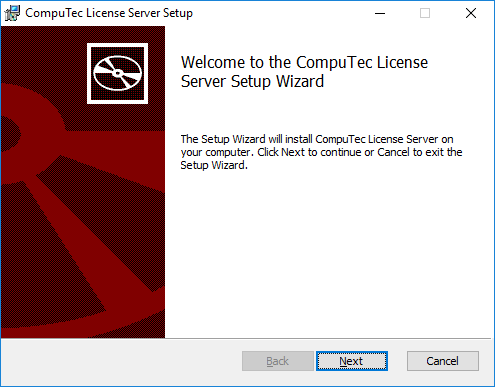
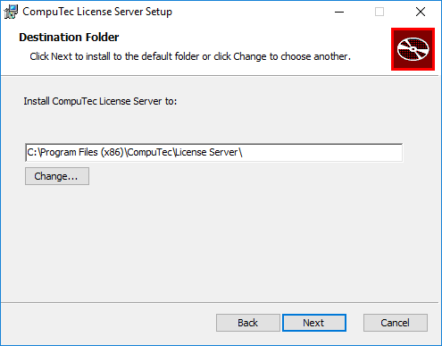
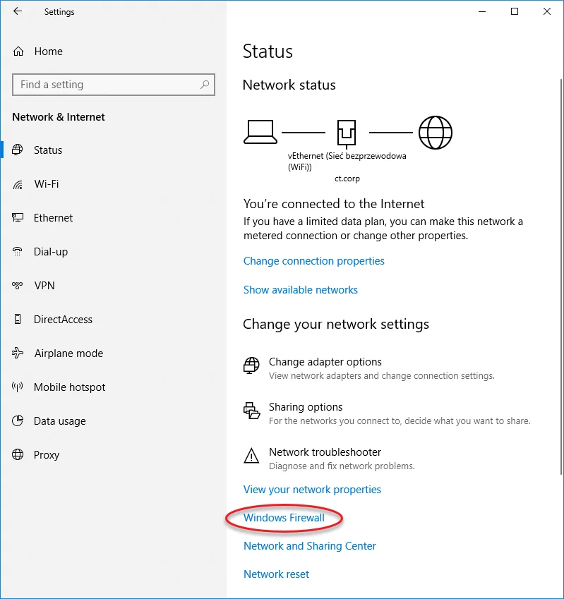
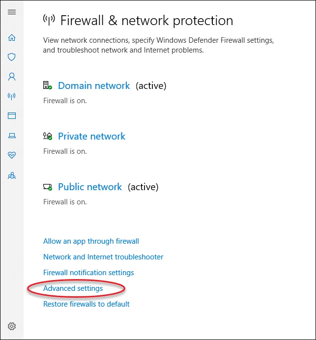
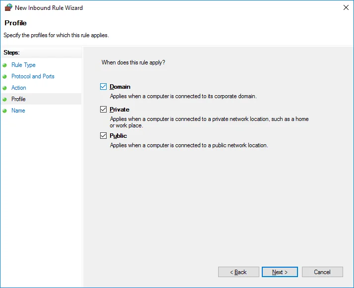

# CompuTec License Server Installation

The **CompuTec License Server** is required to manage user licenses for CompuTec solutions.  
This tutorial guides you through installing the License Server on a Windows system and configuring the firewall so that it can communicate on the correct port.

:::info
For details about available license types, see [**CompuTec ProcessForce User License Types**](../license-chart.md).
:::

---

## Prerequisites

Before you begin:

- You must have administrator rights on the Windows system.  
- Remove any previously installed versions of:
  - **CompuTec ProcessForce License Server**  
  - **SAP COM License Bridge** (if used with ProcessForce 8.81, 8.82, or 9.0 PL05–PL08 HotFix).  
- Ensure you have downloaded the [latest CompuTec License Server package](../../../releases/download.md).

:::caution
    CompuTec License Server can be installed in a **Windows environment** only.
:::

---

## Steps to Install CompuTec License Server

### Step 1: Run the Installer

        - Extract the ZIP file.
        - Run the `CompuTec.LicenseServer.Setup.msi` file and click "Next":

            

### Step 2: Choose Installation Location

        - Accept the default folder (recommended) or choose a custom location.  
        - Click **Next**.  

            

### Step 3: Complete Installation

        - Confirm settings and click **Install**.  
        - When the installation finishes successfully, click **Finish**. 

            

            

### Step 4: Configure Windows Firewall

1. Navigate to `Windows Settings → Network & Internet → Windows Firewall`:

    

2. Click on **Advanced settings** option:

    

3. In the Windows Firewall with Advanced Security window, select Inbound Rules and click New Rule... to open the New Inbound Rule Wizard.

    

4. Choose **Port** as the rule type:

    

5. Choose **TCP** protocol and specify **30002** as the local port:

    

6. Choose **Allow the connection**:

    

7. Choose **all profiles**:

    

8. Specify the rule name and click **Finish**:

    

---

## Outcome

You have successfully:

- Installed the CompuTec License Server.  
- Configured Windows Firewall to allow inbound TCP connections on port 30002.  

Your CompuTec solutions can now connect to the License Server and validate licenses.  

---
