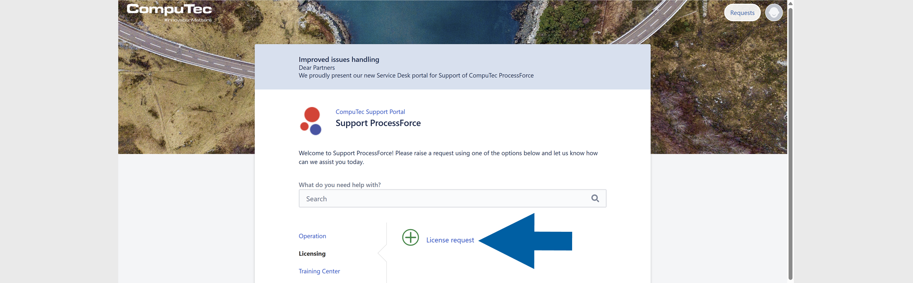
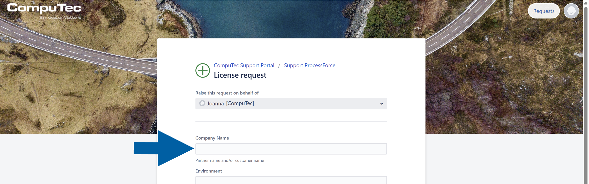
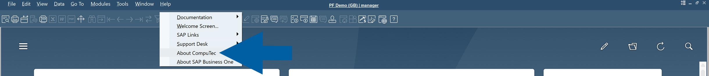
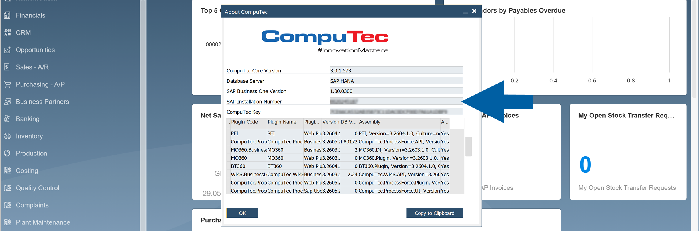
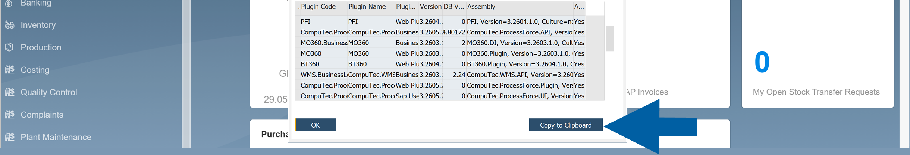
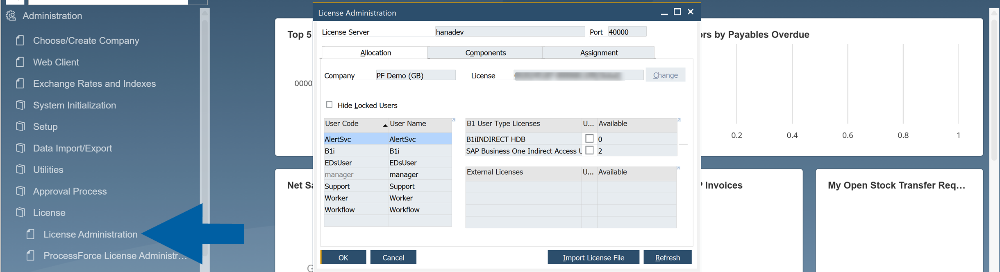
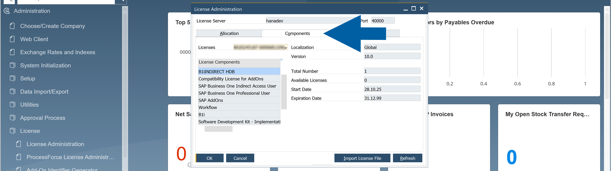
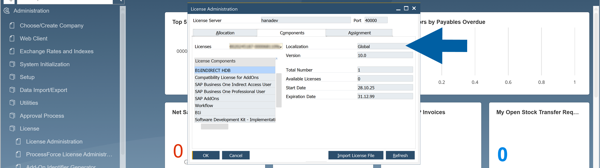

# Request CompuTec ProcessForce License

Before you can use CompuTec ProcessForce, you must obtain a valid license file from CompuTec Support. The license is generated based on your SAP Business One system information, so you must provide accurate system details when submitting your request.

Follow the steps from this guide to request your license.

## Step 1: Create a support ticket

1. Log in to the [**CompuTec Support Portal**](https://support.computec.pl/servicedesk/).
2. Navigate to **Support ProcessForce** > **Licensing**.
3. Click **+ License request** to create a new ticket.

    

4. Fill in the **Company Name** field.

    

## Step 2: Find the required information

1. In **SAP Business One**, go to: **Help** > **About CompuTec ProcessForce**.

    

2. From the **About CompuTec ProcessForce** window, copy these details:

    - **SAP Business One Version**: Example: ``9.3`` or ``10.0``.
    - **SAP Business One Installation Number**: This is a 10-character number.
    - **CompuTec Key**: This is a 40-character key.

    

    :::warning[important]
    Licenses are version-specific. When upgrading to another major version, request a new license.

    If the **Installation Number** is ``-1``, or the **CompuTec Key** field is empty, do not submit the request yet. [Read more](../../troubleshooting/licensing-issues.md)
    :::

3. To avoid mistakes, copy the values directly from the window. You can use **Copy to Clipboard** option.

    

## Step 3: Check the SAP license localization

1. In **SAP Business One**, go to **Administration** > **License** > **License Administration**.

    

2. Navigate to  **Components** tab.

    

3. Find the **SAP Business One** license **Localization**.

    

## Step 4: Add all the required information to the ticket

1. In **CompuTec Support Portal**, add all the required information to the ticket.

    

2. In the **Description** field:
    - Specify where the license will be used:
        - Customer server
        - Partner internal server

    - Add the information about the license purpose:
        - Production / purchased license
        - Demo or test license  

        :::info[Note]
        Demo and test licenses are generated for **1 Professional user** by default.
        :::

3. Before submitting the ticket, check all the information.

## Step 7: Submit the ticket

1. Click **Create** to submit the ticket to CompuTec Support.

    

2. Wait for CompuTec Support to process your request and send you the license file.

## Step 8: Import the license file

After CompuTec Support sends you the license file, continue with the [**License Import and Assignment procedure**](../licensing/license-import-and-assignment.md).
