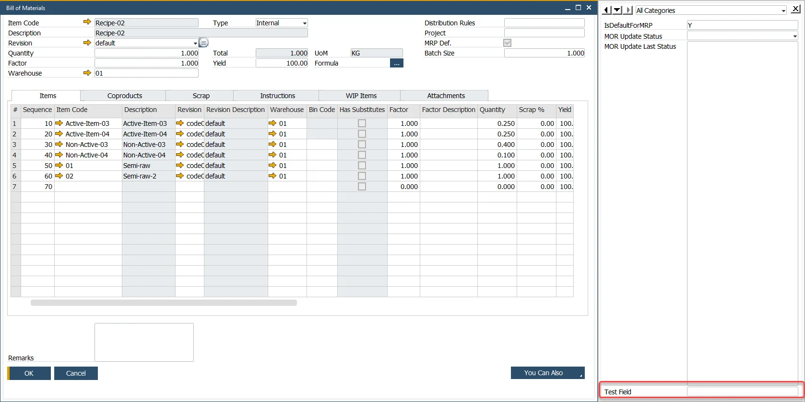

# Working with User-Defined Fields (UDFs)

SAP Business One allows the creation of **User-Defined Fields (UDFs)**, which are custom fields added to forms and tables to meet specific business needs. CompuTec ProcessForce fully supports this functionality, with a few limitations.

This guide shows you how to add UDFs to CompuTec ProcessForce forms, along with notes on recommended settings and constraints.

---

## What You Need to Know Before You Start

- UDFs can be added to CompuTec ProcessForce tables using the standard SAP Business One customization tools.
- Some CompuTec ProcessForce forms **do not support UDFs** or may encounter **errors** if UDFs are added.
- Always **ensure all other users are disconnected** from the company database before making UDF changes.

---

## Limitations

| Form or Area | UDF Support |
|--------------|-------------|
| Costed Bill of Materials | ❌ Not Supported |
| Item Costing & Resource Costing | ⚠️ May cause errors - avoid adding UDFs |
| Downtime Reason (Flat Forms) | ✅ Supported but not displayed on the form - visible only via side panel |

---

## Prerequisites

Ensure you have the following authorization in SAP Business One:

**`Customization Tools → User-Defined Fields - Management`**

Navigate to:

:::info Path
Administration → System Initialization → Authorizations → General Authorizations
:::

---

## How to Add UDFs to CompuTec ProcessForce Forms

1. Go to:

        :::info Path
        Tools → Customization Tools → User-Defined Fields - Management
        :::

2. Navigate to the relevant **User Table** under the *User Tables* section. CompuTec ProcessForce tables appear here:

    

        - Header tables (e.g., `BOM`)
        - Row tables (e.g., `BOM: Items`, `BOM: Scrap`)

3. Select the section (header or row) where you want to add a UDF and click **Add**.

        

4. Fill in required UDF details like: Title, Description, Data type, Field structure

    >**Note**: Title, Type, and Structure cannot be edited once the field is added. You must delete and recreate the UDF if needed.

    

5. Accept the prompt indicating a **database structure change**.

6. Review the list of active users. If others are logged in, disconnect them or try again later.

    :::caution
    Adding UDFs modifies the database structure. It is strongly recommended to **disconnect all users** before proceeding.
    :::

7. Restart the SAP Business One client to reflect the changes.

---

## Viewing and Using UDFs

### Header UDFs

- These are not shown directly on the form.
- Access them via:
    :::info Path
    View → User-Defined Fields
    :::

    or shortcut **Ctrl+Shift+U**

    

### Row UDFs

- Displayed as additional **columns** in the table grid on the form.

    

### Flat Forms (e.g., Downtime Reason)

- These do not support row structures.
- UDFs added will behave like **header UDFs**, viewable in the **side panel** only.

    

---

## Managing Visibility with Form Settings

You can control the visibility and activity of row UDFs using: Form Settings → Table Columns

> **Note**: Only **row UDFs** appear in the Form Settings window.

  

---

## Recommended Settings

After installing CompuTec ProcessForce, some UDFs are automatically added to core SAP Business One forms (e.g., `Revision` on Sales Order).

- **Keep these fields visible and active** to ensure proper behavior.
- Hiding these UDFs may result in **data inconsistencies or failed field updates**.

  

---

## Summary

| Task | Where | Notes |
|------|-------|-------|
| Add Header UDFs | `Tools → Customization Tools` | Access via side panel |
| Add Row UDFs | In table section | Visible as columns |
| Manage Visibility | `Form Settings` | For row UDFs only |
| Avoid Errors | Item Costing, Resource Costing, BOM Costed | May break functionality |

---

By following these best practices and constraints, you can safely extend CompuTec ProcessForce functionality with custom fields aligned to your unique business needs.

---
