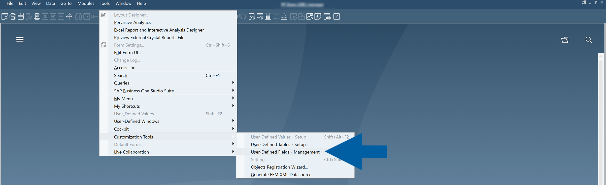
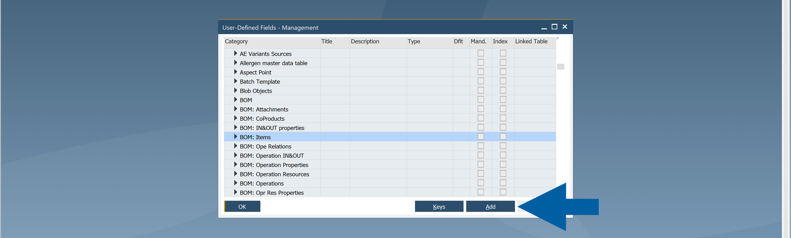
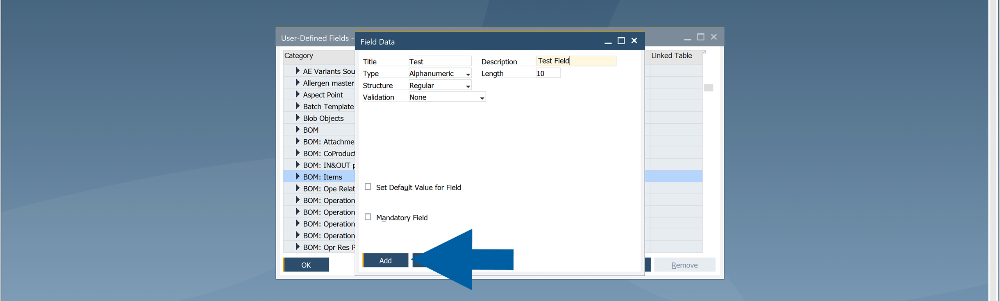
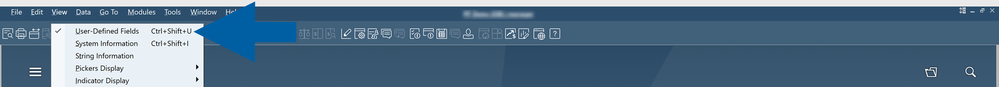
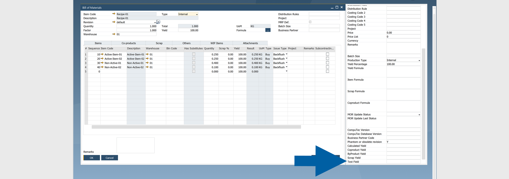
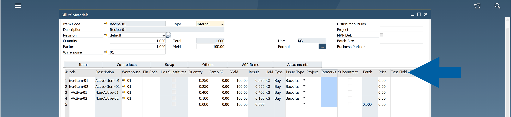
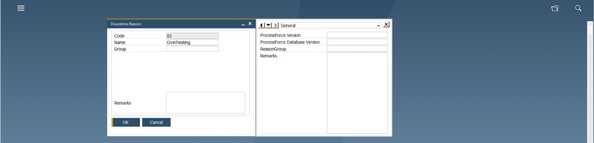
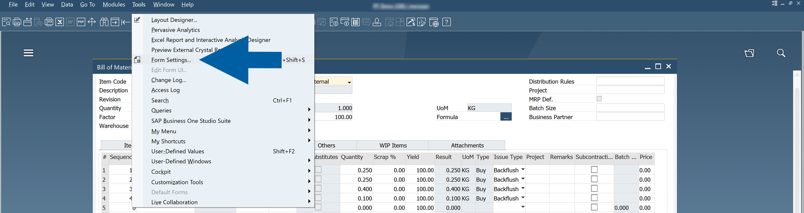
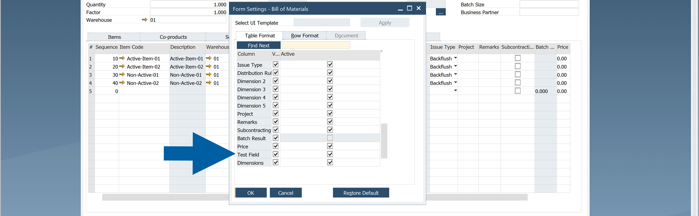
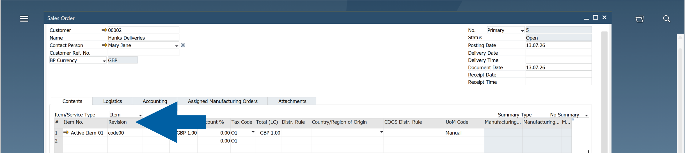

# Add User-Defined Fields (UDFs)

**CompuTec ProcessForce** supports **User-Defined Fields (UDFs)**, allowing you to extend forms and tables to meet your business requirements.

This article explains how to add **UDFs** to **CompuTec ProcessForce** objects, where they are displayed, and which limitations you should be aware of.

## Before you start

Before adding **UDFs**, make sure that:

- You have the ``User-Defined Fields - Management`` authorization in **SAP Business One Administration** > **System Initialization** > **Authorizations** > **General Authorizations**.
- All users are logged out of the company database.

:::warning[important]
Adding a **UDF** changes the database structure.

To avoid errors, disconnect all users before creating or modifying **User-Defined Fields**.
:::

## Supported forms

Most **CompuTec ProcessForce** forms support **User-Defined Fields (UDFs)**.

However, the following forms either **do not support UDFs** or **have limitations** that you should be aware of before adding custom fields:

| Form | Support |
| --- | --- |
| Costed Bill of Materials | Not supported |
| Item Costing | Not recommended |
| Resource Costing | Not recommended |
| Downtime Reason | Supported (displayed in the side panel only) |

## Add a User-Defined Field

1. In **SAP Business One**, go to **Tools** > **Customization Tools** > **User-Defined Fields - Management**.

    

2. Click **User Tables**.

    

3. Select the **CompuTec ProcessForce** table you want to customize, and click **Add**.

        

        :::note[info]
        You can use UDFs in two types of tables:

        - Header tables (e.g., `BOM`)
        - Row tables (e.g., `BOM: Items`, `BOM: Scrap`)
        :::

4. Enter the field information:

   - **Title**
   - **Description**
   - **Data Type**
   - **Structure**

   

   :::info[note]
   After the field is created, you can't change its **Title**, **Data Type**, or **Structure**. To modify these properties, delete the field and create it again.
   :::

5. Confirm the database structure update.

6. Restart the **SAP Business One** client.

## View User-Defined Fields

### Header UDFs

Header UDFs are available from the **User-Defined Fields** window.

To view header UDFs, follow these steps:

1. Open the form, for example: **Bill of Materials**.
2. Click **View** > **User-Defined Fields**.

    :::note[info]
    You can also use the **Ctrl+Shift+U** shortcut.
    :::

    

3. Done. Now you can see the added header UDF in the side panel next to your form.

    

### Row UDFs

Row UDFs appear as additional columns in the table.

    

### Flat forms

Some forms, such as **Downtime Reason**, do not contain row tables.

In these forms, UDFs are available only from the **User-Defined Fields** side panel using **View** > **User-Defined Fields** option.

    

## Control UDF visibility

You can control whether row UDFs are displayed in the table.

To hide or show your UDFs in the table, follow these steps:

1. Open the table you want to edit.
2. Go to **Tools** > **Form Settings**.

    

3. In the **Table Format** tab, find your UDF and choose whether you want to hide or show it in the table.

    

    :::info[note]
    Only **row UDFs** can be managed through **Form Settings**
    :::

## Important

During installation, **CompuTec ProcessForce** adds several User-Defined Fields to standard **SAP Business One** forms, such as the **Revision** field on **Sales Orders**.

Do not hide or deactivate these fields. They are required for **CompuTec ProcessForce** to function correctly.

    

## Best practices

- Use a consistent naming convention for your UDFs.
- Add a unique company or partner prefix to every custom field.
- Do not add UDFs to **Costed Bill of Materials**, **Item Costing**, or **Resource Costing** forms.
- Keep the User-Defined Fields installed by **CompuTec ProcessForce** visible and active.

For naming recommendations, see [**Use Prefixes for Custom User-Defined Fields**](docs/processforce/administrator-guide/udfs/implementation-notes.md).
