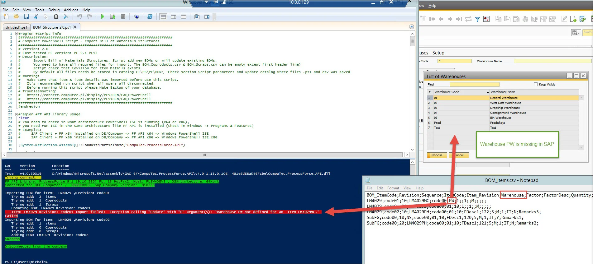
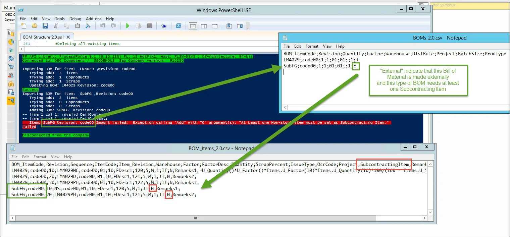

# Bill of Materials Issues

This section covers common issues encountered when importing Bill of Materials (BOM) data using PowerShell scripts. It will be regularly updated based on reports from the support portal and insights from CompuTec consultants.

---

## Exception: Warehouse xx is not defined for an Item xxxxxx

Example 01: Exception: Warehouse PW not defined for an Item LM4029MC.

**Diagnose Steps (for the example)**

1. Open the BOM_Items.csv file and locate the Warehouse value for the affected item (e.g., LM4029MC).
2. In SAP Client, navigate to Warehouse Management and display all available warehouses.
3. Verify if the Warehouse Code exists in SAP:
    - If it does exist, proceed to Example 2 below.
    - If it does not exist, follow the solution steps outlined below.

**Solution**

Set the correct Warehouse code in the BOM_Items.csv file for itemCode LM4029MC or add Warehouse to SAP with Warehouse Code ex. PW.

## Example 02: Exception: Warehouse 01 not defined for an Item LM4029Mc

**Diagnose Steps (for the example)**

- Does the Warehouse code exist in SAP Business One?
  - If no, go to [Example 1](#exception-warehouse-xx-is-not-defined-for-an-item-xxxxxx)
  - If yes, check the name of the Item in the file to import BOM_Items.csv and compare it with the Item name in SAP Business One.

**Solution**

- Item in BOM_Items.csv needs to have the same names as in Item Master Data in SAP.
- Ensure there are no differences in uppercase and lowercase letters in the item name. For example, LM4029Mc and LM4029MC.

## Exception: At Least one Non-stock item must be set as Subcontracting Item {#exception-1}

**Diagnose Steps**

1. Open BOM_Items.csv and locate the BOM entries for Item SubFG and Revision Code 00.
2. Ensure that at least one item is marked as SubcontractingItem = Y.

**Resolution**

None of the Items in Bill of Material of type external is marked as Subcontracting Item

## Exception: At Least one Non-stock item must be set as Subcontracting Item {#exception-2}

**Diagnose Steps**

1. Open BOM_Items.csv and locate the BOM items for Item SubFG and Revision Code 00.
2. Identify which items are marked as SubcontractingItem = Y.
3. Open SAP B1 Client and check the Item Master Data for each subcontracting item.
4. Verify that the Stock Item field is "unchecked".

**Resolution**

When importing an external type Bill of Materials (BOM), one of the items marked as a subcontracting item can have the Stock Item field **unchecked**.

---
