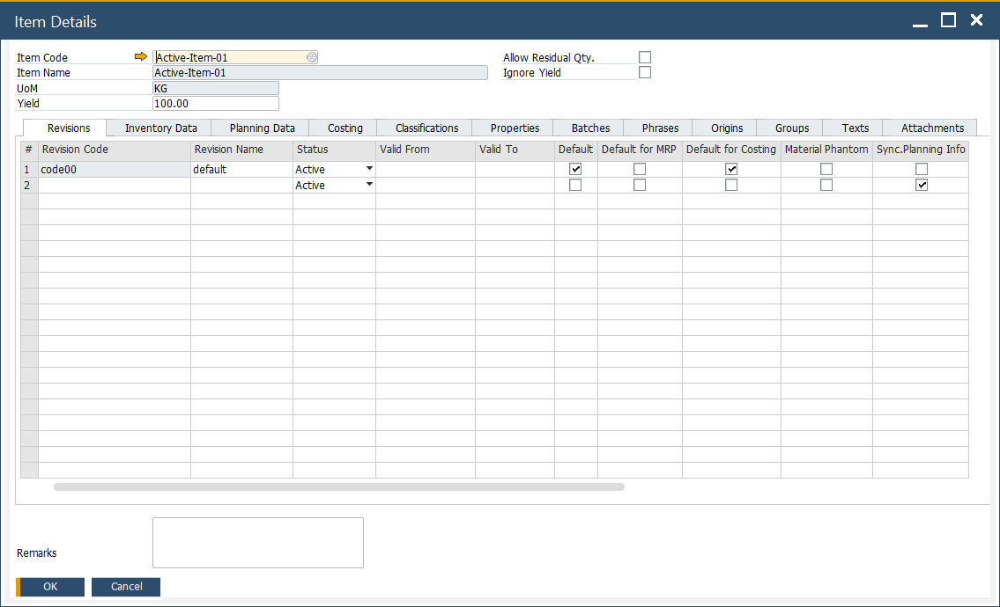
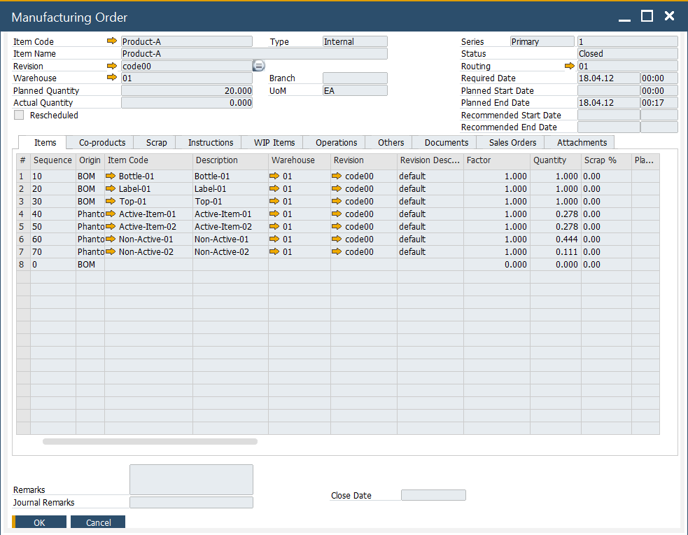

# Introduction to CompuTec ProcessForce

This guide introduces you to **CompuTec ProcessForce**, an advanced manufacturing add-on for SAP Business One. You’ll learn how to install and activate it, explore the first navigation steps, and get a quick overview of the key functional modules.

---

## Prerequisites

Before starting, make sure:

- Your system meets the [minimum requirements](./administrator-guide/system-requirements.md).  
- You have installation files for both the **CompuTec License Server** and the **ProcessForce add-on**. [Download them here](./releases/download.md).

## Step-by-Step Installation

1. Follow the [installation guide](./administrator-guide/installation/first-installation/license-server.md) to set up the CompuTec License Server.
2. Use the standard SAP Business One Add-on Manager to install CompuTec ProcessForce.
3. After installation, the add-on runs in **trial mode for 14 days**.
4. Before the trial expires, request a valid license from your CompuTec ProcessForce provider. [Learn how here](./administrator-guide/licensing/license-request.md).
5. Access the add-on through the SAP Business One menu. To do so, navigate to:
   :::info Path
   Main Menu → Administration → Add-ons
   :::

## Navigation Overview

Once installed, CompuTec ProcessForce modules are available under the SAP Business One **Main Menu**:

---

## Key Functional Modules

Below is a summary of the most important ProcessForce modules:

### General Settings

Here you can define general CompuTec ProcessForce settings, e.g. set default values or time constraints for many of the add-on features.

To access General Settings, navigate to:

:::info Path
Administration → System Initialization → General Settings → ProcessForce
:::

➡️ Learn more more about [General Settings](./user-guide/system-initialization/general-settings/overview.md).

### Item Details

Extended Item definition allows assigning much more information to an item. In the menu, you can assign revision, classifications, phrases, groups, texts, and attachments to a specific item.

To access Item Details, navigate to:

:::info Path
Inventory → Item Details
:::

➡️ Learn more about [Item Details](./user-guide/item-details/overview.md)

### Ingredient Declarations

CompuTec ProcessForce provides an extension to product master data. Nutrient and ingredient information can be used to create complex ingredient listings and declaration statements, thus are useful in the creation of product labels.

To access Ingredients, navigate to:

:::info Path
Inventory → Ingredients
:::

➡️ Learn more about [Ingredients](./user-guide/ingredient-declarations/overview.md).

---

### Batch Control

Batches are groups of the same products. Batch Master Data functionality allows to define of many values for a whole group of the same products.

To access Batches, navigate to:

:::info Path
Inventory → Item Management → Batches
:::

➡️ Learn more about [Batch Control](./user-guide/inventory/batch-control/overview.md).

### Batch Traceability

Batches are a base for traceability – a function that allows to track down a certain raw material on every level of production and a product in later distribution, which can be used e. g. in a fast and easy recall process. Batch Trace functionality allows tracing a whole track that a certain product passed.

To access Batch Traceability, navigate to:

:::info Path
Inventory → Item Management → Batches → Batch Traceability
:::

➡️ Learn more about [Batch Traceability](./user-guide/inventory/batch-control/batch-traceability.md)

### Bill of Materials (BOM)

To access Bill of Materials, navigate to:

:::info Path
Production → Bill of Materials
:::

➡️ Learn more about [Bill of Materials](./user-guide/formulations-and-bill-of-materials/bill-of-materials/overview.md).

### Production Routings

Routing determines the steps that are performed in the manufacturing process for a specific product. Resources required for production and Operations performed on it can be defined within Routing. CompuTec ProcessForce solution allows defining of many settings for Routing, Operation, and Resource.

To access Routings, navigate to:

:::info Path
Production → Routings
:::

➡️ Learn more about [Routings](./user-guide/routings/overview.md).

### Manufacturing Order

CompuTec ProcessForce Manufacturing Orders are used to plan, execute and record production activities.

:::info Path
Production → Manufacturing Order
:::

➡️ Learn more about [Manufacturing Order](./user-guide/manufacturing/manufacturing-order/overview.md).

### Production Scheduling

Based upon many resources and time constraints, CompuTec ProcessForce provides a simple but powerful scheduling solution to manage the Manufacturing Orders within the plant and to manually re-schedule via "drag and drop" means.

To access Scheduling, navigate to:

:::info Path
Manufacturing Order → Scheduling
:::

➡️ Learn more about [Scheduling](./user-guide/scheduling/overview.md).

### Item Costing

CompuTec ProcessForce Product Costing has been built to take advantage of all the costing methods provided by SAP Business One. Thus providing a solution that supports the costing, analysis, and finance controlling operations.

To access Item Costing, navigate to:

:::info Path
Main Menu → Costing
:::

➡️ Learn more about [Item Costing](./user-guide/costing-material-and-resources/item-costing/overview.md).

### Plant Maintenance

### Quality Control

A Quality Control Test can be generated using predefined test protocols, from Goods Receipt PO, Complaint, Manufacturing Order. A request for it can also be set up by an SAP Business One Business Alert. QC functionality allows to set a wide range of details for a quality test, e.g. test protocol templates, Resources and Items used to conduct a test, assigned Inspector, frequency of a test, defects, reasons along with additional instructions and attachments, and more.

To access Quality Control, navigate to:

:::info Path
Main Menu → Quality Control
:::

➡️ Learn more about [Quality Control](./user-guide/quality-control/overview.md)

### Complaint Management

You can create and manage complaints from customers, suppliers, or internal departments. Functionality allows recording, analyzing and starting action upon complaints, among other things.

To access Complaint, navigate to:

:::info Path
Main Menu → Complaint
:::

➡️ Learn more about [Complaint](./user-guide/complaint-management/complaint.md).

---

## Next Steps

- Explore individual module documentation for task-specific usage.
- Learn how to configure initial settings in the Administrator Guide.
- Need support? Write to [https://support.computec.pl](https://support.computec.pl)

---
