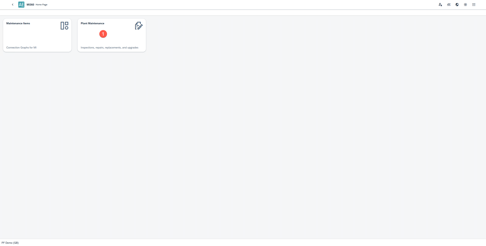
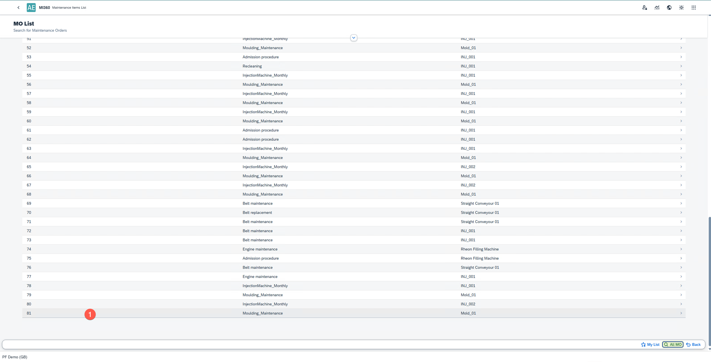
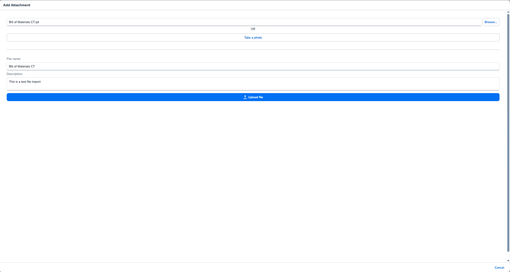
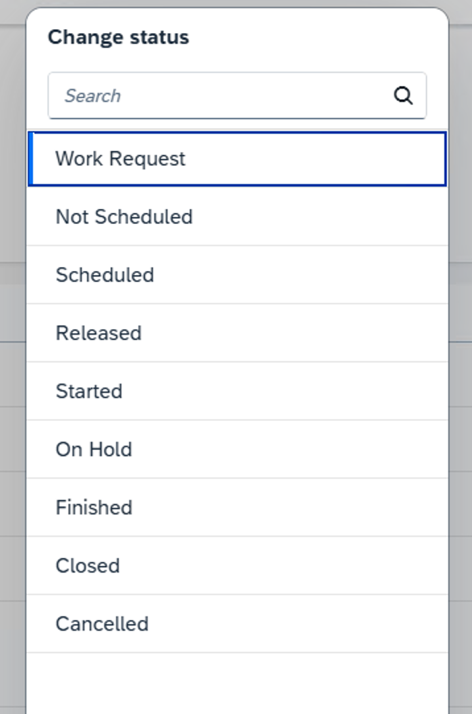
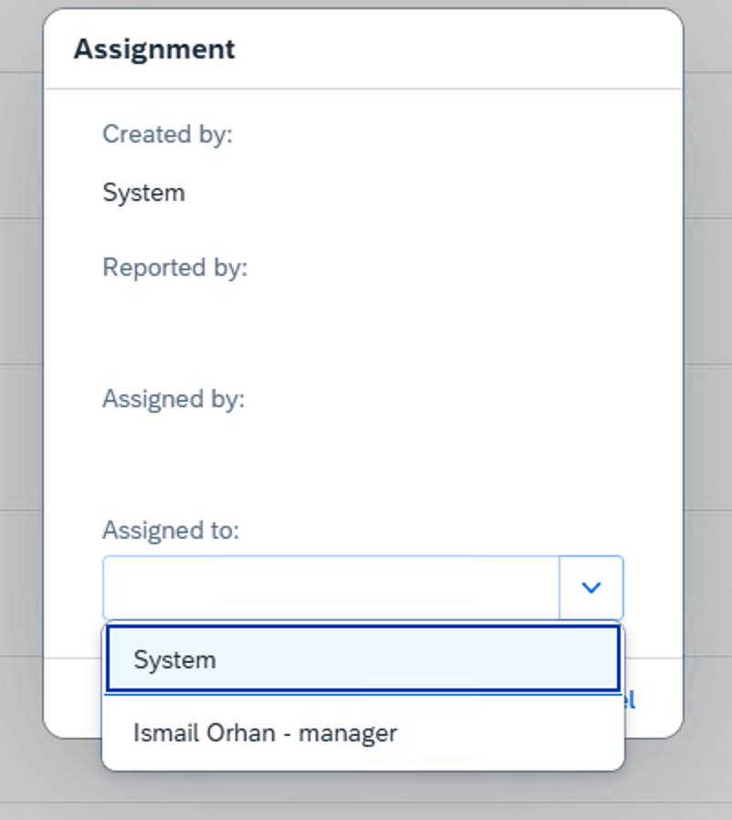
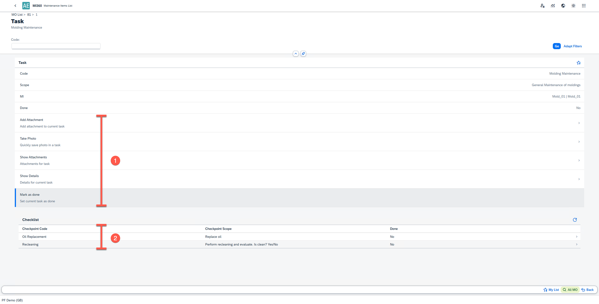

# Plant Maintenance

The Plant Maintenance module in MI360 enables users to manage and record maintenance operations directly from a web interface. It provides a clear overview of Maintenance Orders (MOs) and allows users to register actual task and checkpoint data in real time.

You can launch Plant Maintenance module from the MI360 Launchpad.

---

The Plant Maintenance home screen displays a list of Maintenance Orders (MOs) available to the user. It allows filtering, reviewing, and executing maintenance tasks efficiently within a structured workflow.

## 1. Viewing Maintenance Orders

    

    The module provides two main lists for managing Maintenance Orders:

    - **My List**: Displays Maintenance Orders that a user has personally added for focused tracking.
    - **MO List**: Displays all Released Maintenance Orders. Users can add items from this list to their My List or work on them directly.

        

    To view a Maintenance Order:
        - Select the desired Maintenance Order from either list.
        - The system navigates to the Maintenance Order Overview window.

## 2. Maintenance Order Overview

    

    The Maintenance Order Overview screen provides detailed insights into a selected Maintenance Order For example, in the screenshot above, Maintenance Order No. 81 is displayed.
    You can perform the following actions in this view:
        - Search for specific tasks using the search field.
        - Filter open tasks by selecting the Open Tasks checkbox.
        - Add or remove filter options to refine the display.
        - Add or remove the MO from My List using the star icon.
        - Attach files or images related to the Maintenance Order.

            

    You can also:
        - Upload or capture photos and store them as attachments.
        - View a list of all attachments linked to the Maintenance Order.
        - View detailed Maintenance Order information such as description, status, and assigned employee.
        - Change the status of the Maintenance Order.

            

        - Reassign the order to another employee if necessary.

            

        - Mark the Maintenance Order as Done once all tasks are completed.
        - View the list of tasks associated with the Maintenance Order and select any task to proceed to task-level actions.

## 3. Proceeding with Tasks

    

    When a task is selected, you can:
        - Perform all the same actions as in the overview window (e.g., attach files, change status, view details).
        - Select a Checkpoint to start registering actual data for that task

## 4. Checkpoint Registration

    Checkpoints are the data entry level within a Maintenance Order. Each checkpoint represents a measurable or actionable maintenance activity (e.g., Oil Replacement).

        

    At this level, you can:
        - View and manage checkpoint details.
        - Select Maintenance Recording to log actual results.

## 5. Maintenance Recording

    

    The Maintenance Recording window allows users to document actual findings and outcomes for each checkpoint.

    You can:
        - Select or enter findings in the Findings field - for quantitative checkpoints, enter numeric values.
        - Add remarks in the Memo Follow-Up field to provide context for future Maintenance Orders triggered by this checkpoint.
        - Enter the recording date to register when the action took place.
        - Mark the recording as closed by selecting the Close checkbox.
        - Save the recording to update the Maintenance Order with the new data.

---
