# CompuTec Data Import & Export (PFI) Plugin

The **CompuTec Data Import & Export (PFI)** plugin helps you quickly import, update, and manage data in **CompuTec ProcessForce**. It replaces manual or script-based updates (such as PowerShell) with a clear, user-friendly interface designed for everyday business users.

**CompuTec PFI** is ideal for mass data updates, structured imports, and maintaining consistency across your CompuTec ProcessForce objects.

## Before you start

Before using CompuTec PFI, ensure the following:

1. The **CompuTec ProcessForce** plugin is installed and enabled for the relevant company.
2. If a new **UDF (User-Defined Field)** is added to a **CompuTec ProcessForce** object, restart the **CompuTec AppEngine** service to reflect the changes in PFI templates.

## Install the CompuTec PFI plugin

Follow the standard CompuTec AppEngine plugin installation steps described in [our installation guide](https://learn.computec.one/docs/appengine/plugins-user-guide/install-plugin).

## Access the CompuTec PFI plugin

To access the CompuTec PFI plugin, follow these steps:

1. In your browser, open the **CompuTec AppEngine site** and choose **Launchpad**.

    

2. Click **Log in with SAP Business One**.

     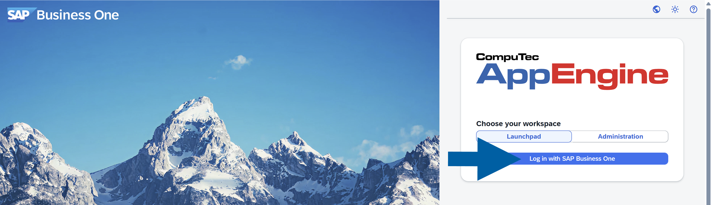

3. Log in using your **SAP Business One credentials**.

    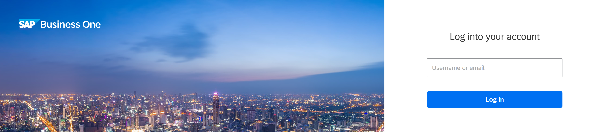

4. Select the **PFI plugin tile**.

    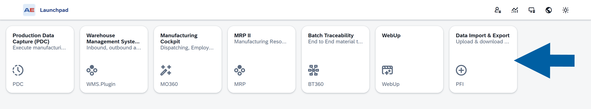

5. Choose the plugin with data import capability, for example, **CompuTec ProcessForce** plugin.

    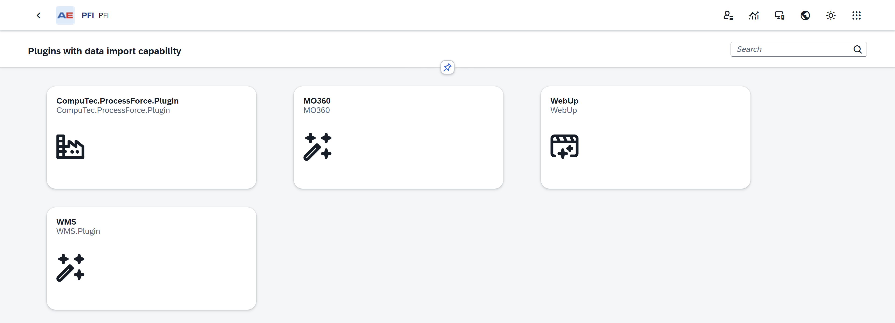

6. Choose the **CompuTec ProcessForce** object you want to work with, for example, **Bill of Materials**.

    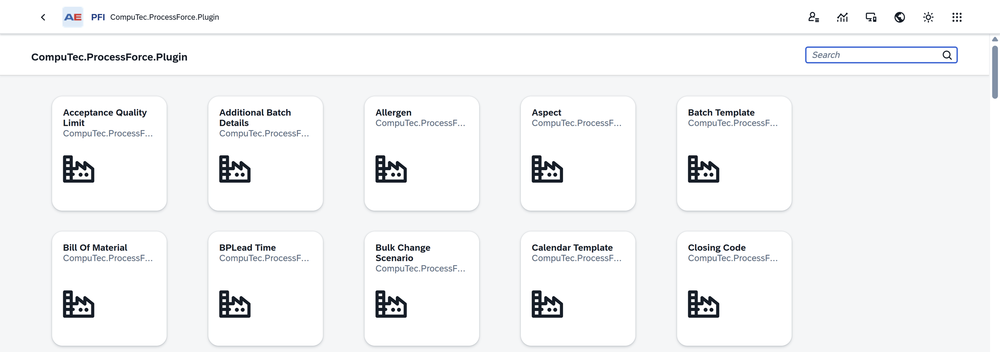

7. Done! Now you can start working with **CompuTec PFI** plugin.

## Using the CompuTec PFI plugin

### Header section

The header section provides key details and functionalities related to the selected object:

- **Object name**: Shows the name of the current object.

    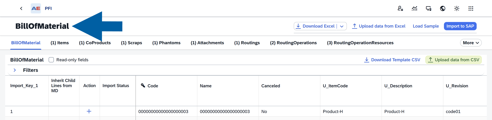

- **Related objects**: Helps you navigate between object levels. Clicking on a related object name displays the corresponding columns (database table properties) in the table below. The numbers in brackets indicate the object's hierarchy level, e.g., ``BillOfMaterial 0`` > ``Items 1``.

    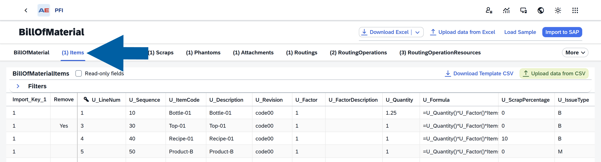

In the header section, you can:

- **Download Excel**: Export the table's content, including column names, to a Microsoft Excel file. If no sample data is loaded (see the **Load Sample** option below), this will download an empty file with only column headers. You can edit this file in Excel, save it, and upload it back into the plugin using the **Upload Data from Excel** option.

    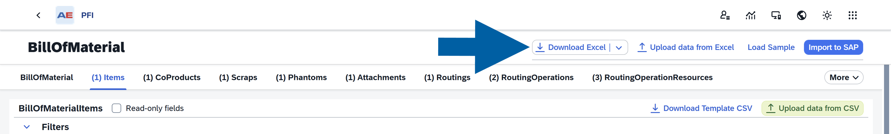

- **Download with advanced settings**: This option is available after clicking the **arrow** next to **Download Excel** option.

    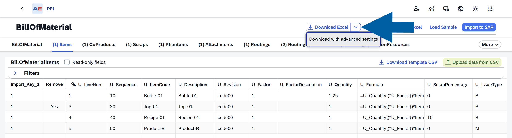

    Select **Download with advanced settings** to see additional export settings.  

    Here you can choose to:
        - **Export successfully imported entries**
        - **Export failed entries**
        - **Export loaded entries**
        - **Include read-only columns**
        - **Include Error Messages**

    And then decide if you want to **Export data to Excel file** and/or **Export data to CSV file**.

    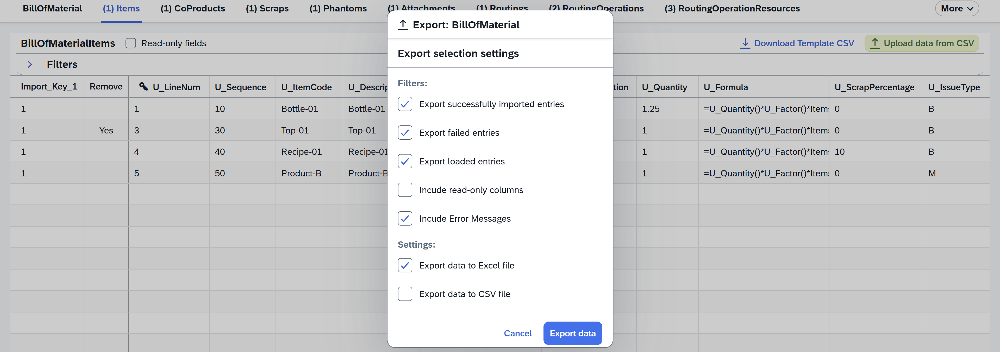

- **Upload data from Excel**: Import data from an MS Excel file. Blank cells are ignored and don't overwrite existing values. To explicitly set a property to blank, use a forward slash (``/``).

    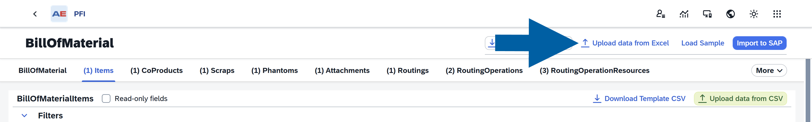

- **Load Sample**: Load data from the database into the table for mass updates.

    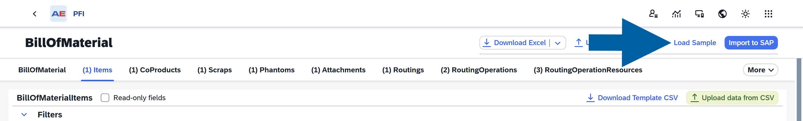

    To load a sample, follow these steps:
        - (Optional) Filter data using specific field values.

            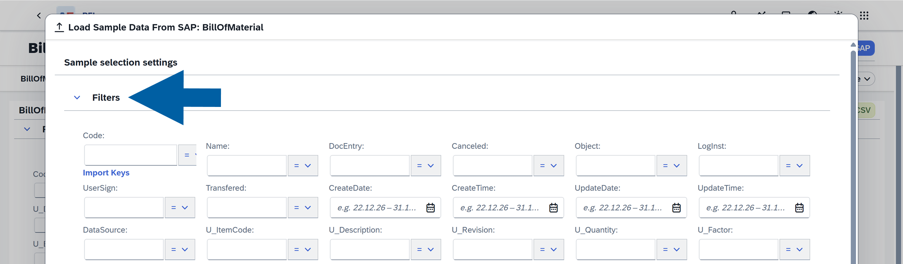

        - Choose the number of records to load.

            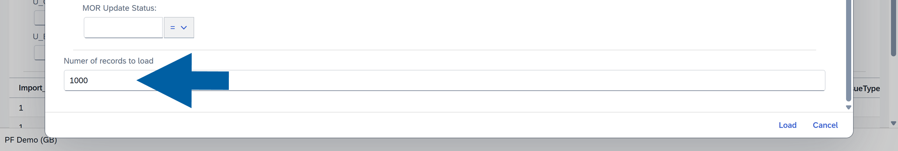

        - Click **Load** to populate the table with the selected object and its lower-level components, for example, Bill of Materials with Items, CoProducts, Scraps, etc.

            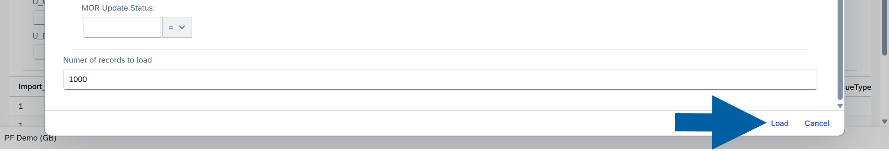

        - After editing, you can re-upload the data for updates.

- **Import to SAP**: Transfer the data to the SAP database.

    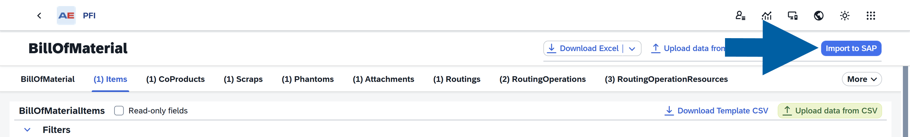

- **Download Template CSV**: Download a CSV template for the currently displayed object, for example, **Bill of Materials** > **Items**. Unlike the advanced download option, this exports templates for only the displayed object without including its lower-level components.

    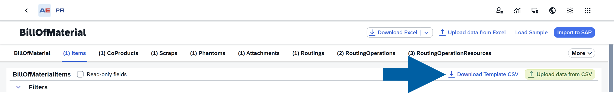

- **Upload Data from CSV**: Import data from a CSV file.

    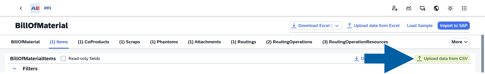

- **Read-only fields**: When you uncheck this option, you'll only see the editable fields. Checking the box will display all available fields.

    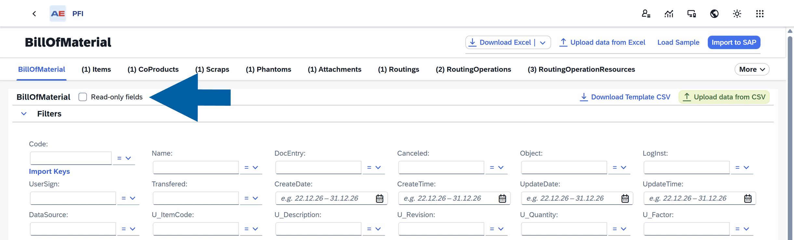

    :::note[info]
    **Read-only fields** are marked with a **padlock icon** for an easier identification.

            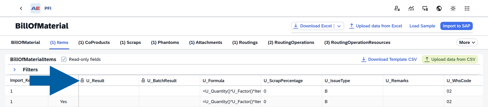
    :::

### Filters

Use filters to narrow down your data. You can edit the filter section to display only the fields you wish to use.

    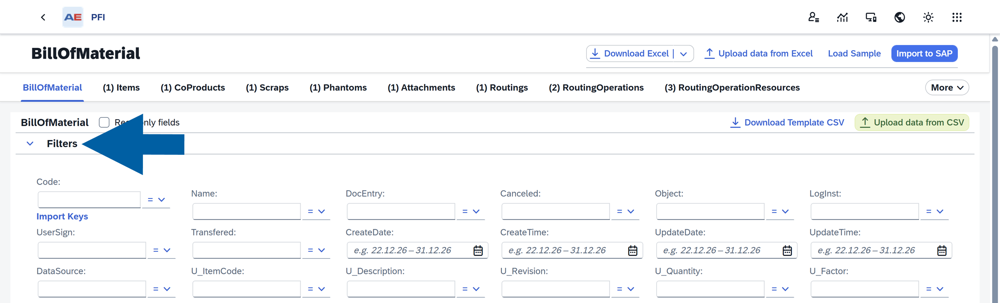

### Table

The table displays data associated with the object selected in the header, including all columns and User-Defined Fields (UDFs) located at the far-right end of the table. This data can be imported into SAP using the relevant header options. Before importing, the table must first be populated using the appropriate actions in the header.

**Key Features of the Table**:

- **Import Key** – The first column in the PFI matrix, acting as a link for the template. For example, it connects the Bill of Materials to its subordinate components.
- **The key icon** – Indicates the primary field for the object. Leaving this field empty during editing will add a new record. If a value is present, the existing record will be updated.
- **Action** – Specifies the type of operation (Add/Update) for each row after uploading an Excel file.
- **Import Status** – Displays the success or failure of each line's import into SAP Business One.

## Additional setting of the Computec PFI plugin

**CompuTec PFI** plugin includes a feature that lets you control how many records are processed in parallel during import. This helps you balance performance and system stability.  

Here's what you need to know:

- Higher values mean faster imports, but require stronger servers.
- Lower values are safer for smaller environments.
- Recommended values:
  - Standard systems: 20–30
  - High-performance servers: up to 100
  - Maximum allowed: 100

### Configure parallel import limit

To configure parallel import limit, follow these steps:

1. Log in to the **CompuTec AppEngine Administration Panel**.

    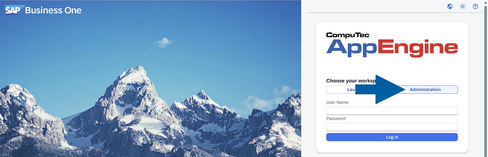

2. Go to **Plugins** > **Downloaded**.

        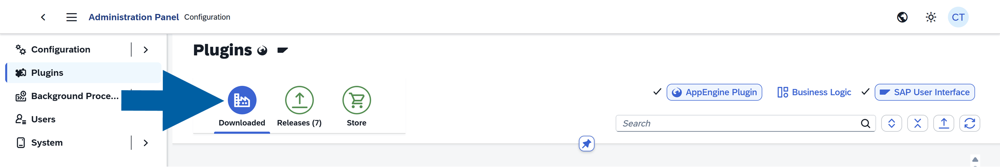

3. Locate the CompuTec **PFI** plugin, and click the **gear icon** next to it.

    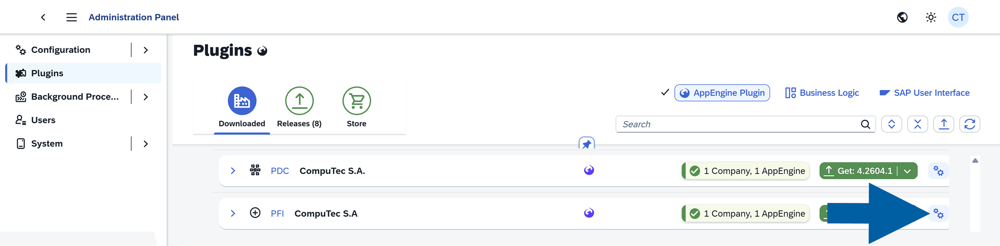

4. Click **Additional Settings**.

    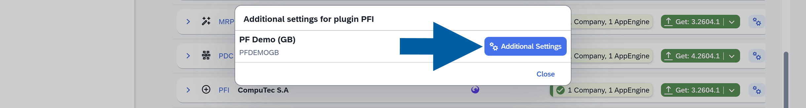

5. In the **Settings** window, find **ImportBatchSize**, and enter your desired number of parallel records.

    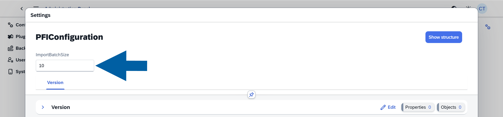

6. Click **Save & Close**.

    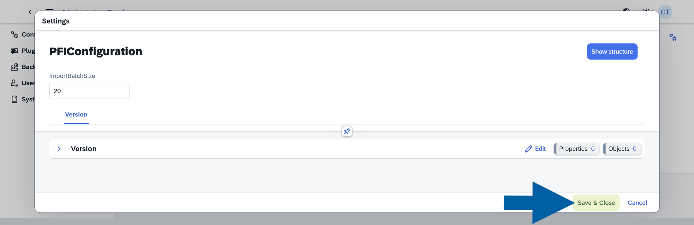

:::note[Best Practices]

- Start with 20–30 records and increase gradually
- Monitor system performance during large imports
- Use **Load Sample** before mass updates to reduce errors

:::

:::info[note]
If you have any questions, contact us using [CompuTec Support Portal](https://support.computec.pl/servicedesk/customer/portals?q=webUp).
:::
