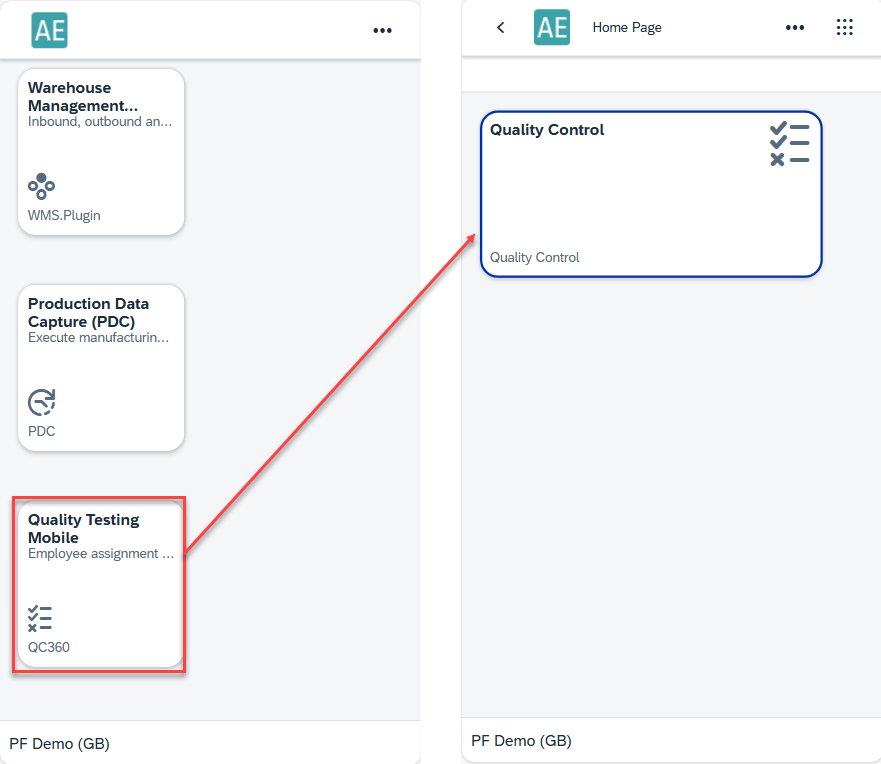
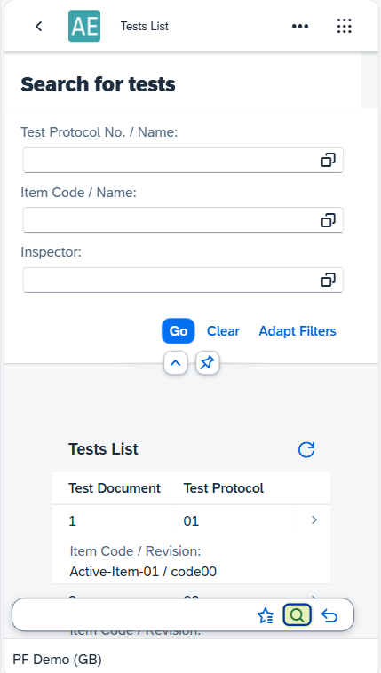
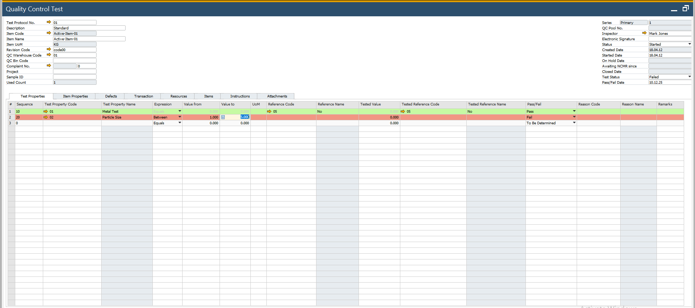

# Overview

The Quality Testing Mobile (QC360) Plugin is an extension to CompuTec ProcessForce that enables quality control users to perform QC inspections quickly and efficiently using a tablet or mobile device. It is designed for shop-floor operators, QC technicians, and warehouse staff who need to record test results in real time - without returning to their desktop system.

This page explains the purpose of the QC 360 Mobile app, how it is accessed, what users can do with it and how data entry and updates occur behind the scenes.

---

## Purpose

Quality Control processes often require the technician to physically inspect items on the production floor or in the warehouse. Performing these checks on a desktop system can be time-consuming and impractical. The QC 360 mobile interface solves this problem by providing:

- A mobile-friendly UI optimized for tablets and phones.
- Direct access to existing Quality Control Test documents.
- A way to record measurements instantly, with automatic validation.
- Real-time updates to the core QC tables—no manual “Update” action needed.
- A simplified workflow for QC operators who need only the essentials.

The QC 360 mobile app does not allow creation of new QC protocols or master data. It focuses entirely on executing and recording QC results quickly.

## Accessing QC 360

1. Installing the Required Plugins

    To enable QC 360, the following ProcessForce plugins must be installed:

    - QC 360 Plugin
    - ProcessForce Plugin API
    - Item Background Plugin
    - QC 360 App Plugin

    Installation notes:

    - Ensure you download compatible versions of the plugins.
    - If a version mismatch occurs, you will see an installation error.

        :::info
        It is recommended to always use the official released plugin versions for stability.
        :::

    - Once installed, the QC 360 tile becomes available in the Launchpad.
        

2. Launching QC 360 in the CompuTec Launchpad

    - Log in to the CompuTec Launchpad.
    - Look for the QC 360 application tile.
    - Click to open the QC 360 mobile app.

    Because QC 360 is primarily designed for tablets and phones, using it on a desktop browser requires enabling the mobile simulation mode.

3. Using Mobile Device Simulation (If Testing on a Laptop)

    To simulate the mobile layout:

    - Open QC 360 in Chrome.
    - Press F12 to open Developer Tools.

        

    - Click Toggle Device Toolbar.
    - Choose a mobile/tablet layout from the dropdown. This displays the correct mobile-optimized interface.
        

## Using QC 360

**Home Screen Overview**

When the app opens, you will see two main views:

1. **Favorites**: Shows QC Tests marked as favorites. This is the default landing view.

    

2. **All QC Test Documents**

    - Displays every Quality Control Test document already created in the CompuTec ProcessForce system.
    - Includes a simple filter allowing you to search by: Test Protocol No., Item Code, Inspectors.

        

## Opening a QC Test Document

1. Navigate to either Favorites or All QC Tests.
2. Select the document you want to inspect.
3. The app loads the QC test and displays all QC properties defined in the associated protocol.

    

## Recording Test Results

When you select a QC property:

- The property details open.
- At the bottom, you will see the Property Test Recording section.

    

- Enter your result.
- Click Add.

    

## Key Behavior

- There is no “Update” button, unlike SAP Business One windows.
- Once you enter a value and confirm, the system automatically updates the QC record in real time.
- The status instantly recalculates:
        - Pass
        - Fail
        - To be determined

Example

- If the expected value is 5 and you enter 4, the result immediately updates as **Failed**.
- If the acceptable range is 4–5 and you enter 1, the result will also appear as **Failed**.

     

The QC test document reflects this immediately without needing to refresh or save.
