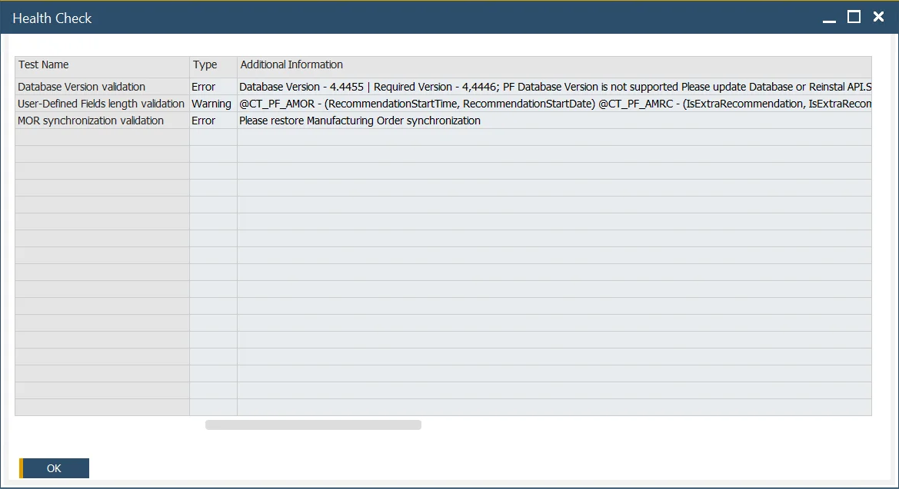

# Health Check

The Health Check feature in CompuTec ProcessForce is a built-in diagnostic tool that helps identify and troubleshoot common issues within the system. Use this option whenever you notice inconsistencies or errors in the system, or as part of a routine system maintenance procedure.

Health Check results offer suggestions for resolution that can be performed by users or serve as guidance for support consultants. Sharing the Health Check output when raising a support ticket helps expedite issue resolution.

To access Health Check, navigate to:

:::info Path
    Upper menu → Help → Support Desk → Health Check
:::

Example Health Check results:

## Key Settings

When you run the Health Check, the results are displayed in a table with the following columns:

- **Test Name**: A short description of the validation test performed.
- **Type**: Indicates the severity of the result. It can be:
        - **Error**: Requires immediate attention.
        - **Warning**: May lead to issues and should be reviewed.
        - **Information**: General system notes or suggestions.
- **Additional Information**: Provides a suggested solution or next steps.
- **Documentation link**: Offers direct access to relevant documentation for the identified issue.
- **Object Type and Code**: Identifies the specific object affected (e.g., document, item, configuration).

---

## What the Health Check does

The Health Check in CompuTec ProcessForce scans various system parameters, configuration settings, and data integrity rules to detect any anomalies. Its goal is to proactively catch issues before they affect daily operations.

Each test run checks for:

- Incomplete configurations
- Invalid master data references
- System performance bottlenecks
- Common integration errors

---
