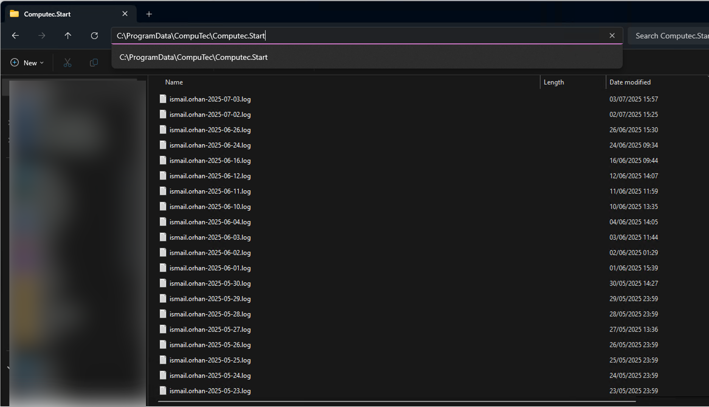

# Logging

Effective logging is critical for troubleshooting and support. You may be asked to send CompuTec ProcessForce log files during the support procedure. Adding them to a support ticket (even without the request) may speed up the support procedure. This guide helps you locate log files, understand their purpose and safely enable advanced logging options when necessary.

---

## Log files directories

### CompuTec ProcessForce

CompuTec ProcessForce log files are kept in the following location: `C:\ProgramData\CompuTec\CompuTec.Start`.

Choose the file that is related by time and date to the issue you are reporting:

### CompuTec License Server

The CompuTec License Server log files are kept in the following location: `C:\ProgramData\CompuTec\License Server\Logs`.

## Additional options

:::caution
    Please note that changes described in this section (raising the log level or adding new rules) can significantly impact the system's performance. Therefore it is recommended to turn it on only during problem investigation (and to turn it off afterward).
:::

## Setting Up Telemetry with Grafana.com

Telemetry is vital for monitoring and analyzing the performance of your systems, ensuring they operate optimally. By leveraging Grafana's robust tools, you can streamline monitoring and gain valuable insights into your CompuTec AppEngine and SAP Business One environments.

➡️ Learn how to set up [Telemetry with Grafana.com](https://learn.computec.one/docs/appengine/administrators-guide/setup-telemetry/)

---
