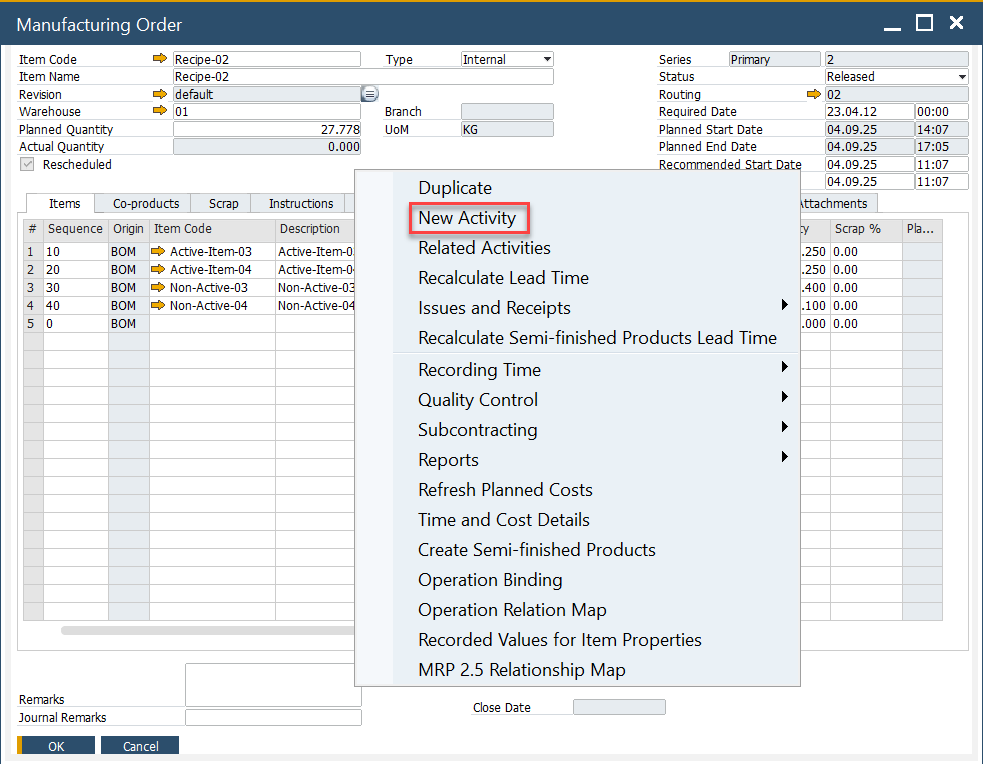
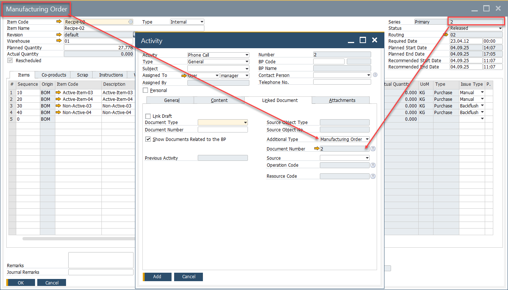
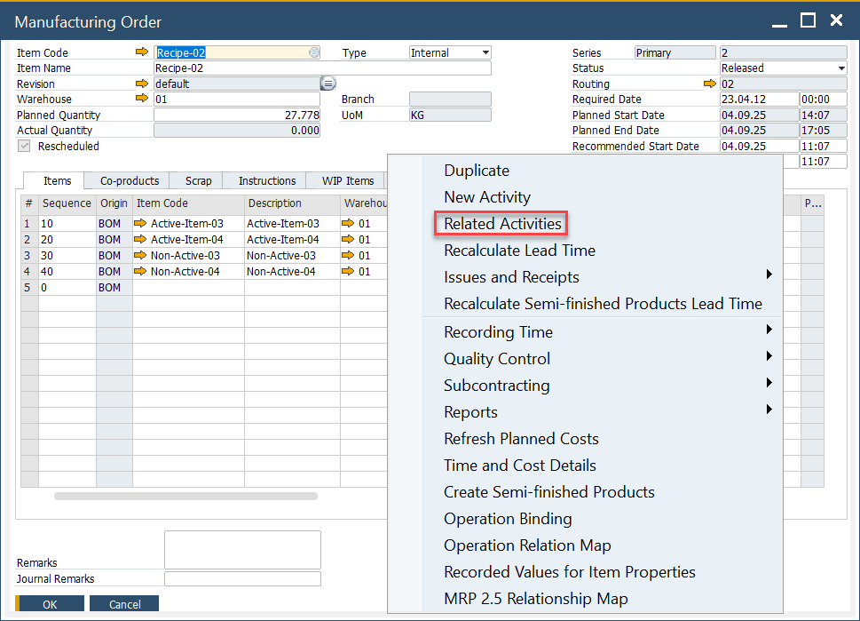
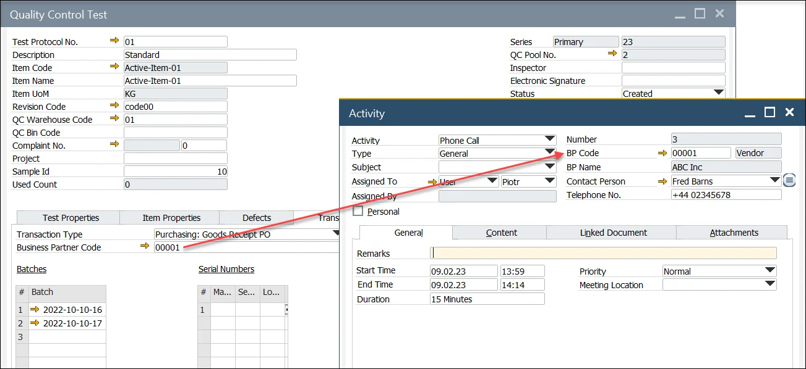

# Activities for ProcessForce Documents

SAP Business One Activities provide a powerful tool to manage interactions and tasks related to various business processes. These activities allow users to record and track interactions with business partners, such as meetings, phone calls, or follow-up tasks. By integrating activities with ProcessForce documents, businesses can streamline their workflows and ensure efficient tracking of critical processes, such as Manufacturing Orders, Complaints, Quality Control tests, and more. This integration helps businesses improve communication, increase accountability, and maintain clear documentation of all relevant actions.

---

## Manufacturing Orders

### Create an Activity

To create an activity for a manufacturing order:

1. Select the Create Activity option from the menu.

    

2. The Activity form opens.

3. Add a BP Code to the activity.

:::caution
    Internal Business Partner Code

    To use Activities related to Manufacturing Orders, it is required to create an internal or dummy Business Partner Code.
:::

>Note: The document type and document number are copied into the activity form

### Manufacturing Order Activity Report

1. Select the Reports menu and click Related Activities:

    

2. All related Activities are displayed within the Activity Report.

## Complaints

To create an Activity for a Complaint:

1. Select the New Activity option (to view activities already related to this complaint, click Related Activities).

- The Activity Form will open.
- The BP Code from the complaint is automatically added.
- The Document Type and Document Number from the complaint will be copied into the Linked Documents tab (similar to the Manufacturing Order activity process).

## Quality Control

### QC test with no BP Code

- This option is available within the document’s tables, rather than the header as in other document types.
- The Quality Control Test document type and document number are automatically copied into the Linked Documents tab.

### QC test with BP Code

- As with other documents, follow the same process to create an Activity.
- If the QC test includes a BP Code (e.g., a test for Goods Receipt PO), the BP Code will be automatically copied into the Activity form.

## Non-Conforming Materials Report

- To create an Activity for a Non-Conforming Materials Report, follow the same steps as with the QC test.
- The QC test document number will be copied into the Linked Documents tab.

## Batch Master Data form

To create an Activity for Batch Master Data:

1. Right-click within the Batch Master Data form and select the New Activity option. To view existing activities related to this batch, click Related Activities.
2. The Activity form will open.
3. Add a BP Code to the activity.

>Note: The Document Type will be set to Batch Master Data, and the Batch Number will be automatically copied into the Document Number field in the Linked Documents tab.

---
Integrating activities with ProcessForce documents in SAP Business One enhances workflow management and ensures that all interactions with business partners are documented and easy to track. By linking activities to critical documents such as Manufacturing Orders, Complaints, and Quality Control reports, businesses can streamline their operations and maintain a clear record of all relevant actions. This functionality not only improves communication within the organization but also helps maintain better accountability and transparency in business processes.
