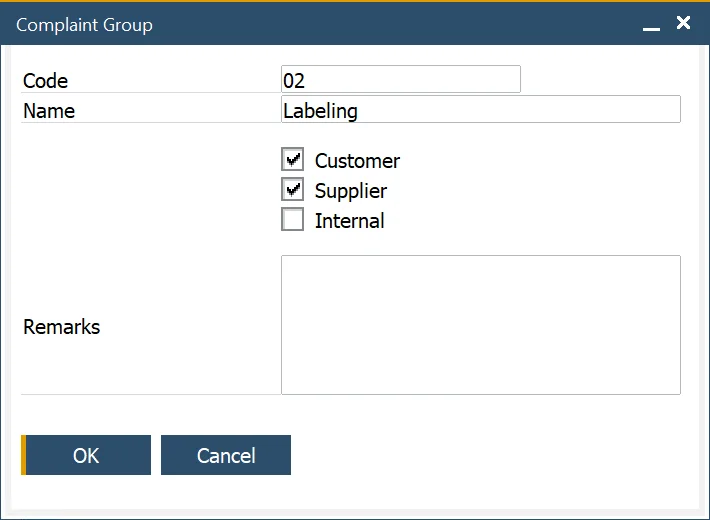

# Complaint Group

:::info Path
    Administration → Setup → Complaints → Complaint Groups
:::

The Complaint Group form enables users to define and manage Complaint Groups, to categorize [Reason Codes](./complaint-reason.md) for reporting and analysis purposes.These groups can be applied across customer, supplier, and internal complaints, providing better organization and insights. Users can add remarks as needed and select multiple options simultaneously for greater flexibility.

---
