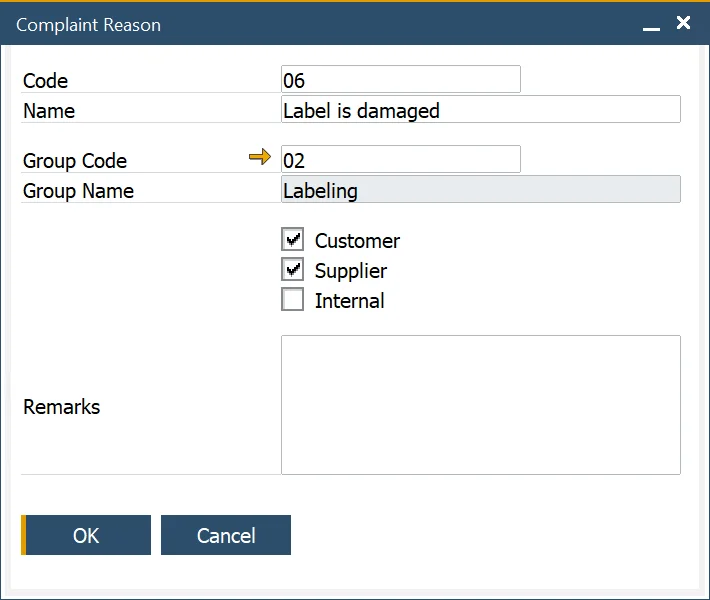

# Complaint Reason

:::info Path
    Main Menu → Administration → Setup → Complaints → Complaint Reasons
:::

The Complaint Reason form allows users to define and manage Reason Codes, which specify the cause behind a complaint. These codes are crucial for tracking the origins of complaints and are used for detailed reporting and analysis. The Reason Code can apply to customer, supplier, and internal complaints and is an integral part of the [Complaint](./complaint.md) form.

---
By establishing clear and organized Reason Codes, businesses can gain deeper insights into the root causes of complaints, improving their ability to address issues efficiently and enhance overall service quality.
