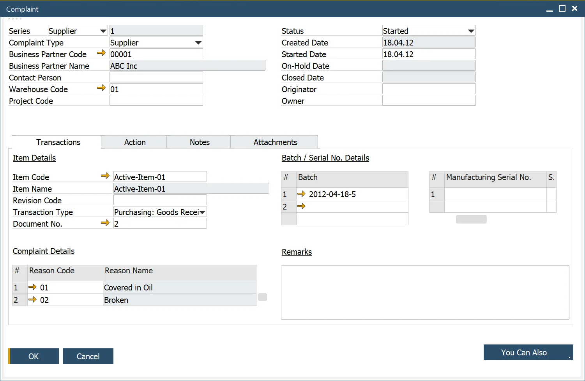
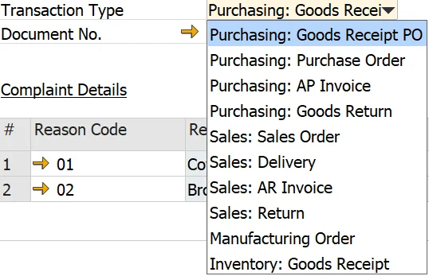

# Complaint

The Complaint form allows you to input all the necessary details for creating and managing a complaint. This includes specifying the document type (Customer, Supplier, or Internal), Contact Person, Warehouse, and any required actions to address the complaint effectively.

:::info Path
    Complaints → Complaint
:::

For a detailed overview, watch the video [Complaint Management](https://www.youtube.com/watch?v=8TnHJo3e7cg).

---

## Complaint Header

The Complaint form header provides a user-friendly interface to manage key details, including:

- **Complaint Number**: Select and enter a complaint number using the defined Document Series Number.
- **Source of the Complaint**: Enter the source of the complaint: Customer, Supplier, or Internal.
- **Business Partner Details**:
        - Select and enter the Business Partner Code. The lookup table filters business partners based on the Complaint Type.
        - If the Complaint Type is Internal, the fields for Business Partner Code, Business Partner Name, and Contact Person are disabled.
- **Contact Person**: Enter the Contact Person, filtered based on the selected Business Partner Code.
- **Additional Information**: Enter details such as the Warehouse and Project Code.
- **Complaint Status**: Manage the complaint's progress by selecting a Status (Created, Started, On-Hold, or Closed) and setting the corresponding Date.
- **originator and Owner**:
        - Enter an Originator, who started the Complaint.
        - Enter an Owner, responsible for managing the Complaint.
- **Alerts**: Generate alerts to notify the Complaint Manager for assigning an Owner.

## Transaction

The Transaction tab allows users to log both item-related and non-item-related complaints with detailed information:

- If the Complaint is Item related, the user enters the Item, and optionally, a Reason Code, indicating the cause of the Complaint.
- The user can also enter the Transaction Type and the associated Document Number relating to the Complaint, along with Batch and Serial Numbers.
- When a Transaction Type is selected, only data associated with the relevant Business Partner is displayed.
- Batches and Serial Numbers can be added and deleted.
- Multiple Reason Codes can be added and deleted for recording and analysis purposes. Reason Codes can be added and deleted.
- A remark can also be added to provide further context or clarification.

## Action

The Action tab is designed for situations requiring additional steps, such as managing sample returns:

- If additional Action is required, the user can enter a sample quantity to be returned either from the Customer or to the Supplier.
- The sample can be tracked by specifying the relevant Date and the location where the sample will be stored.
- An alert is sent to Warehouse Managers to notify them of incoming samples.
        To know more on "Alerts", click [here](https://www.youtube.com/watch?v=GFsTGB9Gc40).
- The alert is based on the following query, Status = Started, Business Partner Code and Name, Item Number, Batch/Serial Number, Delivery Date, Warehouse Code, and Warehouse manager.
        - When the sample is received at the warehouse, based on a Return document, an alert is sent to the Complaint Owner.
        - To know more, click [here](https://www.youtube.com/watch?v=GFsTGB9Gc40).
- The alert is based on the following query, Status = Started, Complaint No, Business Partner Code and Name, Item Number, Batch/Serial Number, Received Date, Warehouse Code, and Complaint Owner.

## Notes

The Notes Tab is a text field for any Complaint related information.

## Attachments

The Attachments Tab allows the user to upload relevant documents relating to the Complaint.

## Creating a Quality Control Test

- From the Action Tab, the user can check that the Complaint requires a [Quality Control Test](../quality-control/quality-control-test/overview.md) and create a Quality Control Test from the "You Can Also" button.
- The user can also check that this Complaint was the source of a Product Recall activity.
- To know more informarion, click the video: [Creating a Quality Control Test from a Complaint](https://www.youtube.com/watch?v=MtuKARV-QWM)

## Creating an activity for a complaint

The standard SAP Business One activity functionality is available to create and check within the Complaint form. To get more information on the subject, click [here](../activities-for-computec-processforce-documents.md).

## Complaint Status

Complaint statuses allow tracking the progress of each case:

- **Created** – a document is created but not yet started; create Date can be set up.
- **Started** – a document is started, Started Date can be set up.
- **On-Hold** – a document is on-hold (no action is taken on it), On-Hold Date can be set up.
- **Closed** – a document is closed; **no further editing can be done**.

---
