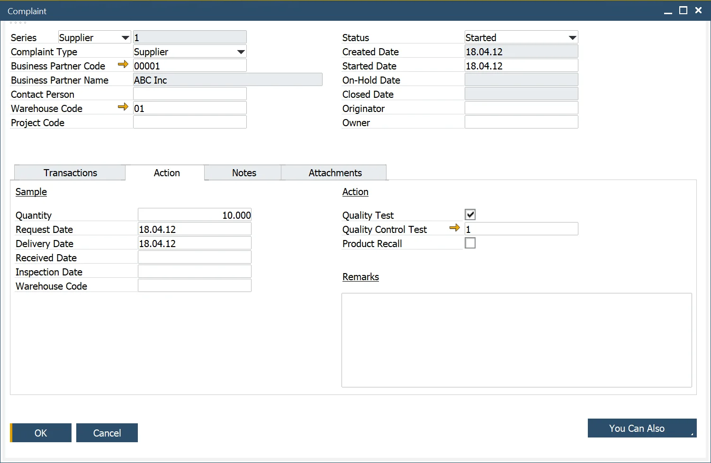

# Complaint

The Complaint form enables users to record, track, and resolve complaints efficiently - whether they originate from customers, suppliers, or internal teams.
It centralizes all complaint-related data, helping maintain traceability and streamline corrective actions.

To access Complaint, navigate to:

:::info Path
    Complaints → Complaint
:::

For a detailed overview, watch the video [Complaint Management](https://www.youtube.com/watch?v=8TnHJo3e7cg).

---

When to Use

Use the Complaint form when:

- You need to log and manage a customer, supplier, or internal complaint.
- You want to track corrective actions, sample returns, or quality control tests linked to a complaint.
- You require an integrated record for audits and reporting.

---

## Complaint Header

The Header section captures the key complaint details for identification, responsibility and tracking.

- **Complaint Number**: Select and enter a complaint number using the defined Document Series Number.
- **Source of the Complaint**: Enter the source of the complaint: Customer, Supplier, or Internal.
- **Business Partner Details**:
        - Select the Business Partner Code (filtered based on the selected Complaint Type).
        - If the Complaint Type is Internal, the Business Partner and Contact Person fields are disabled.
- **Contact Person**: Enter the Contact Person, filtered based on the selected Business Partner Code.
- **Additional Information**: Specify Warehouse and Project Code if applicable.
- **Complaint Status**: Track progress using statuses (Created, Started, On-Hold, Closed), with corresponding dates.
- **originator and Owner**:
        - Enter an Originator, who started the Complaint.
        - Enter an Owner, responsible for managing the Complaint.
- **Alerts**: Alerts can be generated to notify the Complaint Manager to assign or update an Owner.

### Transaction tab

The Transaction tab records detailed information about item-related and non-item-related complaints.

**Item-Related Complaints**

- Enter the Item Code, Reason Code, and Transaction Type (e.g., Delivery, Purchase Order).
- Link the complaint to a Document Number, Batch or Serial Number.
- When a Transaction Type is selected, the system filters data relevant to the selected Business Partner.
- Batches, serial numbers, and multiple reason codes can be added or removed as required.
- Add Remarks for contextual details or clarifications.

**Non-Item-Related Complaints**

- Record general service, process or communication issues not linked to specific items.

### Action tab

The Action tab helps manage any follow-up activity such as sample returns or warehouse inspections.

**Key Features**

- Specify Sample Quantity and whether it is returned from the Customer or sent to the Supplier.
- Define the storage location and date for received samples.
- Automatic alerts notify Warehouse Managers about incoming samples.
- The alert is based on the following query, Status = Started, Business Partner Code and Name, Item Number, Batch/Serial Number, Delivery Date, Warehouse Code, and Warehouse manager.
        - When the sample is received at the warehouse, based on a Return document, an alert is sent to the Complaint Owner.

➡️ Learn more about [Alerts](https://www.youtube.com/watch?v=GFsTGB9Gc40).

### Notes

Use the Notes tab to record any text-based comments or contextual details about the complaint.

### Attachments tab

The Attachments tab allows users to upload supporting documents such as photographs, test results, delivery documents or inspection reports.

---

## Creating a Quality Control Test

From the Action tab, users can create a linked [Quality Control Test](../quality-control/quality-control-test/overview.md) when the complaint requires product evaluation.

- Use the “You Can Also” button to generate a new test.
- The system automatically links the complaint to the created QC Test.
- You can also track if the complaint triggered a Product Recall.

➡️ Watch the video: [How to Create a Quality Control Test from a Complaint](https://www.youtube.com/watch?v=MtuKARV-QWM)

## Creating an Activity for a complaint

SAP Business One’s standard Activity Management is integrated into the Complaint form.
You can create, assign, and monitor activities related to a specific complaint.

➡️ Learn more: [Activities for CompuTec ProcessForce Documents](../activities-for-computec-processforce-documents.md).

---

## Complaint Status

Each complaint follows a defined status flow for better tracking:

| Status | Description |
| --- | --- |
| Created | The complaint record is created but not yet started. |
| Started | Work on the complaint has begun. |
| On-Hold | No further action is currently taken; the issue is paused. |
| Closed | Complaint resolution is complete; no further editing is allowed. |

---
