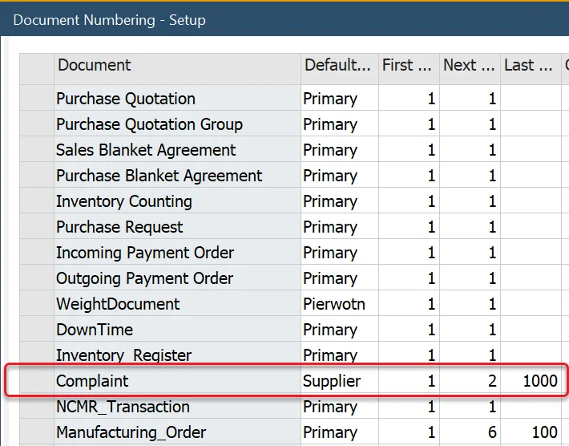
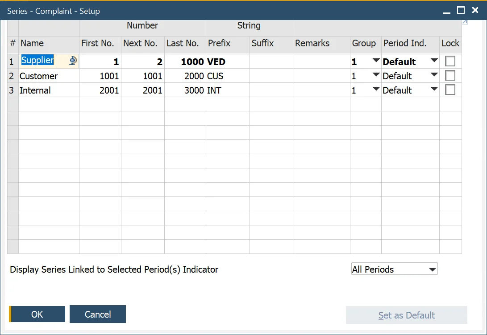

# Document Series Setup

Configuring document series is essential for maintaining organized and efficient complaint tracking in ProcessForce.

---

## Configuration

The [Complaint](complaint.md) form integrates seamlessly with SAP Business One's document numbering functionality, ensuring that each complaint is uniquely identified and categorized.

For instance, you can create distinct document series for each Complaint Type, enabling better classification and streamlined reporting:

To learn more, watch the video [Complaint Management - Creating a Document Series](https://www.youtube.com/watch?v=qmcf-uwU_Ok).

---
