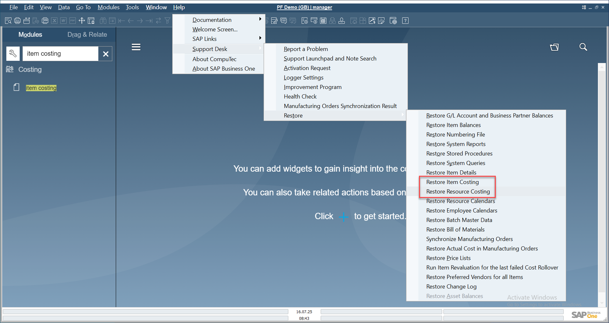
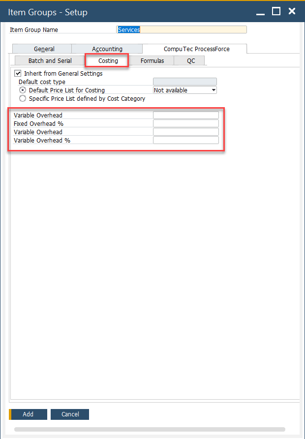
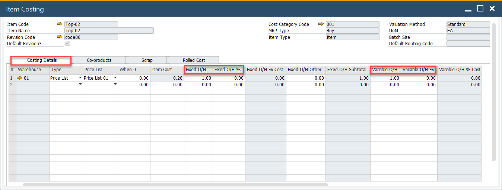

# Overview

This guide walks you through the essential setup steps to ensure accurate and efficient costing in **SAP Business One** with **CompuTec ProcessForce**. Both platforms need to be correctly configured for accurate and efficient costing calculations. The sections below outline the key configuration steps, paths, and considerations.

---

## 1. SAP Business One Settings

These foundational settings define how inventory and costing are managed at the system level, ensuring consistency across warehouses, documents, and item records.

### Company Details

To access Company Details, navigate to:

:::info Path
    Administration → System Initialization → Company Details
:::

- **Use Perpetual Inventory**: This field can be checked or unchecked based on regional practices. For instance, it is checked in the UK and unchecked in Italy.
- **Manage Item Cost per Warehouse**: Optional, but must be decided before costing records are created or recalculated.

### Document Settings

To access Document Settings, navigate to:

:::info Path
    Administration → System Initialization → Document Settings
:::

In a Standard Costing environment, WIP (Work-in-Progress) variances arise from differences between planned and actual quantities or costs of finished products. To accommodate this - ensure **Parent Item WIP Accounts** are checked.

### Warehouses

Warehouse configuration directly impacts how costing records behave:

- **New Warehouses**: Automatically added to the Item Master record based on the SAP Business One configuration. In turn, each warehouse is added to each Item Costing record.
- **Deleted Warehouses**: Automatically removed from each Item Costing record.
- **Drop Ship Warehouses**: Excluded from Item Costing records.

## 2. CompuTec ProcessForce Settings

These configurations extend costing functionality with detailed control over cost categories, overhead rates, and restore actions, enabling precise and automated cost calculations.

To access Costing tab, navigate to:

:::info Path
    Administration → System Initialization → General Settings → ProcessForce tab → Costing tab
:::

### Costing Price Determination

You can define how item costing prices should be pulled (planned, actual, average, etc.).  

➡️ Refer to [Costing Price Determination](./costing-price-determination.md) for more information.

### Restore Functions

If items or resources were created **before CompuTec ProcessForce was installed**, use the restore functions:

- **Restore Item Costing**
- **Restore Resource Costing**

This will populate missing costing data for previously added records.

➡️ Learn more about [Data Restore](../../system-initialization/data-restore.md).

### Cost Categories

To access Cost Categories, navigate to:

:::info Path
    Administration → Setup → Financials → Cost Categories
:::

Define and manage cost categories for streamlined cost calculations.

### Default Overhead Rates

To access Item Groups, navigate to:

:::info Path
    Administration → Setup → Inventory → Item Groups
:::

Assign fixed and variable overhead rates by Item Group. When a new item is created as part of an Item Group, these values will be automatically added to the corresponding fields within the Item Costing form.

Default fixed and overhead values are automatically added to the item costing record for all defined cost categories, except 000

### Changing Default Overhead Values

- Update the default values and press the "Update" button.
- A system message will display.
- To apply new values to all existing Item Costing records, press "OK" and then "Update".
- To apply new values only to new items, close the window and press "Update".
- Newly added items will automatically use the updated default values.

---
