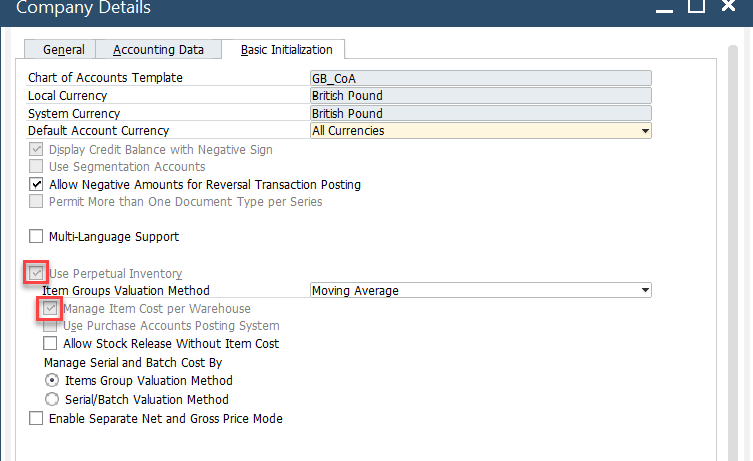
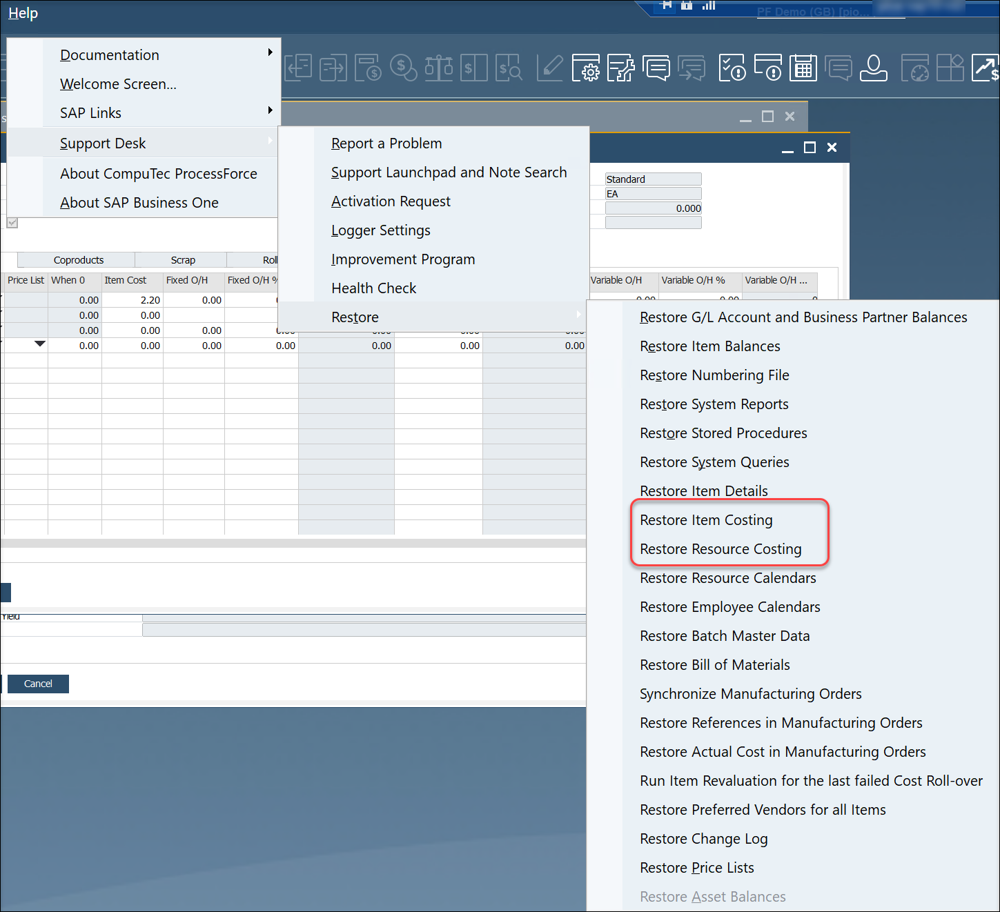
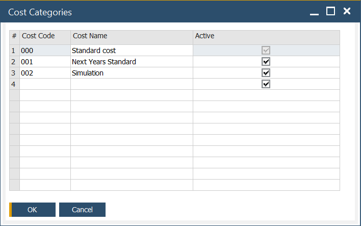
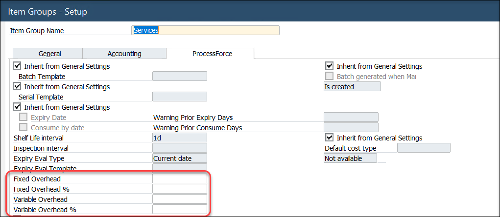
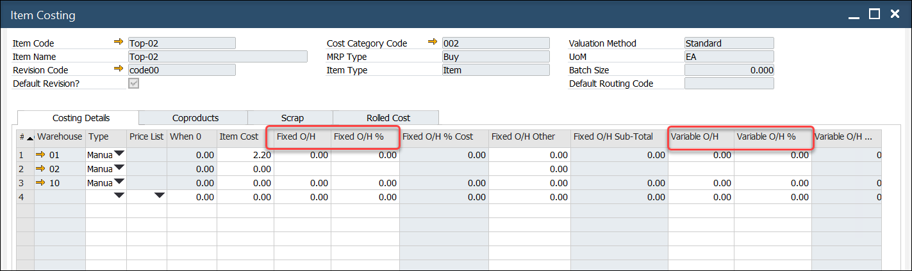

# Overview

This guide provides comprehensive details to ensure the costing function operates correctly in ProcessForce. Both SAP Business One and ProcessForce settings must be properly configured for accurate and efficient costing calculations. The sections below outline the key configuration steps, paths, and considerations.

---

## SAP Business One Setting

### Company Details

:::info Path
    Administration → System Initialization → Company Details
:::

- **Use Perpetual Inventory**: this field can be checked or unchecked based on regional practices. For instance, it is checked in the UK and unchecked in Italy.
- **Manage Item Cost per Warehouse**: it is optional, but should be decided before recreating costings.

### Document Settings

:::info Path
    Administration → System Initialization → Document Settings
:::

In a Standard Costing environment, WIP (Work-in-Progress) variances arise from differences between planned and actual quantities or costs of finished products. To accommodate this - ensure Parent Item WIP Accounts are checked.

### Warehouses

- **New Warehouses**: automatically added to the Item Master record based on the SAP Business One configuration. In turn, each warehouse is added to each Item Costing record.
- **Deleted Warehouses**: automatically removed from each Item Costing record.
- **Drop Ship Warehouses**: excluded from Item Costing records.

## ProcessForce Settings

:::info Path
    Administration → System Initialization → General Settings → ProcessForce tab → Costing tab
:::

### Costing Price Determination

Refer to [Costing Price Determination](./costing-price-determination.md) for more information.

### Restore Functions

If items were added to the Item Master Data form when ProcessForce was not running, select Restore Item Costing and Resource Costing to populate the corresponding costing objects.

Click [here](../../system-initialization/data-restore.md) to find out more about Restore Function.

### Cost Categories

:::info Path
    Administration → Setup → Financials → Cost Categories
:::

Define and manage cost categories for streamlined cost calculations.

### Default Overhead Rates

:::info Path
    Administration → Setup → Inventory → Item Groups
:::

Assign fixed and variable overhead rates by Item Group. When a new item is created as part of an Item Group, these values will be automatically added to the corresponding fields within the Item Costing form.

Default fixed and overhead values are automatically added to the item costing record for all defined cost categories, except 000

### Changing Default Overhead Values

- Update the default values and press the "Update" button.
- A system message will display.
- To apply new values to all existing Item Costing records, press "OK" and then "Update".
- To apply new values only to new items, close the window and press "Update".
- Newly added items will automatically use the updated default values.

---
