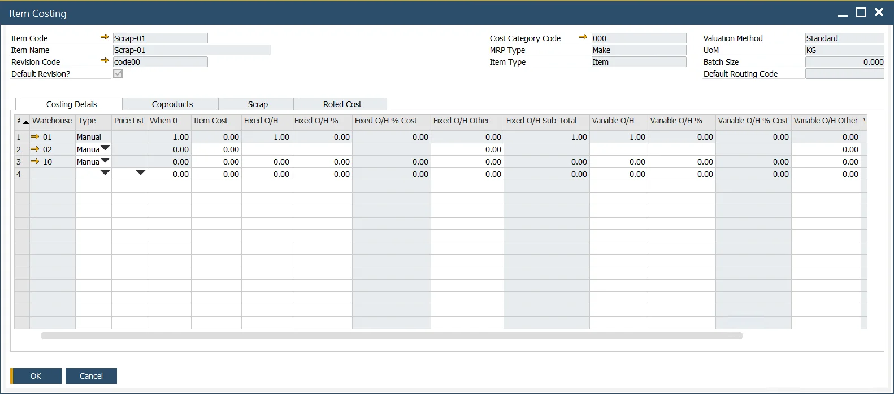

# CoProduct and Scrap Costing

In manufacturing processes, efficient cost management is essential for tracking production and waste. Co-Product and Scrap Costing play a vital role in accurately allocating costs to materials, ensuring precise financial and operational reporting.

---

## Scrap

To account for Scrap materials, create an Item Costing record specifically for the Scrap material item. This record helps allocate costs associated with waste material generated during production.

## CoProduct

Costing for Co-Products follows the same principles as Scrap Costing. The process involves defining the appropriate Item Costing records and assigning cost allocations proportionally to ensure all materials are accurately accounted for.

## Cost Allocation

Proper cost allocation is critical for both Scrap and Co-Products. This ensures that costs are distributed appropriately based on production outputs and waste generation.

---
Co-Product and Scrap Costing are essential for managing production efficiency and controlling expenses. By accurately defining Item Costing records and implementing cost allocation strategies, businesses can enhance their operational insights and maintain financial accuracy.
