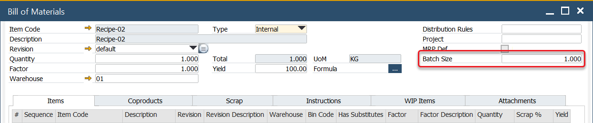
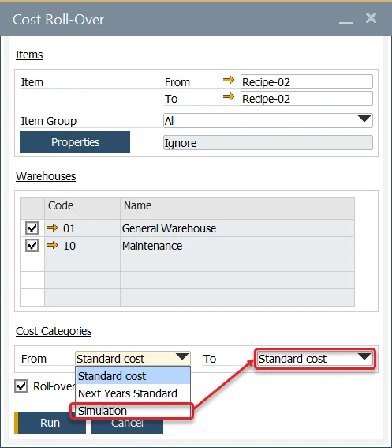
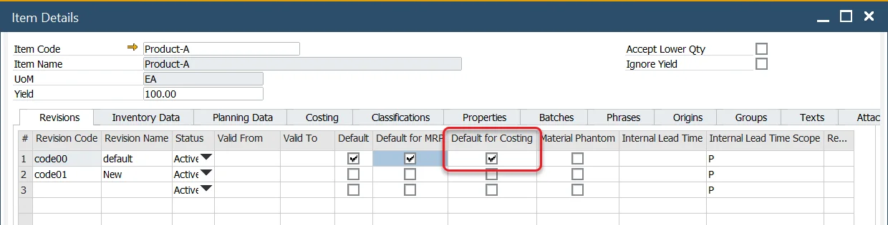

# Cost Categories

This section covers Cost Categories, which are essential for simulating production costs and applying them to production processes. By using Cost Categories, businesses can efficiently manage cost data, allowing for better decision-making and production optimization.

:::info
    For guidance on configuring the system before using costing functions, please check the [Configuration](../costing-material-and-resources/configuration/overview.md) section.

:::

---

## General

:::info Path
    Administration → Setup → Financials → Cost Categories
:::

Cost Categories represent different sets of cost data, such as Item Costing for the same Items and Bill of Materials or Resource Costing for specific Resources.

They are essential for conducting production cost simulations and determining final production valuations

Multiple Cost Categories can be defined in the system. When a new Item is added, Item Costing is automatically generated for each Cost Category, allowing distinct data to be maintained for each costing dataset. Similarly, when a new Resource is added, Resource Costing is created for every defined Cost Category.

Adding a new Cost Category automatically generates corresponding Item Costing and Resource Costing records for all existing Items and Resources in the system.

### 000 Cost Category – Standard Cost

000 Cost Category is a basic cost category that defines the final production valuation of an Item and is used on production documents. It has the following unique attributes:

- it cannot be deleted or deactivated,
- its data cannot be changed in any other forms.

Other Cost Categories can be used for costing simulations. However, to apply the simulated data to the system, it must be transferred to the 000 Cost Category using the [Cost Roll-Over](#cost-roll-over) procedure.

## Cost Roll-Up

:::info Path
    Costing → Cost Roll-Up
:::

The Cost Roll-Up function calculates or recalculates costs for selected Items, typically semi-finished or finished products. This process allows detailed control over which Items and properties are included.

- Choose a specific Item or a range of Items for the roll-up.
- If the fields are not filled, the Cost Roll-Up will be performed for all the Items.
- If only "From" field is filled, the roll-up will start from the specified Item and include all subsequent Items.
- If only "To" field is filled, Cost Roll-Up will be performed for all of the Items from the start on the list to the selected Item.
- Narrow the selection further by filtering for specific Item Groups or Item Properties.
- It is possible to choose specific Item Properties.
- The procedure can be applied just to selected warehouses.
- The procedure can be applied just to selected cost categories. Note that the procedure cannot be used for the 000 cost category. To include it, first perform the Roll-Up on another cost category and then transfer the data to the 000 Cost Category using the Roll-Over procedure.
- Cost Roll-Up is always performed for every revision.

:::info
    Ensure all costing forms are closed before performing a Cost Roll-Up. If not, the system will prompt you to close them before proceeding.
:::

### Perform the roll-up over the structure

By default, the "Perform the Roll-Up Over the Structure" checkbox is unchecked. When checked, the Roll-Up will be performed over the entire product structure. If left unchecked, the lowest level of an Item (e.g., Raw Materials) will not be recalculated.

When the "Perform the Roll-Up Over the Structure" checkbox is checked, the costs are calculated as follows:

- First, the structure is built for the Items selected on the Roll-Up form. This structure is generated based on the Bill of Materials data and the relations with other Bill of Materials.

**Example**:

Consider a final product FG-01, which contains one semi-finished good SG-01, and SG-01 contains a raw material RM-01 (a standard Item).

FG-01:

- SG-01:
- RM-01

**If the checkbox is checked**, the calculation proceeds as follows:

1. The cost for RM-01 (Raw Material) is recalculated first.
2. The cost for SG-01 (Semi-Finished Good) is calculated next, based on the cost of RM-01 (from step 1) and its own costing configuration (fixed, variable, etc.).
3. Finally, the cost for FG-01 (Final Good) is calculated based on the cost of SG-01 (from step 2) and its own costing data (fixed, variable, etc.).

The process is summarized as:

`RM-01 recalculation (saving) → SG-01 recalculation (saving) → FG-01 recalculation (saving)`

**If this checkbox is not checked**, only the 2nd and 3rd steps are performed – and the costs are not refreshed/recalculated for the lowest level (Raw Materials, in this case: RM-01). The expenses are recalculated/restored only for the FG-01 final-good product and SG-01 semi-finished product based on the data saved for the RM-01 during the previous roll-up performance.

This process is summarized as:

`SG-01 recalculation → (recalculation) FG-01 (saving)`

### Use final goods batch size value for semi-goods calculations

This option defines whether the batch size of the final goods should also apply to the semi-goods when calculating costs. Click [here](../costing-material-and-resources/item-costing/batch-size-costing.md) to find out more.

**Batch Size**:

Batch size is an option available in the Bill of Materials header:

It defines the most optimal quantity for production. For instance, producing five pieces of a particular item might be the most cost-effective quantity. By default, the batch size is set to 1 but can be adjusted/changed.

**Example**

Consider the following product structure:

FG-01:

- SG-01:
- RM-01

If the batch size for FG-01 is set to 10 and for SG-01 to 5:

- If the **checkbox is checked**, the Roll-Up will apply the batch size of 10 pieces from FG-01 to all Items in the structure, including SG-01 and RM-01.

- If the **checkbox is unchecked**, the Batch Size for each Item in the structure remains as originally set: 10 pieces for FG-01 and 5 pieces for SG-01.

## Cost Roll-Over

All Cost Categories, except for the 000 Cost Category, represent cost simulations. To make these simulations applicable during the production process, their values must be copied to the 000 Cost Category. This can be achieved through the Roll-Over option.

The Cost Roll-Over function is used in the following:

- To copy costing values into Cost Category 000 to update the SAP Business One Item Cost field (this applies only to Standard Costing).
- To copy values from one Cost Category to another to perform simulation and what-if calculations.
- To update the Cost Category 000 record for Resource Costs.

**Steps to perform Cost Roll-Over**:

- Select an Item or a range of Items in the same manner as in the Cost Roll-Up form.
- Choose the warehouses that will be impacted by the process.
- Select the source and destination Cost Categories to transfer the data.

**Roll-over the costs of resources checkbox**

By checking or unchecking this box, you determine whether Resource costs will be included in the Roll-Over procedure or if only Item Costs will be copied.

## Inventory Revaluation – Standard Costing

An Inventory Revaluation transaction is automatically generated when there is a difference between the current cost and the rolled-over cost. Inventory Revaluation is generated only for the revision with the **Default for Costing** checkbox checked:

This applies to Standard Costing valuation only.

---
Cost Categories play a pivotal role in efficient production cost management, allowing for flexibility, simulation, and accurate valuation. By leveraging tools like Cost Roll-Up and Cost Roll-Over, businesses can maintain precise cost data for decision-making and optimize their production processes. Adopting these practices ensures that the system remains aligned with business goals and operational efficiency.
