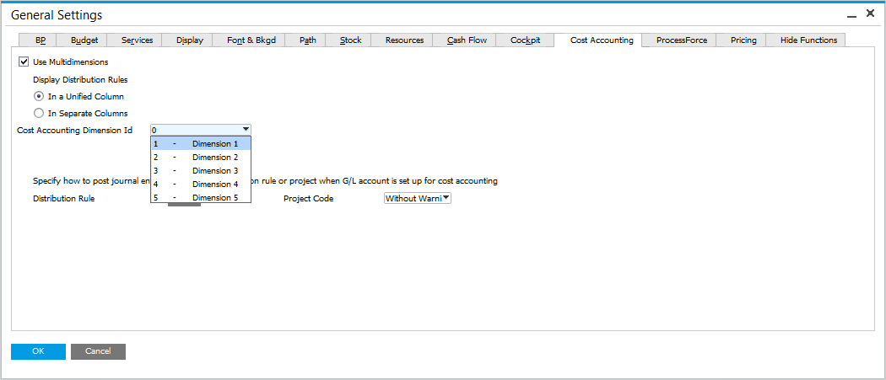

# Overview

## Introduction

In the current setup, Distribution Rules and Cost Centers are integrated into key elements of the ProcessForce solution, enhancing cost tracking and allocation accuracy. These features can be applied to Items and are available across the following ProcessForce master data forms and documents:

- Bill of Materials
- Manufacturing Orders
- Pick Receipt
- Pick Order
- Roll Back correction

Additionally, Distribution Rules and Cost Centers have been added to "Resources", allowing their utilization in the following master data forms and corresponding documents:

- Resources
- Operations
- Routings
- Production Process
- Manufacturing Orders
- Time Recording
- Time Correction
- Journals

## Configuration

SAP Business One is configured to determine the number of dimension fields and columns displayed in ProcessForce forms, ensuring flexibility and consistency. This configuration applies uniformly to both Items and Resources, streamlining the setup and management process.

---
By incorporating Distribution Rules and Cost Centers into both Items and Resources, ProcessForce provides robust tools for efficient cost management and allocation. The uniform configuration across multiple forms and documents simplifies processes, enhances transparency, and supports precise cost analysis, empowering businesses to make informed decisions and optimize operations.
