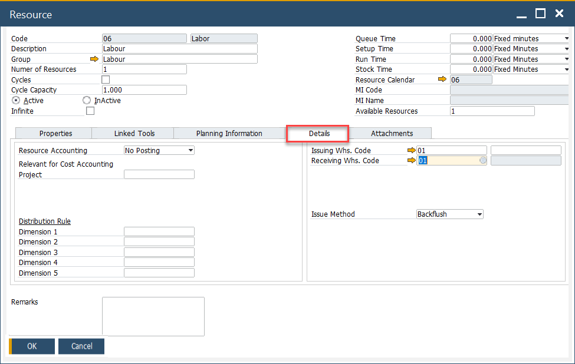
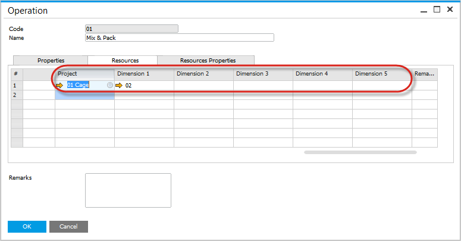
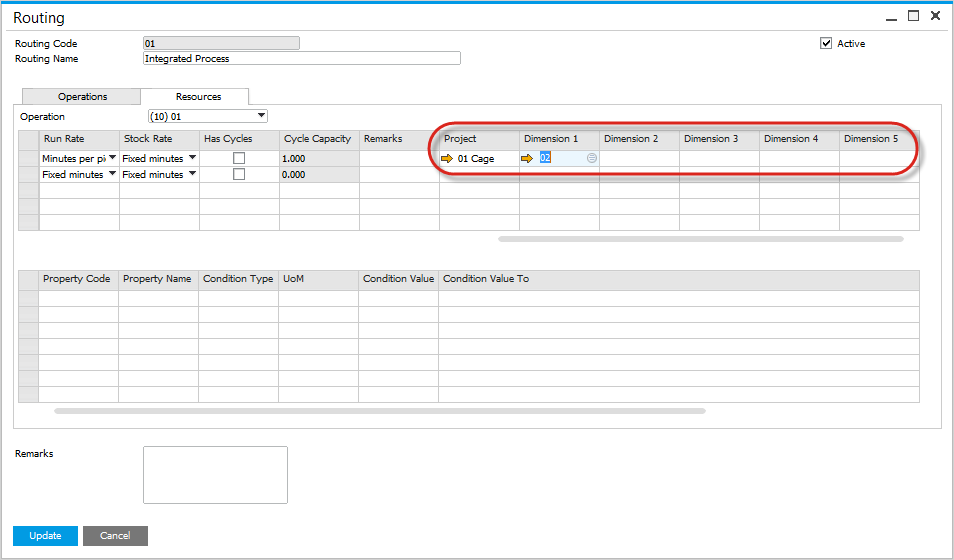
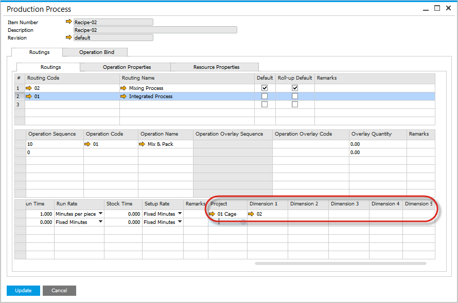
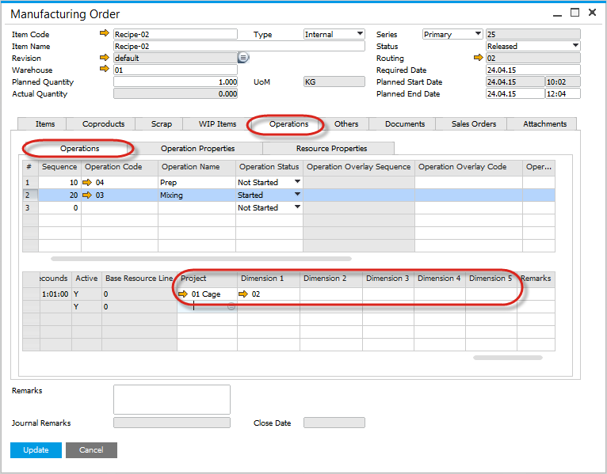
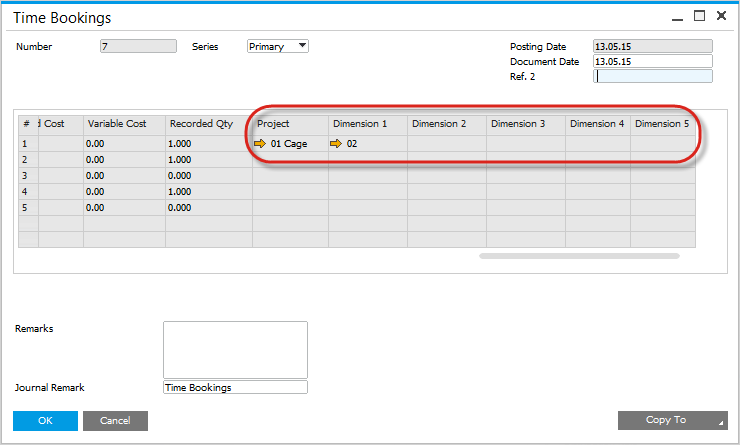
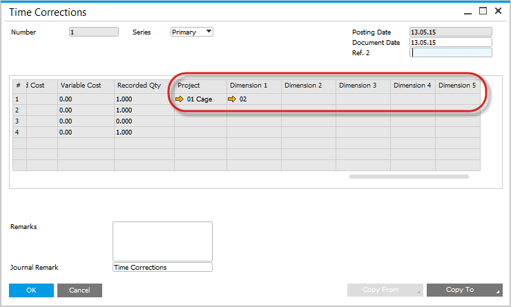
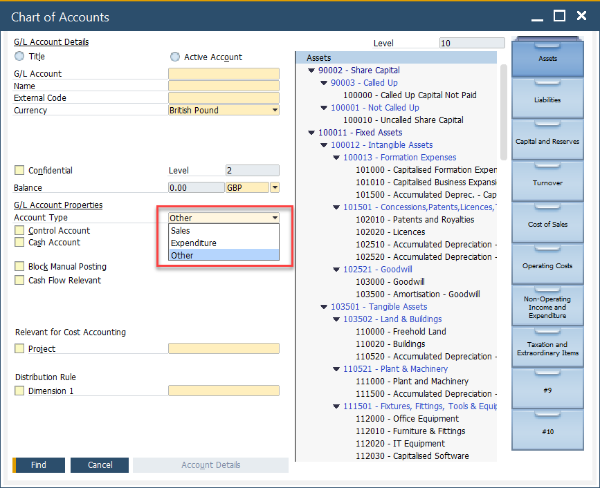

# Resources - Distribution and Cost Dimensions

Managing resources and their associated costs is a crucial aspect of maintaining operational efficiency and financial accuracy in manufacturing and business operations. This document explains how cost centers and projects are distributed and tracked across various forms in SAP Business One ProcessForce, ensuring consistency and flexibility in managing resource-related data.

---

On the Resource form under the Accounting tab, users can select Cost Centers and Projects. The number of dimension fields displayed in CompuTec ProcessForce forms within SAP Business One is determined by the number of Cost Centers enabled in the SAP Business One General Settings.
>Note: The Resource Accounting combo-box, has been moved to this tab for better accessibility

    

## Operation Form

In the Operation form under the Resources tab, the selected Cost Centers and Projects for each resource are displayed. By default, these values are inherited from the Resource form but can be adjusted as needed.

    

## Routing Form

On the Routing form under the Resources tab, Cost Centers and Projects for each resource are displayed.
    - Default values are derived from the Operation form but can be modified if required.
    - When the operation is selected the default values are copied from the Operation definition, and can be changed if required.
    - When the resource is selected the default values are copied from the Resource definition, and can be changed if required.

        

## Production Process Form

The Production Process form displays Cost Centers and Projects in the Resource section.
    - When the routing is selected, the default values are copied from the Routing definition, and can be changed if required.
    - When the operation is selected, the default values are copied from the Operation definition, and can be changed if required.
    - When the resource is selected, the default values are copied from the Resource definition, and can be changed if required.

        

## Manufacturing Order Form

On the Manufacturing Order form under the Operations tab in the Resource section:
    - Default values for Cost Centers and Resources are copied from the routing definition of the Bill of Materials used to create the Manufacturing Order. These values can be updated as necessary.
    - When an operation is selected and added to the Manufacturing Order, the default values are copied, and can be changed if required.
    - When a resource is selected and added to the Manufacturing Order, the default values are copied, and can be changed if required.

        

## Time Bookings Form

The Time Bookings form displays the assigned Cost Centers and Resources based on the Manufacturing Order definition. Default values are copied automatically but can be adjusted as required.

    

## Time Corrections Form

The Time Corrections form shows the relevant Cost Centers and Resources, with default values inherited from the Time Booking record. These can also be updated if required.

    

## Postings

When a Time Booking or Time Correction document is saved, the associated Cost Centers and Projects are reflected in the corresponding Journal Entry document. Key considerations include:

- Each cost center dimension from Time Bookings is saved in its respective counterpart in the Journal Entry.
- Cost centers are applied only to Sales and Expenditure accounts.
- Projects are applied to all account types.

---
