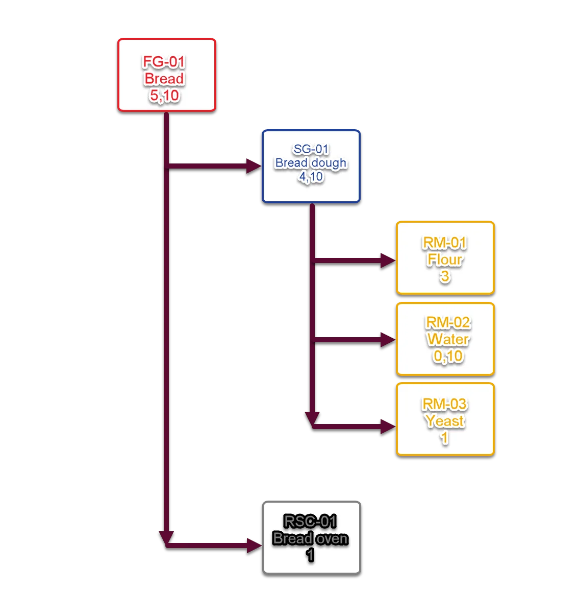
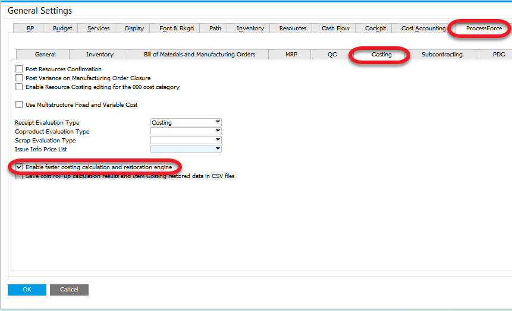

# Faster Costing Calculation and Restoration Engine

In today’s fast-paced business environment, accurate and efficient cost calculations are critical to maintaining profitability and competitiveness. CompuTec ProcessForce introduces the Faster Costing Calculation and Restoration Engine, a breakthrough solution designed to optimize the Cost Roll-Up process. By leveraging advanced data-handling techniques, this feature reduces the time required for complex costing procedures while improving accuracy. In this guide, we’ll explore how the Faster Costing option works, its benefits, and the steps required to activate it.

:::caution
    To use the option, it is required to set up a Direct Data Access connection to a database. You can check how to do this [here](../../administrators-guide/licensing/license-server/configure-computec-service-manager.md).
:::

---

## General

## Standard Costing

### How does it work?

1. Loading Item Costing UDO data for RM-01,  
    Calculating the actual cost of RM-01,  
    Saving changes in Item Costing UDO for RM-01.
2. Loading Item Costing UDO data for RM-02,  
    Calculating the actual cost of RM-03,  
    Saving changes in Item Costing UDO for RM-02.
3. Loading Item Costing UDO data for RM-03,  
    Calculating the actual cost of RM-03,  
    Saving changes in Item Costing UDO for RM-03.
4. Loading Resource Costing UDO data for RSC-01,  
    Calculating the actual cost of RSC-01,  
    Saving changes in Resource Costing UDO for RSC-01.
5. Loading Item Costing UDO data for SG-01,  
    Loading Item Costing UDO data for RM-01,  
    Loading Item Costing UDO data for RM-02,  
    Loading Item Costing UDO data for RM-03,  
    Calculating actual cost of SG-01 based on RM-01, RM-02 i RM-03,  
    Saving changes in Item Costing UDO for SG-01.
6. Loading Item Costing UDO data for FG-01,  
    Loading Item Costing UDO data for SG-01,  
    Loading Resource Costing UDO data for RSC-01,  
    Calculating actual cost of FG-01 based on SG-01 i RSC-01,  
    Saving changes in Item Costing UDO for FG-01.

Loading, calculating, and saving data can take a lot of time in some cases.

In the latest CompuTec ProcessForce version, a new costing mechanism has been implemented. It changes the whole procedure significantly.

## Faster Costing Calculation and Restoration Engine

The Faster Costing Calculation and Restoration Engine redefines the costing process by improving data handling and calculation efficiency.

### How does it work?

1. The following data are being loaded to RAM:
    - Items
    - Revisions
    - Bill of Materials (header, Raw Materials, Coproducts, Scraps, Technology)
    - Routings
    - Operations
    - Resources
    - Item Costing
    - Resource Costing
2. A dynamic multidimensional data cube based on the data from the previous point.
3. Cost Roll-Up on the cube.
4. Cost Cube data are saved in the database (in 10000 records batches) using SqlBulkCopy or HanaBulkCopy classes.

The overall time of Cost Roll-Up is significantly shorter thanks to the reorganization of data reading, update, and saving.

### How to activate it?

To activate the option check the checkbox in General Settings > ProcessForce tab > Costing tab > Enable faster costing calculation and restoration engine:

Unchecking the checkbox causes Costing calculations to be performed according to Standard Costing.

### What do the activation changes?

- CompuTec ProcessForce Cost Roll-Up procedure is based on the new Faster Costing Calculation and Restoration Engine, significantly speeding up the whole procedure.
- Two new options are available on the Cost Roll-Up form: Coproducts cost calculation and Scrap cost calculation.
- A new form is available: Cost Comparison. It is available from the Bill of Materials context menu. It allows for comparison costs of production of a specific Bill of Materials with different batch size.
- Update the Costing button on Item Costing works based on Faster Costing.
- Costed Bill of Materials calculations are based on Faster Costing.
- Changing the Batch size on the Costed Bill of Materials affects updated costs on all structure levels (in Standard Costing: just on Resource, Operation, and Routing levels). New prices for a specific batch size will be displayed on the form.
- A new option on Costed Bill of Materials: Bill of Materials cost calculation based on actual Raw Materials costs in SAP Business One system. If the option is disabled, costs are calculated based on the Costing Details configuration of Raw Materials (Item Costing form).

---
