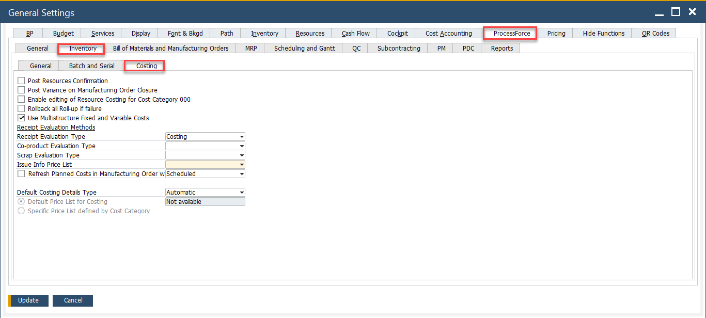
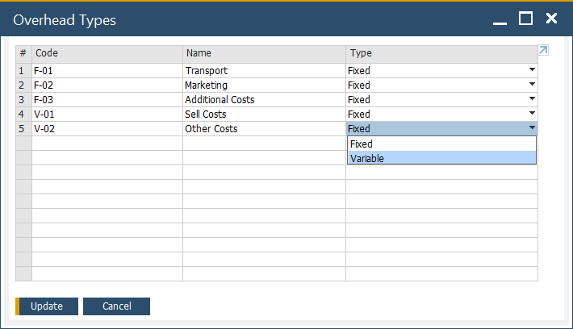
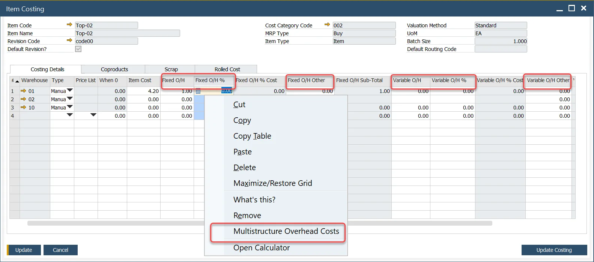
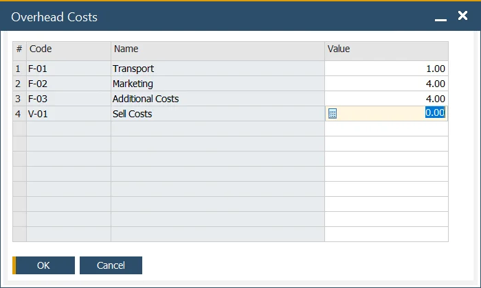

# Multistructure Fixed and Variable Overhead Costs

In ProcessForce, businesses can define and manage both simple and structured Fixed and Variable Overhead costs, offering greater flexibility in cost allocation. This multi-structure costing feature enables the differentiation and presentation of various overhead costs in a more organized manner, helping users to track and calculate costs with precision. This approach can significantly enhance the accuracy of cost roll-ups and provide more insightful financial data for better decision-making.

---

## Settings

### General Settings

:::info Path
    Administration → System Initialization → General Settings → ProcessForce tab → Costing tab
:::

You can enable Multi-structure Fixed and Variable Overhead Costs option by checking the checkbox in the General Settings form under the ProcessForce tab and the Costing section.

### Overhead Types Definition

:::info Path
    Administration → Setup → Financials → Overhead Types
:::

In this form, you can define cost types. Once defined, these cost types can be used in both the Item Costing and Resource Costing forms. The following parameters can be set:

- Code
- Name
- Type – Fixed or Variable

## Usage of the Option

Once defined, the overhead types can be used within the Item Costing and Resource Costing forms. To access these forms, navigate to:

:::info Path
    Costing → Item Costing
:::

Predefined Overhead Types can be used on the Costing Details tab on the Item Costing form and on Resource Costing in the following columns:

- Fixed O/H
- Fixed O/H %
- Fixed O/H Other
- Variable O/H
- Variable O/H %
- Variable O/H Other

:::info
Note that the option is available for entries related to any cost category other than the 000 category. Any changes made for other cost categories can be rolled over to the 000 cost category using the [roll-over](../cost-categories.md) procedure.
:::

After selecting the option, you can choose the desired costs and assign a value to them (only costs marked as fixed can be selected for fixed costs):

Once you click the OK button, the total cost will be added to the corresponding grid:

When you choose the Multistructure Overhead Costs option again, previously saved costs and their values will be displayed, giving you the ability to modify them as needed.

---
The Multi-Structure Fixed and Variable Overhead Costs feature in ProcessForce allows businesses to manage and track overhead costs with greater flexibility and precision. By categorizing costs into different types and applying them to item and resource costings, companies can ensure more accurate cost roll-ups and improve financial reporting. This feature is a powerful tool for achieving more transparent and reliable costing processes, ultimately leading to better financial decision-making and operational efficiency.
