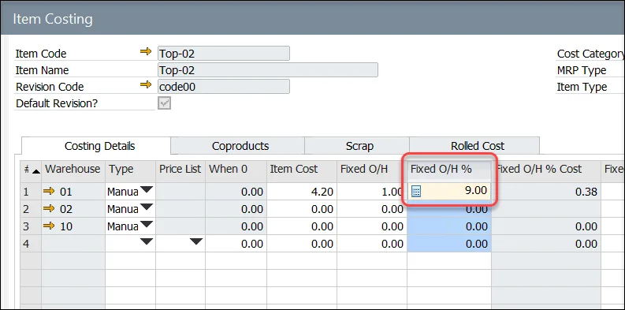

# Multistructure Fixed and Variable Overhead Costs

The Multistructure Fixed and Variable Overhead Costs feature in CompuTec ProcessForce allows businesses to define structured overhead cost types - both fixed and variable - enabling more granular cost allocations. This setup improves the clarity and accuracy of cost calculations by allowing users to organize and apply different overhead structures across items and resources.

By using this functionality, organizations can:

- Enhance accuracy in cost roll-ups
- Gain better visibility into overhead distribution
- Simplify maintenance of cost structures for improved decision-making

---

## Settings

### General Settings

To access Costing, navigate to:

:::info Path
    Administration → System Initialization → General Settings → ProcessForce tab → Inventory tab → Costing
:::

Check the box for Multistructure Fixed and Variable Overhead Costs

### Overhead Types Definition

To access Overhead Types, navigate to:

:::info Path
    Administration → Setup → Financials → Overhead Types
:::

In this form, you can create and manage cost types, which can later be applied in both the Item Costing and Resource Costing forms. The following parameters can be configured:

- Code
- Name
- Type: Fixed or Variable

    

---

## Usage of the Option

Once defined, the overhead types can be used within the Item Costing and Resource Costing forms. To access these forms, navigate to:

:::info Path
    Costing → Item Costing
:::

Predefined Overhead Types can be used on the Costing Details tab on the Item Costing form and on Resource Costing in the following columns:

- Fixed O/H
- Fixed O/H %
- Fixed O/H Other
- Variable O/H
- Variable O/H %
- Variable O/H Other

    

:::info
Please note that this option is applicable to all cost categories except for the 000 category. However, any changes made to other cost categories can be transferred to the 000 category using the r[roll-over](../cost-categories.md) procedure.
:::

Once the option is selected, you can choose the relevant cost types and assign values to them.
>**Note**: Only cost types marked as "Fixed" can be selected for fixed cost entries.

After clicking the "OK" button, the total cost will be automatically populated in the corresponding grid:

When you reopen the Multistructure Overhead Costs option, any previously saved costs and their values will be displayed, allowing you to review and modify them as needed.

---
