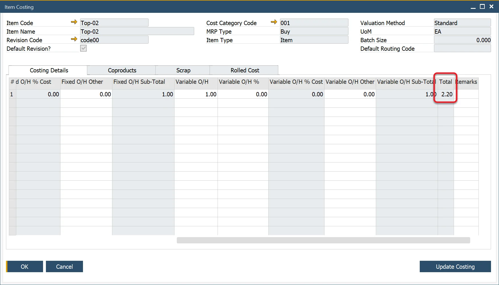

# Overview

ProcessForce employs a bottom-up approach to calculate the cost of semi-finished and finished products. Each Item Master, a part of a Bill of Materials, needs to be defined to calculate the cost of the semi and finished product for Standard Costing and an Estimated Moving Average.

Key considerations include:

- **Costing Methods**: for Moving Average and FIFO, it's possible to incorporate fixed and variable overhead values.
- **Warehouses**: assigning an item to multiple warehouses generates multiple data entries, allowing distinct fixed and variable overhead values for each location.
- **Revision Codes**: multiple revisions of the same item result in unique item costing records.
- **Cost Category Code**: Different cost categories lead to the creation of unique item costing records.

:::info
    Please check the [Configuration](../configuration/overview.md) section before running the Costing functions.
:::

:::danger
    Adding UDFs to the Item Costing and Resource Costing form may cause errors and is not recommended.
:::

---

## Purchased Materials

For each purchased item, an item cost record is created. This record allows you to specify the source of the Item Cost value for calculation purposes and manually add fixed and variable overhead values.

**Steps to Define Item Costing**:

1. Select Item Details: choose the Item Code, Revision, and Cost Category
2. Determine Cost Source: select the orgin of the cost:
        - **Price List**: choose a Price List; the Item Cost field will auto-populate (read-only).
        - **Price List (no roll-up)**: includes the item’s inventory value in the Bill of Materials but excludes it from cost calculations of the semi-finished and finished product.
        - **Manual**: enter a value into the Item Cost field.
        - **Manual (no roll-up)**: an item that has an inventory value included within the Bill of Materials, but the cost is not considered in the cost calculation of the semi-finished and finished product.

    
3. **Assign Price List**:
        - Select the Price List from where the Item Cost will come.
        - For Moving Average and FIFO methods, use the Last Evaluated Price.

        

4. **Add Overhead Values**:
    - For Fixed and Variable overhead values, amounts can be added as a value or a % of the Item Cost:
        - **Fixed Overhead**:
                - Enter Fixed Overhead, e.g., 10.
                - Enter a percentage (e.g., 10% of Item Cost @ 1.000 = Fixed Overhead % Cost 0.100).
                - Enter other fixed overhead values
                - - The total of these Fixed Overhead values will be displayed in the Fixed Over Head Sub-Total column.
        - **Variable Overhead**:
            - Follow the same process as for fixed overhead.
    - When entering the values, the Total column will auto-calculate.

5. **Save Data**: Press the "Update" button to save the data.

    
6. **Review Rolled Cost**:
        - Navigate to the Rolled Cost tab to view all values.
        - The TC Total column displays the total calculated cost, which is copied to the Item Costing field within SAP Business One Item Master Details, Inventory Data tab.

    

## Semi-Finished Products

For each Make item, an item cost record will be created. This form allows you to define the source of the Item Cost value for calculation purposes, as well as manually add fixed and variable overhead values. It also enables the calculation of semi-finished and finished product costs by performing a cost roll-up through the "Update Costing" function.

- **Select Item Details**: select the Item Code, Revision, and Cost Category.
- **Define Cost Source**: Choose from the following options:
        - **Automatic**: the system will calculate the cost.
        - **Automatic (no roll-up**): includes the item’s inventory value in the higher-level Bill of Material but excludes it from cost calculations.
        - **Price List**: select a Price List to provide the cost, which will auto-populate the Item Cost field (read-only).
        - **Price List (no roll-up)**: similar to "Price List," but excludes the cost from the calculation of semi-finished and finished products.
        - **Manual**: enter a value into the Item Cost field.
        - **Manual (no roll-up)**: includes the item's inventory value in the Bill of Material but excludes it from semi-finished and finished product cost calculations.

    

- **Rolled Cost Tab**: it displays a summary of the calculated costs.
        - The summary includes values for a single-level Bill of Materials (BOM), displayed in the "At This Level" (ATL) columns for Materials, Resources, Fixed Overhead, and Variable Overhead.
        - The TC Total represents the total calculated cost of the BOM. This value is transferred to the SAP Business One Item Cost field when performing a cost rollover to cost category 000.
        - For [cost rollover](../cost-categories.md)to categories other than 000, these values are transferred to facilitate what-if analysis and cost simulations.

    

## Finished Products

Finished products are costed by aggregating the costs of all semi-finished products, raw materials, and associated overheads within their BOM.

## Distribution Rules and Cost Dimensions

For further details on item distribution and cost dimensions, refer to the [Distribution and Cost Dimensions](../distribution-and-cost-dimensions/item-distribution-and-cost-dimensions.md) guide.

---
ProcessForce’s robust costing methodology ensures precision and flexibility, enabling businesses to calculate product costs accurately across various levels of production. Whether managing purchased materials, semi-finished goods, or finished products, this bottom-up approach integrates seamlessly with SAP Business One, supporting informed decision-making and effective cost control
