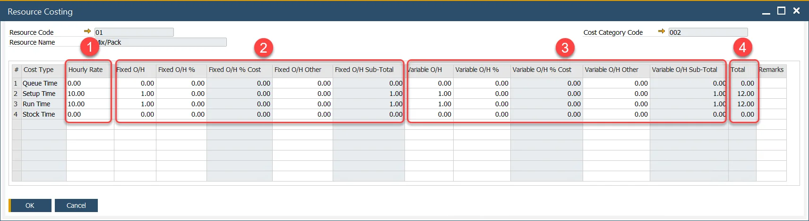
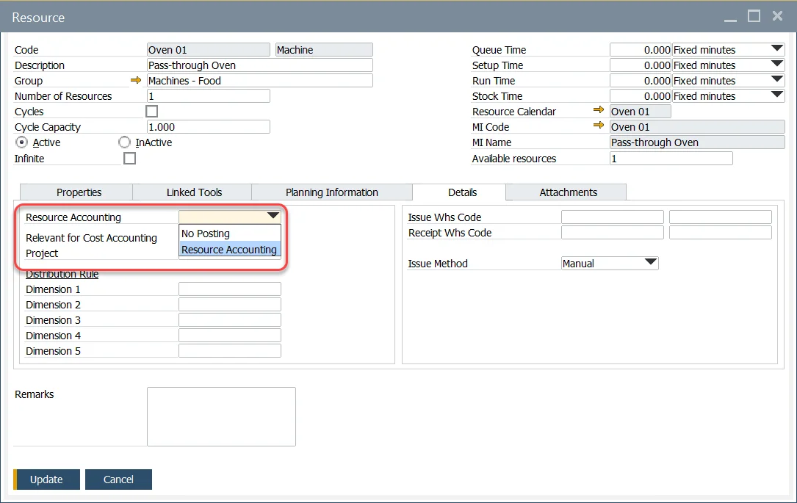

# Resource Costing

Resource Costing is a vital function in production management that calculates the cost of a Resource's work during the manufacturing process. When combined with Item Costing (which evaluates material costs), it provides a comprehensive assessment of production costs for a given Manufacturing Order. This enables organizations to monitor and optimize both fixed and variable costs effectively.

:::danger
    Adding User Defined Fields to the Item Costing and Resource Costing form may cause errors and is not recommended.
:::

Before using the Costing functions, ensure all configurations are properly set up as described in the [Configuration](./configuration/overview.md) section.

:::info Path
    Costing → Resource Costing
:::

---

## General Information

Resource Costing entries are created automatically when a new Resource is added to the system. For every Resource, separate Resource Costing is created for each of the [Cost Categories](../costing-material-and-resources/cost-categories.md) in the system. However, Resource Costing for Cost Category 000 cannot be edited directly within this form.

During the Item Cost Roll-up process, fixed and variable overhead values are displayed within the respective columns, providing transparency in cost evaluation for semi-finished or finished goods.

### Resource Cost Calculation

The overall Resource Cost calculation is derived from three primary elements:

1. **Resource Cost** – Calculated for one hour of work, based on the Resource Costing Hourly Rate and Resource Times values. TDefault Resource Times are initially defined in the Resource form but can be modified later for specific Operations or Production Processes:

    

    Resource Cost is calculated on the following basis:

    |     |       Unit        |    Pattern     |
    | :-: | :---------------: | :------------: |
    |  1  |   Fixed seconds   |   V(H/36000)   |
    |  2  |   Fixes minutes   |    V(H/60)     |
    |  3  |    Fixed hours    |     V × H      |
    |  4  | Seconds per piece |  V/(3600 × H)  |
    |  5  | Minutes per piece |   V/(60 × H)   |
    |  6  |  Hours per piece  |     V × H      |
    |  7  | Pieces per second | 1/V/(3600 × H) |
    |  8  | Pieces per minute |  1/V/(60 × H)  |
    |  9  |  Pieces per hour  |   1/(T × H)    |

    where, *H* - Hourly Rate, *V* - a value for a given time for a Resource, e.g., in the screenshot above Queue Time value is 30.

2. **Fixed Overhead Cost** – Includes costs that do not vary with production output, such as rent. Key components include:

        - **Fixed O/H**: main fixed overhead cost
        - **Fixed O/H %**: percent value of an Hourly Rate to be added to fixed overhead
        - **Fixed O/H % Cost**: value calculated based on Hourly Rate and Fixed O/X %
        - **Fixed O/H Other**: it is possible to define other fixed costs
        - **Fixed O/H SubTotal**: overall fixed overhead value: Fixed O/H + Fixed O/H % Cost + Fixed O/H Other

3. **Variable Overhead Cost** – costs that may vary significantly in relation to production output changes, e.g., production supplies.

    - **Variable O/H**: main variable overhead cost
    - **Variable O/H %**: percent value of an Hourly Rate to be added to the variable overhead
    - **Variable O/H % Cost**: percent value of an Hourly Rate to be added to the variable overhead
    - **Variable O/H Other**: it is possible to define other variable costs
    - **Variable O/H Sub-Total**: overall variable overhead value: Variable O/H + Variable O/H % Cost + Variable O/H Other

4. **Total** - Combined total of Hourly Rate, Fixed Overhead SubTotal, and Variable Overhead SubTotal.

    For a detailed breakdown of structured overhead costs, refer to [Multistructure Fixed and Variable Overhead Costs](../costing-material-and-resources/item-costing/multistructure-fixed-and-variable-overhead-costs.md).

### Labor

Resource Costs are calculated as an Hourly Rate, which may combine both machine and labor costs into a single value.

If machine and labor rates need to be separated, you can achieve this using one of the following methods:

1. **Add Labor Costs as Overhead**:

    Include the labor rate as a fixed or variable overhead. This can be defined as a specific value (e.g., 10) or as a percentage of the Hourly Rate (e.g., 10% of 20 = 2). For more details, refer to [Multistructure Fixed and Variable Overhead Costs option](./item-costing/multistructure-fixed-and-variable-overhead-costs.md).

2. **Create a Separate Resource for Labor**:

    Define a distinct resource labeled "Labor" and assign appropriate costs and Resource Accounting codes to it.

## Resource Accounting

### Configuration

:::info Path
    Administration → Setup → Financials → Resources Accounting
:::

Resource Accounting establishes links between specific Resource-related costs and their corresponding financial accounts. These accounting rules can then be applied to one or more Resources as needed.

Currently only the following accounts are utilized for financial postings: Account, Fixed Overhead, and Variable Overhead. accounts are used for financial posting. Variance, Fixed Overhead Variance, and Variable Overhead Variance will be incorporated in a future release.

At present, all Resource-related variances are consolidated into a single WIP (Work-in-Progress) variance posting, similar to the handling of inventory items.

When different time types are used, each type can be assigned a separate account code.

:::caution
    Each Resource Account (Title column) must have an assigned Account Code for Resource Costing to function properly.
:::

### Resource Account Definition

Predefined Resource Accounting, as outlined in the previous section, can be assigned to a Resource through the Details tab of the Resource form.

To enable financial postings, select an appropriate Resource Accounting code. If financial postings are unnecessary, choose the "No Posting" option.

Click [here](../routings/resources.md) to find out more about Resources.

## Distribution Rules and Cost Dimensions

To learn about Resource Distribution and Cost Dimensions, refer to [Resources - Distribution and Cost Dimensions](../costing-material-and-resources/distribution-and-cost-dimensions/resources-distribution-and-cost-dimensions.md).

---
Resource Costing is an essential tool for organizations seeking precise cost management in manufacturing. By understanding the interplay between fixed and variable costs, businesses can enhance decision-making, improve financial reporting, and achieve greater efficiency in production processes. Proper configuration and adherence to guidelines ensure the accuracy and reliability of Resource Costing functions.
