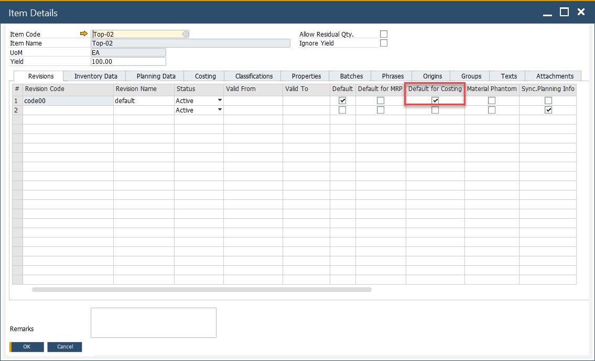
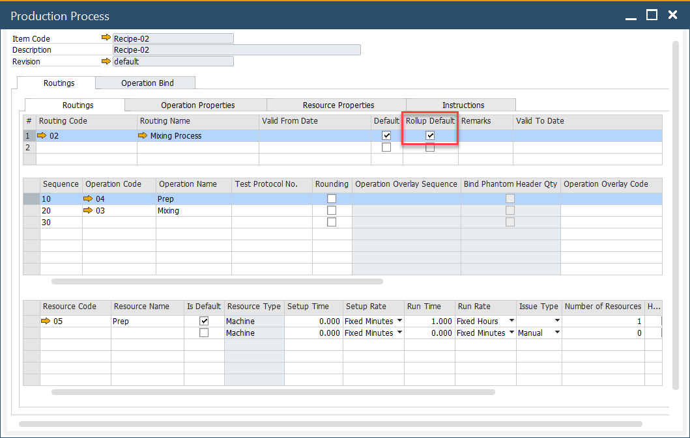

# Revision and Routing Costing Defaults

Defining costing defaults for specific **Revisions** and **Routings** ensures accurate and product-specific cost calculations. This guide explains how to define costing defaults at both the revision and routing levels.

---

## Revisions

CompuTec ProcessForce allows you to calculate costs at the **revision level** of an item.

Within the **Item Details** form:

1. Select the appropriate Revision to be used for costing.
2. Enable the **"Is Costing Default"** checkbox to set it as the default revision for cost calculation.

    

➡️ Learn more about Item Details [Item Details](../item-details/overview.md).

## Production Process

Each product can have **multiple production routings**. To include resource-related costs in the calculation:

- Open the relevant **Routing** in the Production Process form.
- Check it as the **default** for cost calculation.

>**Note**: Even if there's only a single routing defined, this checkbox must still be selected for the cost to be included.

➡️ Learn more about [Production Process](../formulations-and-bill-of-materials/production-process/overview.md).

---
