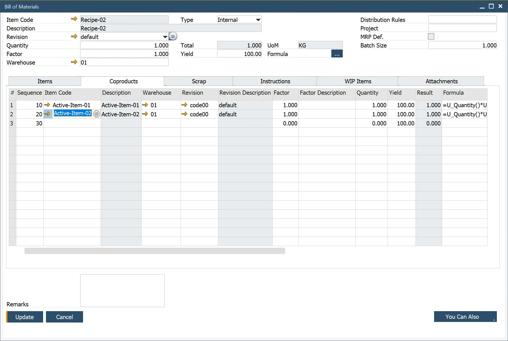

# CoProducts tab

In the Bill of Materials (BoM) module, the CoProducts tab plays a crucial role in managing the additional components produced alongside the parent product. This tab allows users to accurately define, track, and allocate CoProducts within the production process.

---
To access CoProducts tab, navigate to:

:::note
    Production → Bill of Materials → Bill of Material → CoProducts Tab
:::

This form allows the user to perform the following:

- Enter the components produced as a byproduct of producing the parent product.
- Record the warehouse where the inventory is held. If the item is backflushed, this is the warehouse where inventory entries occur.
- Define a factor and description. This serves as a variable for adjusting the CoProduct quantity dynamically.
- Enter the Quantity of the Coproduct in relation to the parent product.
- View the result, a calculated value based on the parent-child relationship using a predefined [Formula](../formula.md).
- Select between using the default formula (from General Settings/ProcessForce Tab) or change the expression format to calculate the Coproduct quantity (result). See [Formula](../formula.md) for additional information.
- Enter the UoM, which is pre-defined in the Item Master Data → Inventory Data Tab.
- Enter the Issue Type as Backflush or Manual. The default value defined within the Item Master Data/General Tab.
- Enter the Project code to categorize CoProducts for reporting and analytical purposes.

---
By utilizing the CoProducts tab effectively, businesses can enhance their production planning and inventory management. This feature ensures accurate tracking of additional materials, optimizes resource allocation, and provides greater control over the manufacturing process.
