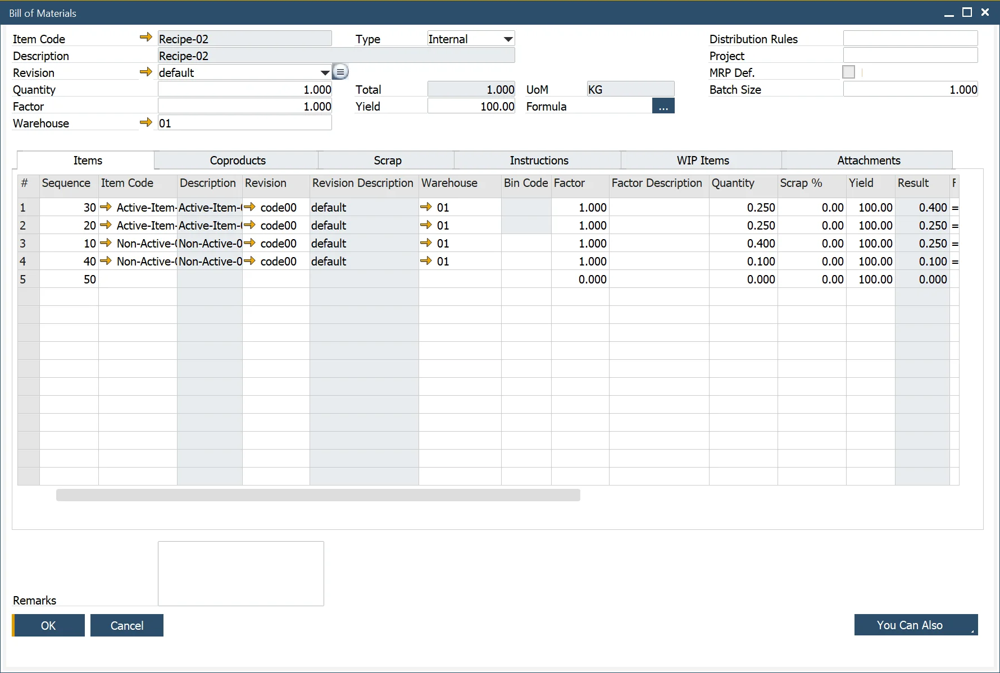

# Bill of Materials form Header

The Bill of Materials (BOM) Header form enables users to define the structure of a Bill of Material for a final product or a component used in another Bill of Material. This feature ensures precise material management and production planning.

:::note Path
    Production → Bill Of Materials → Bill of Materials → Header
:::

---

## Key Features

- **Multiple BOM Versions**: users can create multiple BOMs for a product based on the Revision Code, managed in Inventory → Item Details → Revision Tab. Learn more Click [here](../../item-details/overview.md) to find out more.
- **Quantity & UoM**: specifies the required product quantity and unit of measure (UoM) for the parent item.
The Quantity and UoM represent the product quantity of the parent item.
- **Factor**: defines variables affecting parent and component quantities, such as yield or scrap.
- **Warehouse**: identifies the production location.
- **Type Field**: indicates whether the product is Internal (produced in-house) or External (subcontracted).
- **Distribution Rule & Project**: optional fields for tracking financial and operational data.
- **MRP Default**: determines if this BOM is the default for Material Requirements Planning (MRP). If unchecked, the BOM does not sync with SAP Business One.
- **Batch Size**: defines production batch sizes to calculate costs, considering setup time, fixed runtime, stock, and queue time.

---
The Bill of Materials Header provides a structured approach to defining production components, ensuring efficiency, traceability, and seamless integration with SAP Business One.
