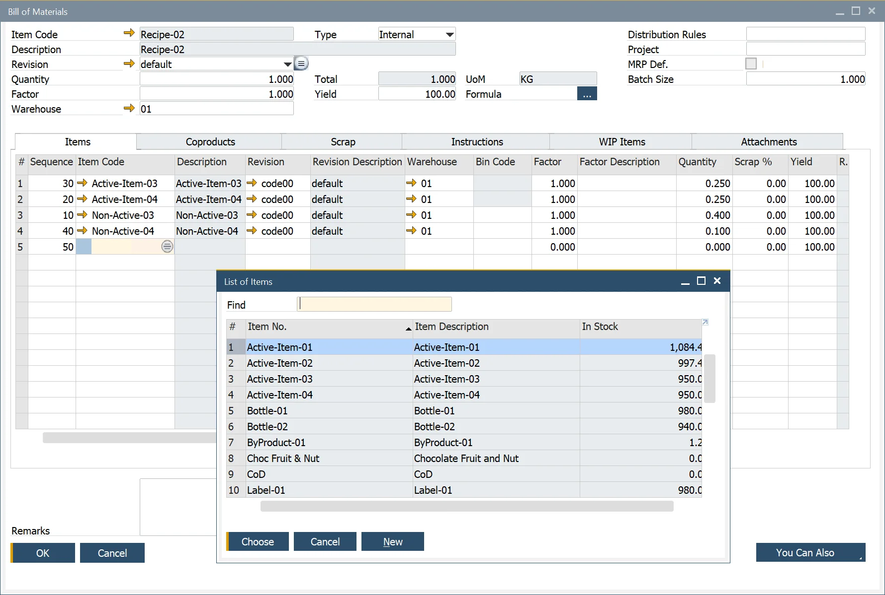

# Items tab

In the Bill of Materials (BOM) module, the Items tab plays a crucial role in defining the components required to produce a parent product. This section allows users to manage and configure the materials, quantities, and related settings essential for the manufacturing process.

:::note Path
    Production → Bill of Materials → Bill of Material → Items Tab
:::

---

## Key Functionalities

This form allows the user to perform the following:

- **Component Entry**: users can list all the components necessary for producing the parent product.
- **Warehouse Assignment**: specifies where the inventory is stored and, if backflushed, where deductions occur.
- **Factor & Description**: the Factor acts as a variable to adjust the quantity dynamically
- **Quantity**: users can set the number of items required per unit of the parent product.
- **Scrap % Inclusion**: accounts for expected material wastage, affecting the total item quantity.
- **Result Calculation**: automatically computes the relationship between item and parent product quantity using a predefined or customized Formula See [Formula](../formula.md) for additional information.
  
- **Unit of Measure (UoM)**: defined in the Item Master Data/Inventory Tab, ensuring accurate unit tracking.
- **Type (Make or Buy)**: display-only field that indicates whether the component is produced in-house or procured externally. This is determined in the Item Master Data/Planning Data Tab..
- **Issue Type Selection**: determines whether inventory issuance follows a Manual or Backflush method. The default setting is found in the Item Master Data/General Tab.
- **Project Codes**: allows users to assign project-specific codes to each line item for tracking purposes.

---
By leveraging the Items tab, users can streamline material planning, ensure precise inventory control, and optimize the production process. Proper configuration of these fields enhances efficiency, reduces waste, and improves overall manufacturing accuracy.
