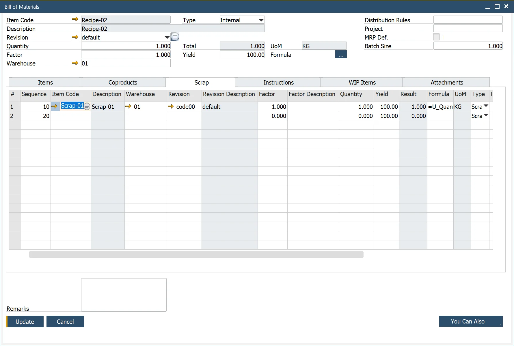

# Scrap tab

In the Bill of Materials (BoM) module, the Scrap tab is essential for managing materials that result from the production process but are not part of the intended finished product. This tab allows users to define, track, and categorize scrap, ensuring accurate inventory control and production analysis.

---

To access Scrap tab, navigate to:

:::note Path
    Production → Bill of Materials → Bill of Materials → Scrap Tab
:::

The Scrap tab enables users to:

- Enter the products created as a consequence of producing the parent product.
- Record the Warehouse where the inventory is held. If the Item is backflushed, this is the Warehouse where the inventory will be placed from a Production Receipt.
- Define a factor and description. This factor is used as a variable to change the quantity.
- Enter a Quantity of the scrap in relation to the parent product.
- The Result is a calculated value of the scrap and parent quantity relationship based on the defined [Formula](../formula.md).
- Use the default Formula (defined on the General Settings/ProcessForce Tab) or change the expression format to calculate the scrap quantity (result). See [Formula](../formula.md) for additional information.
- Enter the UoM; the default value is defined within the Item Master Data/Inventory Data Tab
- Select the scrap Type:
  - The valid options are Scrap and ByProduct.
  - Both types of scrap create inventory transactions.
  - ByProducts can be reused in future production processes or sold to customers.
  - Scrap cannot be reused.
- Define the Issue Type as either Backflush or Manual, based on the default settings in Item Master Data → General Tab.
- Enter the Project code for reporting and analysis purposes.
- Set a Distribution Rule to allocate scrap costs appropriately.
- Add remarks to specify details about the scrap.

---
By effectively utilizing the Scrap tab, businesses can minimize material waste, improve cost allocation, and optimize inventory handling. Tracking scrap types and quantities ensures better resource utilization and enhances overall production efficiency.
